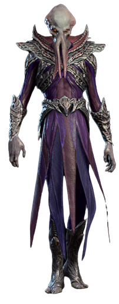

# Mind Flayer

**Level 8 Medium Aberration**

## <mark style="color:green;background-color:blue;">Defense Traits</mark>

<mark style="color:green;">**AC**</mark> 23\
<mark style="color:green;">**HP**</mark> 84\
<mark style="color:green;">**Poise**</mark> 30\
<mark style="color:green;">**Fort**</mark> +9, <mark style="color:green;">**Refl**</mark> +10, <mark style="color:green;">**Will**</mark> +11

<mark style="color:green;">**Resistance**</mark> - Psychic

<mark style="color:green;">**Break Will \[charm]**</mark> - As an immediate action when hit by an attack, a mind flayer can attempt to charm the attacking creature (will negates). Once a creature has passed its save against this effect, it becomes immune until rest.&#x20;

## <mark style="color:orange;background-color:red;">Offense Traits (DC 20)</mark>

<mark style="color:red;">**Tentacles (C)**</mark>  +10 (+4 grapple, +4 MI)\
d8+2 (6)

<mark style="color:red;">**Innate Techniques**</mark> - [Mind Crush](https://app.gitbook.com/s/2kNIiIcUKxqLFlLgDKSI/magical-techniques/larella/level-1/mind-crush) (U4), [Detect Thoughts](https://app.gitbook.com/s/2kNIiIcUKxqLFlLgDKSI/magical-techniques/larella/level-2/detect-thoughts), [Telekinetic Maneuver](https://app.gitbook.com/s/2kNIiIcUKxqLFlLgDKSI/magical-techniques/larella/level-3/telekinetic-maneuver)\
1/day - [Telekinetic Thrust](https://app.gitbook.com/s/2kNIiIcUKxqLFlLgDKSI/magical-techniques/larella/level-5/telekinetic-thrust)\
Constant - [Telekinetic Lift](https://app.gitbook.com/s/2kNIiIcUKxqLFlLgDKSI/magical-techniques/larella/level-3/telekinetic-lift)

<mark style="color:red;">**Brain Blast (Su) \[psychic] \[recharge]**</mark> - Creatures in a 30 ft cone take 6d6 (21) psychic damage and are stunned (will halves damage and reduces stun to stagger). At the end of the creatures turn, they can roll an additional save to end the stun.&#x20;

A mind flayer must devour intellect, wait 1 minute or concentrate as a FRA to gain use of this ability again.

<mark style="color:red;">**Displacer (Su) \[psychic]**</mark> - Creatures that take fall damage from your actions take an additional 5 psychic damage.

<mark style="color:red;">**Devour Intellect \[recharge]**</mark> - **Special:** Can only be used against the creature that is stunned, grappled or defeated.\
Spend a standard action to chomp on a creatures brain. Creature takes 10d8 (45) pierce dmg (fort halves). A mind flayer must digest for at least an hour before it can devour intellect again.

## <mark style="color:blue;background-color:purple;">Weaknesses/Deep Lore</mark>

<mark style="color:blue;">**Psychic Casting**</mark> - A mind flayer requires a higher degree of concentration to use many of its psionic abilities. It cannot use its supernatural abilities or its innate techniques while it is frightened, dominated or confused.

## <mark style="color:yellow;background-color:yellow;">Other Traits</mark>

<mark style="color:yellow;">**Ability Scores - Str +1, Dex +2, Lucc +0, Int +3, Wis +1, Cha +1**</mark>

<mark style="color:yellow;">**Telepathy**</mark> - A mind flayer cannot verbally communicate and must rely on telepathy.

<mark style="color:yellow;">**Blindsense**</mark> - Thought Sense 30 ft

<mark style="color:yellow;">**Speed**</mark> - Hover 30. During its turn, a mind flayer can use this speed to fly.

<mark style="color:yellow;">**Feats**</mark> - [MM Coax](https://app.gitbook.com/s/vxnMGGHnEtmcEQDFxcK6/magic-feats/mm-coax), [Combat Step](https://app.gitbook.com/s/vxnMGGHnEtmcEQDFxcK6/combat-feats/combat-step), [Maneuver Initiate](https://app.gitbook.com/s/vxnMGGHnEtmcEQDFxcK6/combat-feats/maneuver-initiate),&#x20;

<mark style="color:yellow;">**Skills**</mark> - +11 (+4) perception, +11 deception, +11 persuasion, +13 cryptozoology, +13 arcana, +13 planes

<figure><figcaption>
Illithid, Baldur's Gate 3
</figcaption></figure>
