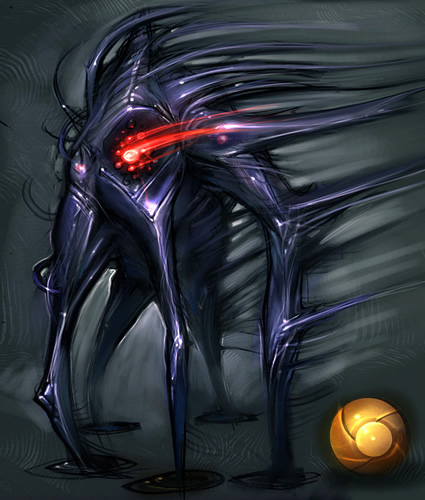

# Shadowling Warrior

**Level 8 Large Aberration**

## <mark style="color:green;background-color:blue;">Defense Traits</mark>

<mark style="color:green;">**AC**</mark> 21\
<mark style="color:green;">**HP**</mark> 84\
<mark style="color:green;">**Poise**</mark> 34\
<mark style="color:green;">**Fort**</mark> +12, <mark style="color:green;">**Refl**</mark> +11, <mark style="color:green;">**Will**</mark> +9

<mark style="color:green;">**Resistance**</mark> - Cold

<mark style="color:green;">**Pool \[recharge]**</mark> - As an swift action, a warrior can turn into an amorphous dark liquid. They can choose to maintain this form indefinitely, but cannot attack while pooled. While in this form, they can move along any surface, including liquids, walls and roofs. They are also amorphous (AC+15). This form can be ended as a free action.

This ability cannot be used in consecutive rounds.

## <mark style="color:orange;background-color:red;">Offense Traits (DC 20)</mark>

<mark style="color:red;">**Stomp (P)**</mark>  +11\
2d8+3 (12) (+2/4 predatory instincts)

<mark style="color:red;">**Gloombolt (Necrotic)**</mark>  +11 (40/80)\
6d6 (21)

<mark style="color:red;">**Multiattack**</mark> - Make 2 stomp attacks

<mark style="color:red;">**Innate Techniques**</mark> - [Darkness](https://app.gitbook.com/s/2kNIiIcUKxqLFlLgDKSI/magical-techniques/moogen/level-2/darkness), [Nearsighted (U4)](https://app.gitbook.com/s/2kNIiIcUKxqLFlLgDKSI/magical-techniques/moogen/level-2/nearsighted), [Toe Smasher](https://app.gitbook.com/s/2kNIiIcUKxqLFlLgDKSI/martial-techniques/unarmed/level-2/toe-smasher), [Frenzied Leap](https://app.gitbook.com/s/2kNIiIcUKxqLFlLgDKSI/martial-techniques/beastmode/level-1/frenzied-leap), [Terminal Isolation (U2)](https://app.gitbook.com/s/2kNIiIcUKxqLFlLgDKSI/martial-techniques/scoundrel/level-1/terminal-isolation)\
1/day - [Unseen Predator](https://app.gitbook.com/s/2kNIiIcUKxqLFlLgDKSI/martial-techniques/beastmode/level-3/unseen-predator)\
Constant - [Predatory Instincts](https://app.gitbook.com/s/2kNIiIcUKxqLFlLgDKSI/martial-techniques/beastmode/level-2/predatory-instincts)

<mark style="color:red;">**Possession (Su) \[recharge]**</mark> - A shadowling can transform into a vapor and advance rapidly towards a creature within 30 ft of them, inhabiting their body. The extent to which varies based on the targets level. Shadowlings cannot possess creatures that are a higher level than them. Ing always instinctually understand what they can possess and how to activate their hosts abilities.

<mark style="color:orange;">Same or Lower Level</mark> - The shadowling takes control of the creatures actions (will negates). During the possessed creatures turn, instead the ing acts. All damage taken by the host also damages the ing possessing the creature (up to a maximum of the hosts current hp). At the end of each turn the ing possesses, they get a new save to end the effect. The shadowling can choose to end this effect as a free action. When it fails or ends, willing or not, they appear within 10 ft of the creature they targeted.\
<mark style="color:orange;">Minion</mark> - The shadowling has full control over the creature while it possesses them. The effect has no save and lasts indefinitely. The shadowling takes damage equal to half the damage its host takes (up to a maximum of half hosts current hp). The ing can choose to end this effect as a free action. When it ends, willing or not, they appear within 10 ft of the creature they targeted.

<mark style="color:red;">**Corruption (Su) \[necrotic] \[recharge]**</mark> - As a swift action, a shadowling can invade a creatures body without taking control of it, eroding it from the inside. The creature must be within reach. While within the creatures body, the shadowling cannot be targeted with attacks and the targeted creature is staggered. The shadowling exits and appears within 30 ft of the target at the start of its next turn. The target creature takes 8d6 (28) necrotic damage and is staggered for 1 round (fort halves dmg and negates stagger).

## <mark style="color:blue;background-color:purple;">Weaknesses/Deep Lore</mark>

<mark style="color:blue;">**The Light, It Burns!**</mark> - While in direct sunlight, a shadowling is persistently set ablaze, but it instead deals true damage. This weakness is suppressed while it possesses a creature.

<mark style="color:blue;">**Weakness**</mark> - Holy 3. When a shadowling takes holy damage while possessing a creature, it must make a will save (DC 10+possessed creatures level) or be ejected.

## <mark style="color:yellow;background-color:yellow;">Other Traits</mark>

<mark style="color:yellow;">**Ability Scores - Str +2, Dex +3, Lucc +0, Int +0, Wis +1, Cha +1**</mark>

<mark style="color:yellow;">**Darkvision**</mark>

<mark style="color:yellow;">**Speed**</mark> - 50

<mark style="color:yellow;">**Superior Jump**</mark> - A shadowling can jump as far and as high as its movement speed

<mark style="color:yellow;">**Feats**</mark> - [SF Stealth](https://app.gitbook.com/s/vxnMGGHnEtmcEQDFxcK6/general-feats/skill-focus), [SS Stealth](https://app.gitbook.com/s/ffUc9JSjKiYL5XuDfVdc/skills/stealth), [Combat Reflexes](https://app.gitbook.com/s/vxnMGGHnEtmcEQDFxcK6/combat-feats/combat-reflexes), [Fighter's Lament](https://app.gitbook.com/s/vxnMGGHnEtmcEQDFxcK6/combat-feats/blind-fight)

<mark style="color:yellow;">**Skills**</mark> - +11 perception, +15 acrobatics, +15 stealth, +12 athletics, +10 cryptozoology, +10 planes

<figure><figcaption>
Metroid Prime 2 concept art
</figcaption></figure>
