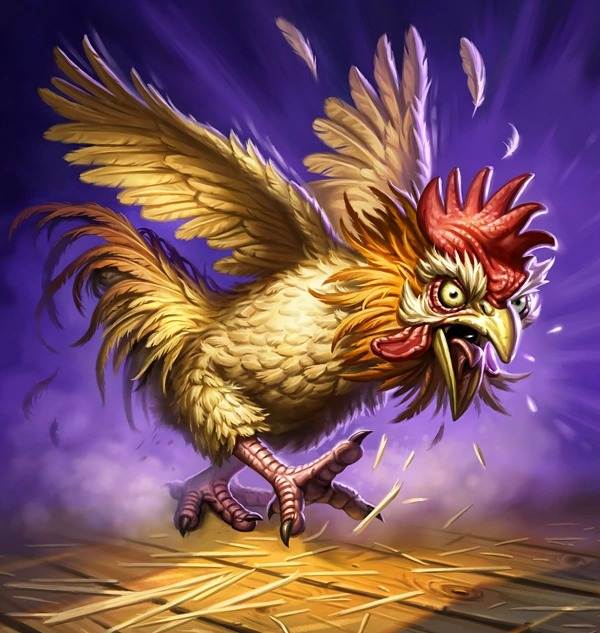

# Angry Chicken

**Level 1 Tiny Beast**

## <mark style="color:green;background-color:blue;">Defense Traits</mark>

<mark style="color:green;">**AC**</mark> 13\
<mark style="color:green;">**HP**</mark> 32\
<mark style="color:green;">**Poise**</mark> 23 (+4 when enraged)\
<mark style="color:green;">**Fort**</mark> +3 (+4 enraged), <mark style="color:green;">**Refl**</mark> +3, <mark style="color:green;">**Will**</mark> +2

## <mark style="color:orange;background-color:red;">Offense Traits (DC 13)</mark>

<mark style="color:red;">**Peck (P)**</mark>  +3 (+2 enraged)\
2d6+2 (9) (+2 enraged)

<mark style="color:red;">**Enrage**</mark> - While at full hp, the angry chicken is aggressive, but typically not threatening. After it takes any damage, it enrages, increasing its strength to +4, gains a multi-attack and 2 special attacks.

<mark style="color:red;">**Multi-Attack**</mark> - Make 2 peck attacks.

<mark style="color:red;">**Special Attack: Chicken Scratch**</mark> - Flap up to a creatures face and peck at its eyes. On hit apply blurred vision for 1 round.

<mark style="color:red;">**Special Attack: Miracle of Life \[recharge]**</mark> - Launch an egg at a creature as though making a thrown weapon attack. It deals 3d6+4 (14) crush dmg.&#x20;

## <mark style="color:blue;background-color:purple;">Weaknesses/Deep Lore</mark>

<mark style="color:blue;">**Bed Time**</mark> - If an angry chicken is covered up, or otherwise subject to complete darkness, it must make a DC 10 will save or fall asleep and stop raging. If it is again exposed to light it awakens.

## <mark style="color:yellow;background-color:yellow;">Other Traits</mark>

<mark style="color:yellow;">**Ability Scores - Str +0, Dex +2, Lucc +0, Int -3, Wis +1, Cha +0**</mark>

<mark style="color:yellow;">**Glide**</mark>

<mark style="color:yellow;">**Feats**</mark> - [Back to the Wall](https://app.gitbook.com/s/vxnMGGHnEtmcEQDFxcK6/combat-feats/back-to-the-wall)

<mark style="color:yellow;">**Skills**</mark> - +4 perception

<figure><figcaption>
<a href="https://hearthstone.wiki.gg/wiki/Chicken_(Gnomish_Experimenter)">Hearthstone Card Art</a>
</figcaption></figure>
