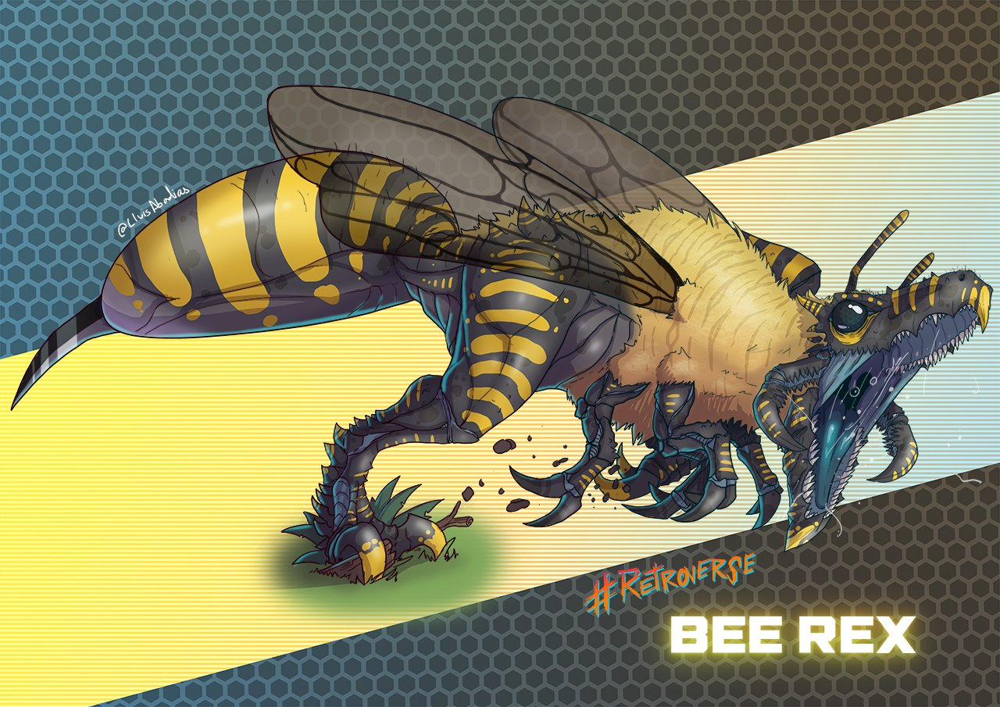

# Bee Rex

**Level 6 Huge Beast**

## <mark style="color:green;background-color:blue;">Defense Traits</mark>

<mark style="color:green;">**AC**</mark> 20\
<mark style="color:green;">**HP**</mark> 91\
<mark style="color:green;">**Poise**</mark> 32\
<mark style="color:green;">**Fort**</mark> +12 (stalwart), <mark style="color:green;">**Refl**</mark> +5, <mark style="color:green;">**Will**</mark> +7

## <mark style="color:orange;background-color:red;">Offense Traits (DC 18)</mark>

<mark style="color:red;">**Bite (C)**</mark>  +10 (+4 grapple, +4 MI, +free grapple on hit)\
3d8+4 (17)

<mark style="color:red;">**Stinger (P)**</mark>  +10 (+envenom)\
2d8+4 (13)

<mark style="color:red;">**Multiattack**</mark>  - Whenever a bee rex is flanked, it gains access to this multiattack. It will purposefully attempt to position itself to get into such a position if it can, hopefully provoking AoOs for Blood for Blood procs.\
Make a bite attack and a stinger attack, but not against the same creature.

<mark style="color:red;">**Innate Technique**</mark> - [Blood for Blood](https://app.gitbook.com/s/2kNIiIcUKxqLFlLgDKSI/martial-techniques/barbarism/level-1/blood-for-blood)\
1/day - [Carnage](https://app.gitbook.com/s/2kNIiIcUKxqLFlLgDKSI/martial-techniques/barbarism/level-1/carnage)

<mark style="color:red;">**King of the Jungle \[fear] \[sonic]**</mark> - As a FRA the T-Rex can unleash a mighty roar. Creatures within 60 ft are frightened for 2 rounds (will reduces to shaken 1). Creatures threatened by the t-rex also take 6d6 (21) sonic damage.

<mark style="color:red;">**Swallow**</mark> - 3d6 (10) poison

<mark style="color:red;">**Venomous**</mark> - Stinger only

## <mark style="color:blue;background-color:purple;">Weaknesses/Deep Lore</mark>

<mark style="color:blue;">**Don't Move**</mark> - If a creature takes no action and it doesn't move on its turn, the bee rex can only perceive it with scent.

<mark style="color:blue;">**Clumsy Titan**</mark> - When the bee rex dashes, it must move in a straight line. It cannot take the jump action or climb.

<mark style="color:blue;">**What's the Buzz?**</mark> - A bee rex is taunted by any creature it sees attacking bees.

## <mark style="color:yellow;background-color:yellow;">Other Traits</mark>

<mark style="color:yellow;">**Ability Scores - Str +4, Dex -1, Lucc +0, Int -3, Wis +1, Cha +0**</mark>

<mark style="color:yellow;">**Speed**</mark> - 40

<mark style="color:yellow;">**Blindsense**</mark> - Scent (5 ft)

<mark style="color:yellow;">**Glide**</mark>

<mark style="color:yellow;">**Nightvision**</mark>

<mark style="color:yellow;">**Feats**</mark> - [Maneuver Initiate](https://app.gitbook.com/s/vxnMGGHnEtmcEQDFxcK6/combat-feats/maneuver-initiate), [Combat Reflexes](https://app.gitbook.com/s/vxnMGGHnEtmcEQDFxcK6/combat-feats/combat-reflexes), [Toughness](https://app.gitbook.com/s/vxnMGGHnEtmcEQDFxcK6/combat-feats/toughness)

<mark style="color:yellow;">**Skills**</mark> - +9(+4) perception, +16 athletics, +7 stealth

<figure><figcaption>
<a href="https://x.com/LluisAbadias/media">By Lluis</a>
</figcaption></figure>
