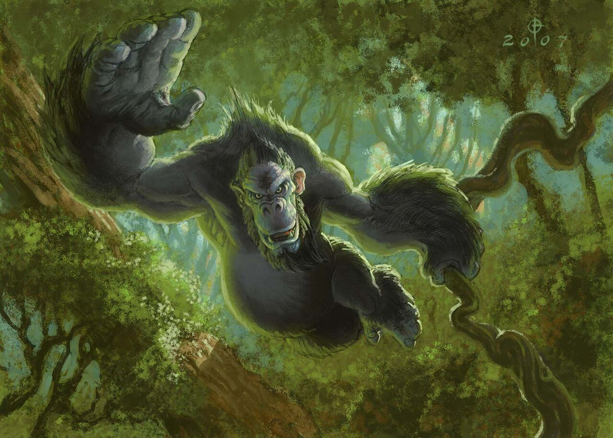

# Harambe

**Level 2 Large Beast**

## <mark style="color:green;background-color:blue;">Defense Traits</mark>

<mark style="color:green;">**AC**</mark> 15\
<mark style="color:green;">**HP**</mark> 40\
<mark style="color:green;">**Poise**</mark> 22\
<mark style="color:green;">**Fort**</mark> +7, <mark style="color:green;">**Refl**</mark> +3, <mark style="color:green;">**Will**</mark> +3

## <mark style="color:orange;background-color:red;">Offense Traits (DC 13)</mark>

<mark style="color:red;">**Unarmed (C)**</mark> +5\
2d6+3 (10)

<mark style="color:red;">**Rock (C)**</mark>  +5 (20/40)\
2d6+3 (10)

<mark style="color:red;">**Multiattack**</mark> - Make 1 unarmed attack and one topple or grapple attack.

<mark style="color:red;">**Innate Technique**</mark> - [Boasting Taunt](https://nick-nacks-rpg.gitbook.io/nicknacksrpg.com/techniques/martial-techniques/warfare/level-1/boasting-taunt), [Improvise](https://nick-nacks-rpg.gitbook.io/nicknacksrpg.com/techniques/martial-techniques/unarmed/level-1/improvise),[ Wake-Up Slap](https://nick-nacks-rpg.gitbook.io/nicknacksrpg.com/techniques/martial-techniques/unarmed/level-1/wake-up-slap)\
1/day - [Foe Toss](https://nick-nacks-rpg.gitbook.io/nicknacksrpg.com/techniques/martial-techniques/barbarism/level-2/foe-toss)

<mark style="color:red;">**Special Attack: Bending Branches**</mark> - While in the presence of small and flexible trees, such as bamboo or saplings, a gorilla can bend it and have it slap a creature. The attack deals 3d6+3 (13) crush dmg and makes the creature clumsy 2 on hit.

<mark style="color:red;">**Ape Together Strong**</mark> - Harambe are exceptionally good at assisting each other. Whenever they take the aid action, they always grant +2 to skill bonuses. They can aid an allied harambe as a swift action.

## <mark style="color:blue;background-color:purple;">Weaknesses/Deep Lore</mark>

<mark style="color:blue;">**Dominance Established**</mark> - Harambe are often led by an elder male who calls the shots and protects the rest of the troop. In neutral scenarios where harambe encounter other creatures, they will attempt to intimidate them to assess their foes. By succeeding on an opposed intimidation check, a creature can usually dissuade a harambe from engaging.

<mark style="color:blue;">**Never Forget**</mark> - Harambe have weakness 2 to firearm attacks, and are shaken 1 on hit by them.

## <mark style="color:yellow;background-color:yellow;">Other Traits</mark>

<mark style="color:yellow;">**Ability Scores - Str +3, Dex +1, Lucc -1, Int -3, Wis +1, Cha +0**</mark>

<mark style="color:yellow;">**Speed**</mark> - 30 climb

<mark style="color:yellow;">**Feats**</mark> - [Bullseye](https://nick-nacks-rpg.gitbook.io/nicknacksrpg.com/feats/combat-feats/bullseye)

<mark style="color:yellow;">**Skills**</mark> - +5 perception, +7 athletics, +7 intimidation

<figure><figcaption>
<a href="https://hearthstone.wiki.gg/wiki/Silverback_Patriarch#/media/File:Silverback_Patriarch_full.jpg">Harambe</a>, Hearthstone Card Art
</figcaption></figure>
