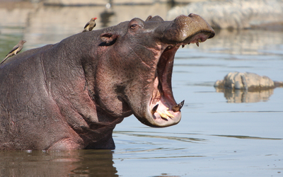

# Hippo

**Level 3 Large Beast**

## <mark style="color:green;background-color:blue;">Defense Traits</mark>

<mark style="color:green;">**AC**</mark> 15\
<mark style="color:green;">**HP**</mark> 64\
<mark style="color:green;">**Poise**</mark> 26 (DR 10 vs grapple)\
<mark style="color:green;">**Fort**</mark> +7, <mark style="color:green;">**Refl**</mark> +3, <mark style="color:green;">**Will**</mark> +4

<mark style="color:green;">**Chunky**</mark> - A hippo cannot take more than 15 damage from a single instance of damage.

## <mark style="color:orange;background-color:red;">Offense Traits (DC 15)</mark>

<mark style="color:red;">**Bite (C)**</mark>  +5\
2d6+3 (10)

<mark style="color:red;">**Multiattack**</mark> - Make 1 bite attack and 1 topple or shove attack.

<mark style="color:red;">**Innate Technique**</mark> - [Roar](https://app.gitbook.com/s/2kNIiIcUKxqLFlLgDKSI/martial-techniques/cataclysm/level-1/roar), [Headbutt](https://app.gitbook.com/s/2kNIiIcUKxqLFlLgDKSI/martial-techniques/warfare/level-2/headbutt)\
1/day - [Burst of Speed](https://app.gitbook.com/s/2kNIiIcUKxqLFlLgDKSI/martial-techniques/pupper/level-2/burst-of-speed), [Thick of the Fight](https://app.gitbook.com/s/2kNIiIcUKxqLFlLgDKSI/martial-techniques/warfare/level-2/thick-of-the-fight)

<mark style="color:red;">**Muck Spreading \[recharge]**</mark> - A hippo can turn away from a creature within reach and spin its tail rapidly while defecating. The targeted creature can choose to protect their mouth or their eyes. If they protect their mouth, they get blinded (reflex reduced to blurred vision). If they choose to protect their mouth, they are instead dazed (fort reduces to stagger). Either status lasts until they are sufficiently cleaned off, usually requiring a standard action (or the aid action).

<mark style="color:red;">**Special Attack: Capsize \[fear]**</mark> - Hippos are powerful enough to knock over vehicles that are about their size, in land or in water. Against such vessels, this attack automatically makes the vessel flip over or onto its side, ejecting all riding creatures. Used against a creature, it knocks them down on hit.

In either case, all creatures that witness the attack are frightened for 1 round (will negates).

## <mark style="color:blue;background-color:purple;">Weaknesses/Deep Lore</mark>

<mark style="color:blue;">**Moist**</mark> - A hippo requires water sources during hot days in order to maintain homeostasis. If a hippo takes fire damage, or is otherwise made dry, it is fatigued until it is made wet again.&#x20;

## <mark style="color:yellow;background-color:yellow;">Other Traits</mark>

<mark style="color:yellow;">**Ability Scores - Str +3, Dex +0, Lucc +0, Int -3, Wis +1, Cha +0**</mark>

<mark style="color:yellow;">**Speed**</mark> - Hippos cannot swim, but they can use their land speed to trot along the bottom of floor while submerged in water.

<mark style="color:yellow;">**Feats**</mark> - [Toughness](https://app.gitbook.com/s/vxnMGGHnEtmcEQDFxcK6/combat-feats/toughness), [Unstoppable](https://app.gitbook.com/s/vxnMGGHnEtmcEQDFxcK6/combat-feats/unstoppable)

<mark style="color:yellow;">**Skills**</mark> - +6 perception, +8 athletics, +8 intimidation

<figure><figcaption></figcaption></figure>
