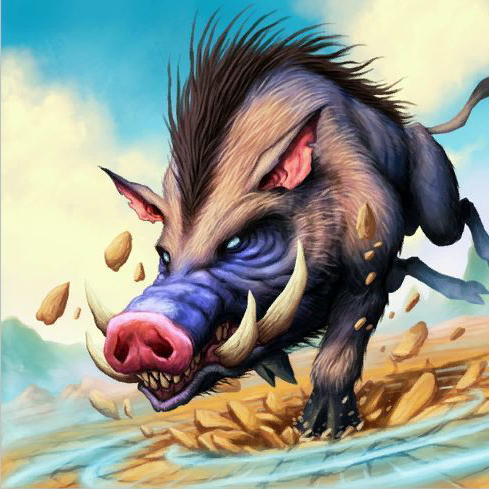

# Huffer

**Level 2 Medium Beast**

## <mark style="color:green;background-color:blue;">Defense Traits</mark>

<mark style="color:green;">**AC**</mark> 16\
<mark style="color:green;">**HP**</mark> 40\
<mark style="color:green;">**Poise**</mark> 22\
<mark style="color:green;">**Fort**</mark> +7, <mark style="color:green;">**Refl**</mark> +3, <mark style="color:green;">**Will**</mark> +3

## <mark style="color:orange;background-color:red;">Offense Traits (DC 14)</mark>

<mark style="color:red;">**Gore (P)**</mark>  +5 (+4 shove/topple) (+2 charge)\
2d6+3 (10)

<mark style="color:red;">**Innate Technique**</mark> - [Break Free](https://nick-nacks-rpg.gitbook.io/nicknacksrpg.com/techniques/martial-techniques/warfare/level-1/break-free), [Sprint](https://nick-nacks-rpg.gitbook.io/nicknacksrpg.com/techniques/martial-techniques/pupper/level-1/sprint)

<mark style="color:red;">**Charge**</mark> - When a huffer makes a charge attack, it gets a +2 bonus to attack and takes no AC penalty. It gets a free shove or topple attack (no MA penalty) on hit.

<mark style="color:red;">**Shockwave \[recharge]**</mark> - As a standard action, huffer can slam its hooves into the ground to create a shock wave. Creatures within 10 feet of it take 2d6+2 (9) crush damage and are knocked down (fort halves dmg and negates knockdown).

<mark style="color:red;">**Stampede**</mark> - A huffer can prepare to charge at the same time as another huffer. If they both charge attack the same creature, they attack with advantage.

## <mark style="color:blue;background-color:purple;">Weaknesses/Deep Lore</mark>

<mark style="color:blue;">**JuggerNOT**</mark> - Stopping a huffer in the middle of its charge also causes it to get knocked down until the start of its next turn.

## <mark style="color:yellow;background-color:yellow;">Other Traits</mark>

<mark style="color:yellow;">**Ability Scores - Str +3, Dex +1, Lucc +0, Int -3, Wis +1, Cha +0**</mark>

<mark style="color:yellow;">**Speed**</mark> - 30

<mark style="color:yellow;">**Feats**</mark> - [Diehard](https://nick-nacks-rpg.gitbook.io/nicknacksrpg.com/feats/combat-feats/diehard)

<mark style="color:yellow;">**Skills**</mark> - +5 perception, +9 athletics

<figure><figcaption>
<a href="https://hearthstone.wiki.gg/wiki/Huffer#/media/File:Huffer_full.jpg">Huffer</a>, Hearthstone Card Art
</figcaption></figure>
