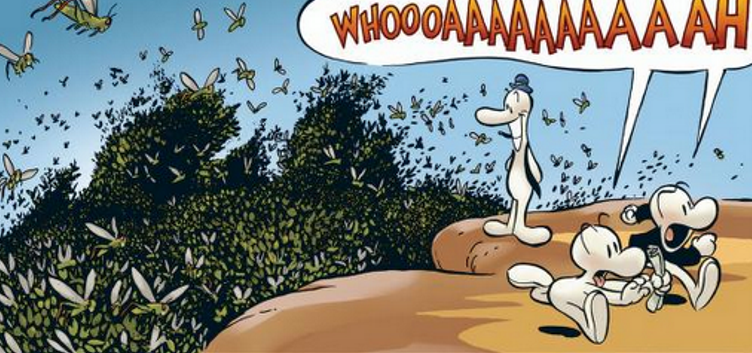

# Insect Swarm

**Level 4 Huge Beast \[group]**

## <mark style="color:green;background-color:blue;">Defense Traits</mark>

<mark style="color:green;">**AC**</mark> 14\
<mark style="color:green;">**HP**</mark> 60\
<mark style="color:green;">**Poise**</mark> -\
<mark style="color:green;">**Fort**</mark> +7, <mark style="color:green;">**Refl**</mark> +7, <mark style="color:green;">**Will**</mark> +4

<mark style="color:green;">Single Target Resistance</mark> - Resistance to any damage that only affects a single creature, most common with attack rolls. Certain attacks like cleave can ignore this resistance.

Single target effects that deal no damage have no effect.

<mark style="color:green;">Poise Immune</mark> - Cannot be poise broken

## <mark style="color:orange;background-color:red;">Offense Traits (DC 15)</mark>

<mark style="color:red;">**Swarm Attack (P)**</mark> (+distraction)\
2d6+3 (10)&#x20;

<mark style="color:red;">**THEY'RE IN MY EVERYTHING**</mark> - While within a swarm, creatures are sickened 2 and have blurred vision. Exiting immediately ends both conditions.

<mark style="color:red;">**Distraction**</mark>

<mark style="color:red;">**Species**</mark> - Lots of different bugs! Choose one.

<mark style="color:orange;">Locust</mark> - Always focuses plant creatures first. Deal double damage to plant creatures.\
<mark style="color:orange;">Bee</mark> - Deals an additional 2d6 poison damage with swarm attack (fort negates).\
<mark style="color:orange;">Scarab</mark> - Creatures hurt by swarm attack also start bleeding for d10 damage (fort negates).\
<mark style="color:orange;">Spider</mark> - Gains the venomous quality, applied on swarm attack.\
<mark style="color:orange;">Ant</mark> - Ants crawl into every nook and cranny and never let go. Their swarm damage happens again at the end of the creatures turn if not hit with AoE, submerged in water, etc. Lose fly speed, gain 30 ft climb.

## <mark style="color:blue;background-color:purple;">Weaknesses/Deep Lore</mark>

<mark style="color:blue;">**AoE Vulnerability**</mark> - Take 50% more damage from any AoE effect

<mark style="color:blue;">**No Reach**</mark> - Insect swarms cannot threaten, and therefore cannot flank or AoO

## <mark style="color:yellow;background-color:yellow;">Other Traits</mark>

<mark style="color:yellow;">**Ability Scores - Str +1, Dex +3, Lucc -1, Int -3, Wis +1, Cha +0**</mark>

<mark style="color:yellow;">**Speed**</mark> - 40 fly

<mark style="color:yellow;">**Blindsense**</mark> - Scent (10 ft)

<mark style="color:yellow;">**Nightvision**</mark>

<mark style="color:yellow;">**Skills**</mark> - +4(+4) (adv) perception, + stealth

<figure><figcaption>
Bone Comics, Jeff Smith
</figcaption></figure>
