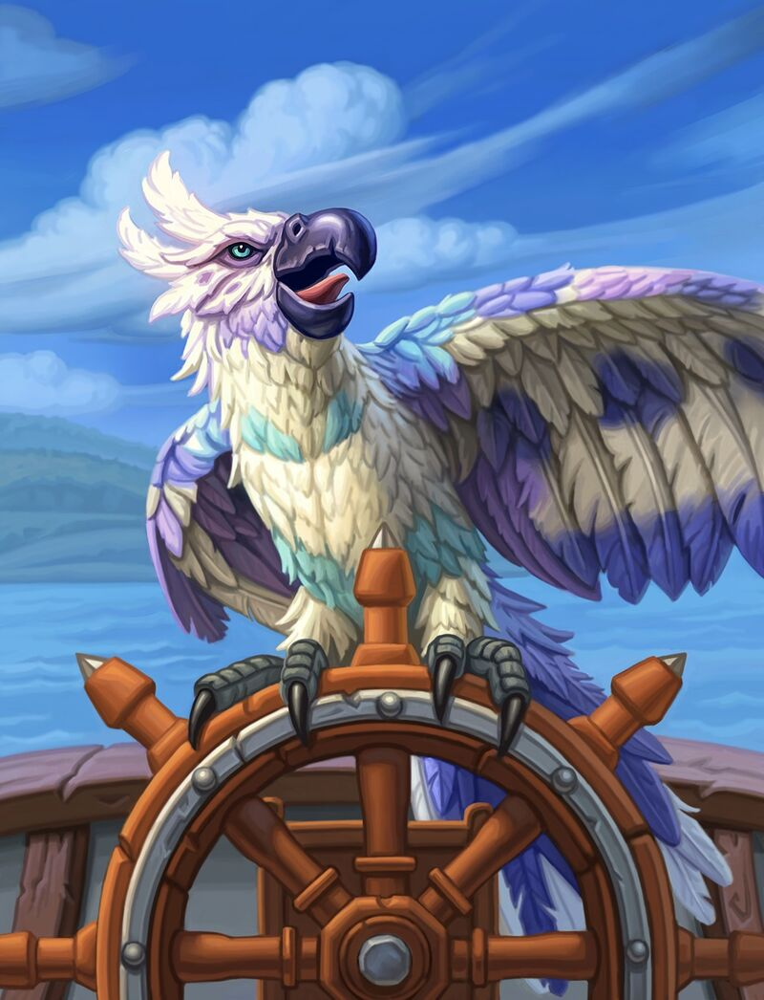

# Macaw

**Level 2 Small Beast**

## <mark style="color:green;background-color:blue;">Defense Traits</mark>

<mark style="color:green;">**AC**</mark> 14\
<mark style="color:green;">**HP**</mark> 32\
<mark style="color:green;">**Poise**</mark> 18\
<mark style="color:green;">**Fort**</mark> +1, <mark style="color:green;">**Refl**</mark> +6, <mark style="color:green;">**Will**</mark> +3

## <mark style="color:orange;background-color:red;">Offense Traits (DC 14)</mark>

<mark style="color:red;">**Peck (P)**</mark>  +4\
d6+2 (5)

<mark style="color:red;">**Innate Technique**</mark> - 1/day - [Roar](https://nick-nacks-rpg.gitbook.io/nicknacksrpg.com/techniques/martial-techniques/cataclysm/level-1/roar), [Boasting Taunt](https://nick-nacks-rpg.gitbook.io/nicknacksrpg.com/techniques/martial-techniques/warfare/level-1/boasting-taunt)

<mark style="color:red;">**Mimicry (Su) \[recharge]**</mark> - Whenever a macaw sees an **enemy** use a technique or special attack, it can use it on its next turn. If a creature uses a special attack or technique directly against the macaw. All techniques function as though they were innate techniques and use the macaws statistics.

If the macaw uses a \[mana burn] or \[recharge] ability, it cannot use mimicry again until it rests. It is limited to level 3 or lower techniques. The macaw cannot use this ability while silenced.

Mimicry cannot be used in consecutive rounds.

<mark style="color:red;">**Shanty \[concentration]**</mark> - A macaw can use a standard action to start singing a song. All allied pirates, seamen and sea creatures within 60 ft get a +2 bonus to attack. Continuing to sing on subsequent turns is a free action.\
The macaw cannot use this ability while silenced.

## <mark style="color:blue;background-color:purple;">Weaknesses/Deep Lore</mark>

<mark style="color:blue;">**Tongue Twister**</mark> - Fond of repetition, the macaw will often mimic interesting words and phrases. A creature trained in linguistics can roll an opposed linguistics check to as a swift action to distract the macaw if they are within 30 ft, or farther if they can increase the volume of their voice significantly. Success stops from singing and prevents it from taking any actions it on its next turn other than movement.\
This can only function once per combat.

## <mark style="color:yellow;background-color:yellow;">Other Traits</mark>

<mark style="color:yellow;">**Ability Scores - Str -1, Dex +2, Lucc +3, Int -2, Wis +1, Cha +0**</mark>

<mark style="color:yellow;">**Speed**</mark> - 15 land, 30 fly

<mark style="color:yellow;">**Intelligence**</mark> - An oddity amongst beasts, a macaw can understand and speak common, plus 2 other languages. It's ability to communicate complex ideas is still quite limited. It is exceptionally good at remembering voices and faces. In general its memory is good and it can intuit the functionality of simple devices like doors and pulley systems.

<mark style="color:yellow;">**Feats**</mark> - [Signature Skill (linguistics)](https://nick-nacks-rpg.gitbook.io/nicknacksrpg.com/skills/skills/linguistics)

<mark style="color:yellow;">**Skills**</mark> - +5 perception, +3 linguistics, +6 Sleight of Hand

<figure><figcaption>
<a href="https://hearthstone.wiki.gg/wiki/Brilliant_Macaw">Brilliant Macaw</a>, Hearthstone card art
</figcaption></figure>
