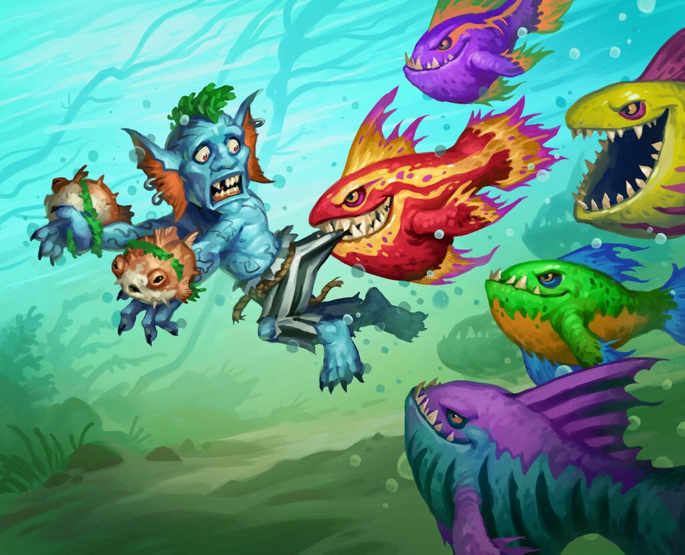

# Piranha Swarm

**Level 2 Large Beast \[group]**

## <mark style="color:green;background-color:blue;">Defense Traits</mark>

<mark style="color:green;">**AC**</mark> 14\
<mark style="color:green;">**HP**</mark> 40\
<mark style="color:green;">**Poise**</mark> -\
<mark style="color:green;">**Fort**</mark> +4, <mark style="color:green;">**Refl**</mark> +5, <mark style="color:green;">**Will**</mark> +3

<mark style="color:green;">**Single Target Resistance**</mark> - Resistance to any damage that only affects a single creature, most common with attack rolls. Certain attacks like cleave can ignore this resistance. Single target effects that deal no damage have no effect.

<mark style="color:green;">**Poise Resistance**</mark> - Cannot be poise broken

## <mark style="color:orange;background-color:red;">Offense Traits (DC 14)</mark>

<mark style="color:red;">**Auto Attack**</mark> - Target takes 2d6 (7) pierce damage and starts bleeding (d6) +Cling

<mark style="color:red;">**Cling**</mark> - Piranhas never let go. Their auto attack damage happens again at the end of the target creature's turn. When the creature is attacked by another creature, or is hit with a harmful AoE, this effect ends. The piranhas can also be forcefully ripped off with an athletics check as a standard action. Failure causes the creature to take the attack damage again immediately.

At the end of a piranha swarm's turn, it loses 3 hp for each creature it uses its auto attack, representing the dwindling swarm cause by the tenacious fish clinging to their enemies.

<mark style="color:red;">**Sense Weakness**</mark> - If a creature without a swim speed or athletics proficiency is detected by the piranha swarm, it gets a free dash action on its next turn. This ability also activates if a bleeding creature is detected.

## <mark style="color:blue;background-color:purple;">Weaknesses/Deep Lore</mark>

<mark style="color:blue;">**Baited**</mark> - While piranhas do attack living creatures, they prefer easier prey. If a dead carcass is within range of their blood scent, piranhas will tear it to shreds before moving on. Medium or small creatures distract for one turn. Anything smaller only uses their movement. Anything larger than medium distracts for 1 more turn per size category.

## <mark style="color:yellow;background-color:yellow;">Other Traits</mark>

<mark style="color:yellow;">**Ability Scores - Str +0, Dex +3, Lucc +0, Int -3, Wis +1, Cha +0**</mark>

<mark style="color:yellow;">**Speed**</mark> - 30 swim, 5 land

<mark style="color:yellow;">**Blindsense**</mark> - Scent (10 ft, or 100 ft vs creatures missing hp)

<mark style="color:yellow;">**Feats**</mark> - [SF Perception](https://app.gitbook.com/s/vxnMGGHnEtmcEQDFxcK6/general-feats/skill-focus), [Blind Fight](https://app.gitbook.com/s/vxnMGGHnEtmcEQDFxcK6/combat-feats/blind-fight)

<mark style="color:yellow;">**Skills**</mark> - +7 (adv) perception

<figure><figcaption>
<a href="https://hearthstone.wiki.gg/wiki/Schooling">Schooling</a>, Hearthstone card art
</figcaption></figure>
