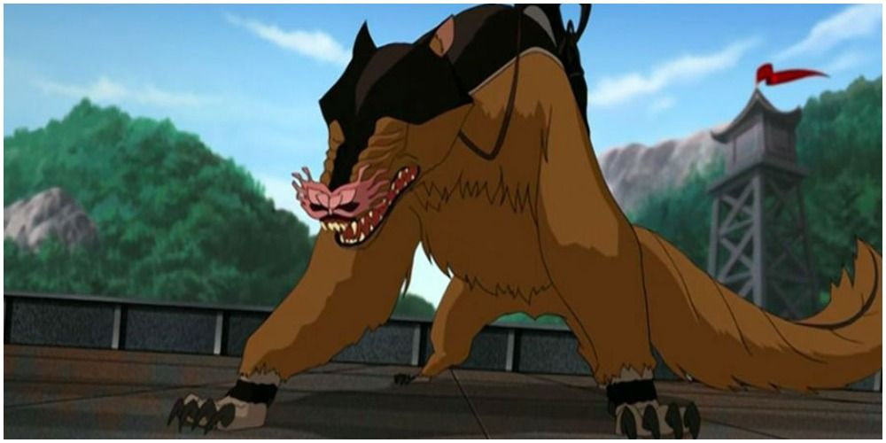

# Shirshu

**Level 8 Huge Beast**

## <mark style="color:green;background-color:blue;">Defense Traits</mark>

<mark style="color:green;">**AC**</mark> 23\
<mark style="color:green;">**HP**</mark> 84\
<mark style="color:green;">**Poise**</mark> 33\
<mark style="color:green;">**Fort**</mark> +13, <mark style="color:green;">**Refl**</mark> +10, <mark style="color:green;">**Will**</mark> +8

## <mark style="color:orange;background-color:red;">Offense Traits (DC 20)</mark>

<mark style="color:red;">**Tongue (S)**</mark>  +13\
2d6+3 (10) +poison

<mark style="color:red;">**Claw (S)**</mark>  +11\
3d6+3 (13)

<mark style="color:red;">**Multiattack**</mark> - Make 1 tongue attack and one claw attack

<mark style="color:red;">**Innate Technique**</mark> - [Preparation](https://app.gitbook.com/s/2kNIiIcUKxqLFlLgDKSI/martial-techniques/scoundrel/level-4/preparation-su), [Bestial Claw (U4)](https://app.gitbook.com/s/2kNIiIcUKxqLFlLgDKSI/martial-techniques/beastmode/level-1/bestial-claw), [Break Free](https://app.gitbook.com/s/2kNIiIcUKxqLFlLgDKSI/martial-techniques/warfare/level-1/break-free)\
1/day - [Burst of Speed](https://app.gitbook.com/s/2kNIiIcUKxqLFlLgDKSI/martial-techniques/pupper/level-2/burst-of-speed)

<mark style="color:red;">**\[Poison]**</mark> - On hit character is stunned. Creature can save against the effect at the end of their turn. Creatures get advantage on saves against this poison if they have saved out of it once already in the last hour.&#x20;

<mark style="color:red;">**Extend**</mark> - As a swift action, a shirshu can increase the range of their tongue to 30 ft.

<mark style="color:red;">**Special Attack: Tongue Lash**</mark> - You can use your tongue attack on two creatures within 10 feet of each other.

## <mark style="color:blue;background-color:purple;">Weaknesses/Deep Lore</mark>

<mark style="color:blue;">**Elite Tracking**</mark> - Shirshu are practically extinct, with the few that still live existing in captivity. They are naturally gifted trackers and such talents are typically nourished by a knowledgeable captor.

When presented with an item that has a creature's scent on it, very little can prevent the shirshu from finding its target. It can follow its scent across continents, under water, underground etc. If the creature currently exists on the same plane, the shirshu will follow the most direct path to reach this creature, usually informing its master of the general distance (within a mile, dozens, hundreds or thousands of miles) via gestures.

If the target is dead, it will lead you to its body. If the target went to another plane, it will bring you to the portal (potentially allowing you to continue the chase) or its last location before teleporting. Other strange circumstances can also completely prevent a shirshu from smelling anything related to a creature.

Only through repeated exposure to powerfully smelling chemicals (such as perfume) can a creature evade a shirshu's scent. Such exposure requires enough to fully submerge a creature, typically increasing its price 10x for medium creatures. You must submerge yourself in this fluid every day. You can also choose to make yourself smell rancid for a similar effect that instead lasts for a week, provided you don't clean up. Such a scent can easily be obtained via smearing yourself in fecal matter or taking a dip in a sewer, but you yourself are always sickened 2 while this persists.

## <mark style="color:yellow;background-color:yellow;">Other Traits</mark>

<mark style="color:yellow;">**Ability Scores - Str +3, Dex +2, Lucc +0, Int -3, Wis +1, Cha +0**</mark>

<mark style="color:yellow;">**Speed**</mark> - 50, 50 climb

<mark style="color:yellow;">**Sightless Blindsense**</mark> - Scent 120 ft

<mark style="color:yellow;">**Feats**</mark> - [Skill Focus (Survival)](https://app.gitbook.com/s/vxnMGGHnEtmcEQDFxcK6/general-feats/skill-focus), [Signature Skill (Survival)](https://app.gitbook.com/s/ffUc9JSjKiYL5XuDfVdc/skills/survival),[ Combat Reflexes](https://app.gitbook.com/s/vxnMGGHnEtmcEQDFxcK6/combat-feats/combat-reflexes), [Sentinel](https://app.gitbook.com/s/vxnMGGHnEtmcEQDFxcK6/combat-feats/combat-reflexes/sentinel)

<mark style="color:yellow;">**Skills**</mark> - +11 (+8) perception, +11 (adv) survival, +13 athletics

<figure><figcaption>
Shirshu, The Last Airbender
</figcaption></figure>
