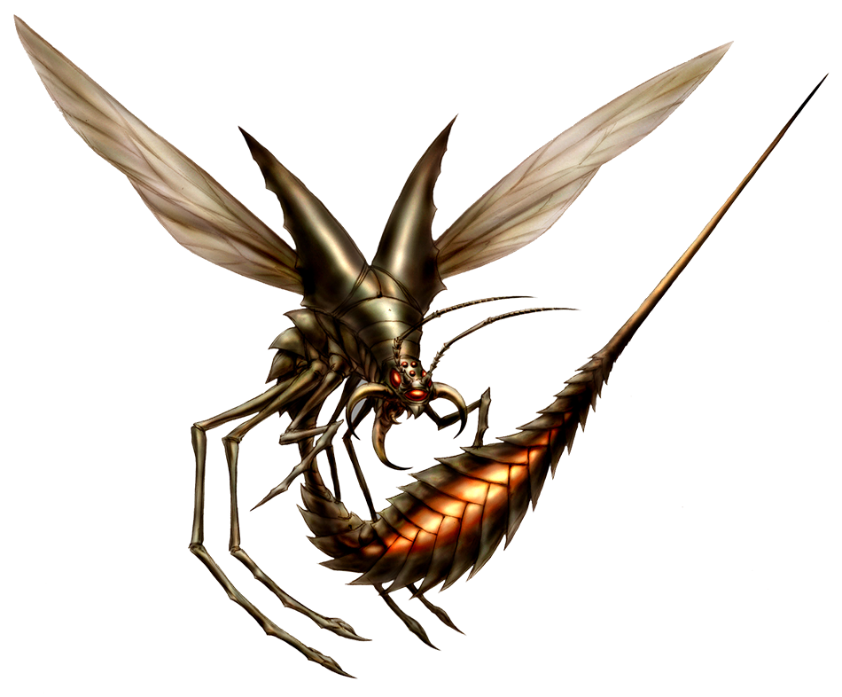

# Stinger

**Level 1 small Beast**

## <mark style="color:green;background-color:blue;">Defense Traits</mark>

<mark style="color:green;">**AC**</mark> 17\
<mark style="color:green;">**HP**</mark> 30\
<mark style="color:green;">**Poise**</mark> 18\
<mark style="color:green;">**Fort**</mark> +3, <mark style="color:green;">**Refl**</mark> +5, <mark style="color:green;">**Will**</mark> +2

## <mark style="color:orange;background-color:red;">Offense Traits (DC 12)</mark>

<mark style="color:red;">**Sting (P)**</mark>  +3 (+Venom)\
2d6+2 (9)

<mark style="color:red;">**Multiattack**</mark> - Special: Can only be made against creatures with a speed of 0 (entangle, stun etc). \
Make 2 sting attacks.

<mark style="color:red;">**Venomous**</mark> - Applied on-hit with sting attack. Once a stinger uses its venom, it cannot use it again for 1 minute.

<mark style="color:red;">**Drone**</mark> - A stinger makes a constant loud buzzing sound as it flies. It can choose to fly around an adjacent creature's head to bother it, taunting it for 1 round (will negates). A stinger gets +2 AC any turn it drones. Cannot use if it cannot fly.

<mark style="color:red;">**Special Attack: Lunge**</mark> - Increase natural reach by 5 ft.

<mark style="color:red;">**Special Attack: Skewer**</mark> - Pierce through a creature, dealing an additional d6 (3) damage and entangling the stinger and the target on hit until the start of the stingers next turn.

## <mark style="color:blue;background-color:purple;">Weaknesses/Deep Lore</mark>

<mark style="color:blue;">**Swat**</mark> - A stinger is also grounded for 1 turn in addition to any other effect from being poise broken. When grounded, a stinger has 13 AC.

## <mark style="color:yellow;background-color:yellow;">Other Traits</mark>

<mark style="color:yellow;">**Ability Scores - Str +2, Dex +2, Lucc -1, Int -3, Wis +1, Cha +0**</mark>

<mark style="color:yellow;">**Speed**</mark> - 30 Fly, 10 land

<mark style="color:yellow;">**Night Vision**</mark>

<mark style="color:yellow;">**Blindsense**</mark> - (Scent 10 ft)

<mark style="color:yellow;">**Feats**</mark> - [Skill Focus (acrobatics)](https://app.gitbook.com/s/vxnMGGHnEtmcEQDFxcK6/general-feats/skill-focus)

<mark style="color:yellow;">**Skills**</mark> - +5 perception, +8 (adv) acrobatics

<figure><figcaption></figcaption></figure>
