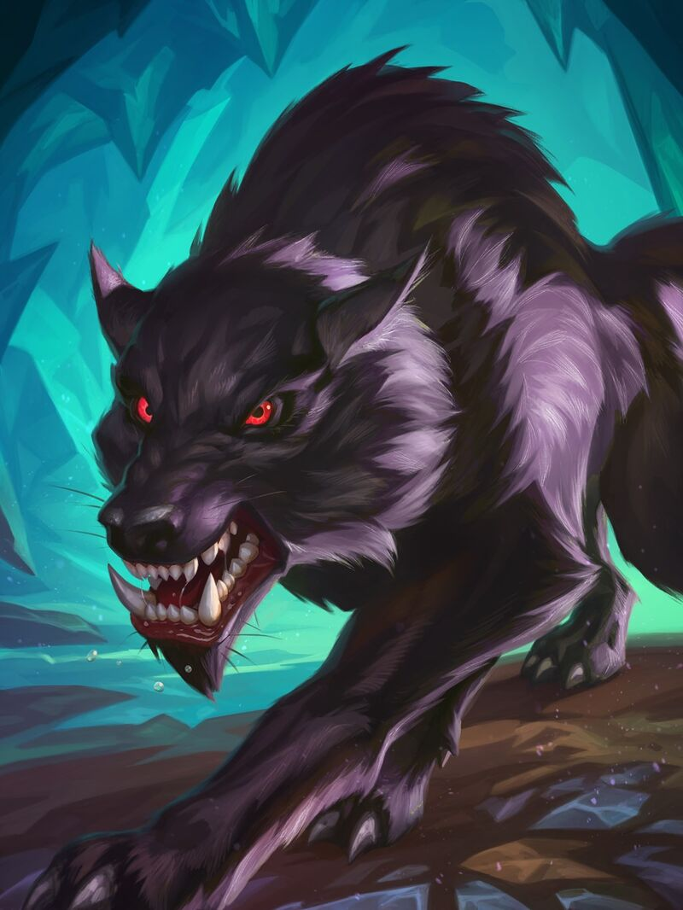

# Wolf

**Level 1 medium Beast**

## <mark style="color:green;background-color:blue;">Defense Traits</mark>

<mark style="color:green;">**AC**</mark> 14\
<mark style="color:green;">**HP**</mark> 30\
<mark style="color:green;">**Poise**</mark> 23\
<mark style="color:green;">**Fort**</mark> +5, <mark style="color:green;">**Refl**</mark> +3, <mark style="color:green;">**Will**</mark> +2

## <mark style="color:orange;background-color:red;">Offense Traits (DC 13)</mark>

<mark style="color:red;">**Bite (P)**</mark>  +3 (+4 topple)\
2d6+2 (9)

<mark style="color:red;">**Pack Attack**</mark> - Gain flanking as long as an ally threatens. Flanking also gives advantage for wolves, in addition to the usual +2 bonus.

<mark style="color:red;">**Howl**</mark> - As a standard action while it threatens an enemy, a wolf can howl to have allies converge on its position. They can move 20 feet closer to it as an instant action \[elusive].

## <mark style="color:blue;background-color:purple;">Weaknesses/Deep Lore</mark>

<mark style="color:blue;">**Lonely Wolf**</mark> - If a wolf cannot sense one of its companions that isn't defeated, it flees.

## <mark style="color:yellow;background-color:yellow;">Other Traits</mark>

<mark style="color:yellow;">**Ability Scores - Str +2, Dex +2, Lucc +0, Int -3, Wis +1, Cha +0**</mark>

<mark style="color:yellow;">**Speed**</mark> - 40 Land\
<mark style="color:yellow;">**Night Vision**</mark>\
<mark style="color:yellow;">**Blindsense**</mark> - Scent 10 ft

<mark style="color:yellow;">**Feats**</mark> - [Escape Route](https://app.gitbook.com/s/vxnMGGHnEtmcEQDFxcK6/teamwork-feats/escape-route)

<mark style="color:yellow;">**Skills**</mark> - +4 perception, +7 stealth

<figure><figcaption>
<a href="https://hearthstone.wiki.gg/wiki/Wolf">Hearthstone Card Art</a>
</figcaption></figure>
