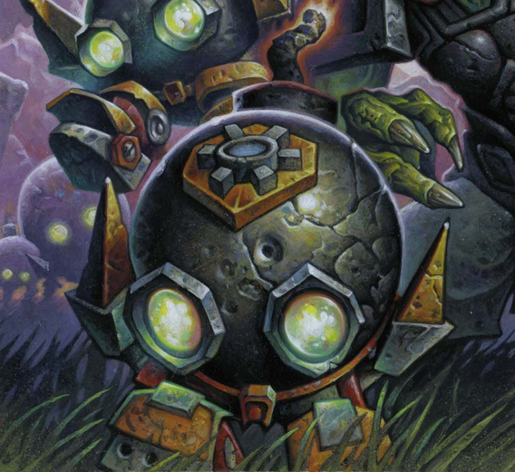

# Boom Bot

**Level 0 Tiny Construct**

## <mark style="color:green;background-color:blue;">Defense Traits</mark>

<mark style="color:green;">**AC**</mark> 12\
<mark style="color:green;">**HP**</mark> 10\
<mark style="color:green;">**Poise**</mark> 15\
<mark style="color:green;">**Fort**</mark> +0, <mark style="color:green;">**Refl**</mark> +4, <mark style="color:green;">**Will**</mark> +0

## <mark style="color:orange;background-color:red;">Offense Traits (DC 12)</mark>

<mark style="color:red;">**Deathrattle**</mark> - Jump at an enemy (15 ft for a typical boom bot). If the boom bot can land inside of a creatures space, it explodes, dealing 3d6 (10) fire damage to them (reflex halves).

A boom bot can trigger this ability automatically as a standard action.

## <mark style="color:blue;background-color:purple;">Weaknesses/Deep Lore</mark>

<mark style="color:blue;">**Disarm**</mark> - With a successful DC 10 engineering check as a standard action, a boom bot can be diffused safely, rendering it unable to explode.

## <mark style="color:yellow;background-color:yellow;">Other Traits</mark>

<mark style="color:yellow;">**Ability Scores - Str +0, Dex +2, Lucc +0, Int -, Wis +0, Cha +0**</mark>

<mark style="color:yellow;">**Skills**</mark> - +2 perception, +4 acrobatics

<figure><figcaption>
<a href="https://hearthstone.wiki.gg/wiki/Boom_Bot">Boom Bot, Hearthstone</a>
</figcaption></figure>
