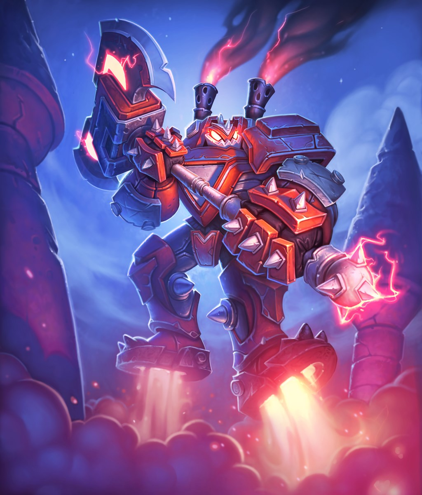

# Boom Reaver

**Level 7 Huge Construct \[boss]**

## <mark style="color:green;background-color:blue;">Defense Traits</mark>

<mark style="color:green;">**AC**</mark> 23\
<mark style="color:green;">**HP**</mark> 135\
<mark style="color:green;">**Poise**</mark> 36 (DRA 1)\
<mark style="color:green;">**Fort**</mark> +12, <mark style="color:green;">**Refl**</mark> +9 (+4 vs acrobatics), <mark style="color:green;">**Will**</mark> +7

<mark style="color:green;">**Resistance**</mark> - Psychic, Mind affecting +4

<mark style="color:green;">**Magnets**</mark> - As a swift action, the Boom Reaver can return its axe to its hand as long as it is within 60 ft. If it is possessed by another creature (reflex negates).

<mark style="color:green;">**Jet Boots**</mark> - Immune to fall damage while not dazed or stunned.

## <mark style="color:orange;background-color:red;">Offense Traits (DC 20)</mark>

<mark style="color:red;">**2h Axe (S)**</mark>  +12 (+4 MI, +4 Shove)\
2d6+3 (10)

<mark style="color:red;">**Multiattack**</mark> - Make 2 axe attacks.

<mark style="color:red;">**Innate Techniques**</mark> - [Sonic Boom (U4)](https://app.gitbook.com/s/2kNIiIcUKxqLFlLgDKSI/martial-techniques/cataclysm/level-1/sonic-boom), [Earth Shatter](https://app.gitbook.com/s/2kNIiIcUKxqLFlLgDKSI/martial-techniques/cataclysm/level-3/earth-shatter), [Lightning Strike (U3)](https://app.gitbook.com/s/2kNIiIcUKxqLFlLgDKSI/magical-techniques/clairvoyance/level-1/lightning-strike)\
1/day - [Crater (U4)](https://app.gitbook.com/s/2kNIiIcUKxqLFlLgDKSI/martial-techniques/cataclysm/level-2/crater), [Fore! (U4)](https://app.gitbook.com/s/2kNIiIcUKxqLFlLgDKSI/martial-techniques/barbarism/level-1/fore)\
Constant - [Shockwave](https://app.gitbook.com/s/2kNIiIcUKxqLFlLgDKSI/martial-techniques/cataclysm/level-3/shockwave)

<mark style="color:red;">**Special Attack: Giga Impact**</mark> - Make a charge attack that deals an additional 4d8 (18) sonic damage. The creature takes poise damage equal to the total damage of the attack. If they are poise broken, they are shoved 20 ft. Before being knocked back, the Boom Reaver can use the second attack in its multiattack.

<mark style="color:red;">**Next Turn Shipping \[companion] \[teleportation]**</mark> - The Boom Reaver has a special rune engraved on one of its hands that gives it direct access to factories used to create contructs. As a free action, as long as it does not already have 2 companions, it can mark a point on the ground for a construct of up to level 3 to teleport to that position at the start of the Boom Reaver's next turn. When the creature appears, all creatures within 10 ft take 20 poise damage. If this poise breaks, knock down.

<mark style="color:red;">**Displacer**</mark> - The Boom Reaver gets a +4 bonus to shove attacks. When it shoves, the target is pushed back an additional 10 ft (actions listed in the Boom Reaver's stat array have already included this +10 ft boost).

<mark style="color:red;">**Powerful Charge**</mark>&#x20;

<mark style="color:red;">**Boss Actions**</mark> -&#x20;

<mark style="color:orange;">Aftershock</mark> - Can only be used in response to a creature being knocked down within reach. On hit, the creature has their speed reduced to zero. The ground underneath them glows. A 5 ft radius around their space explodes after 1 round, launched any creature in the radius 30 ft in a random direction. \
<mark style="color:orange;">Kinetic Reverberation</mark> - When the Boom Reaver takes slash, pierce, crush damage, it can store the kinetic energy from the blow and immediately release back on their attacker if they are within 30 ft. The attacker takes poise damage equal to the damage dealt to the Boom Reaver. If this breaks their poise, they are shoved directly away from the Boom Reaver 20 ft.

## <mark style="color:blue;background-color:purple;">Weaknesses/Deep Lore</mark>

<mark style="color:blue;">**Card Denied**</mark> - While siphoned or anchored, the Boom Reaver loses access to its _next day shipping_ ability. Any in process shipments are still made, however.

<mark style="color:blue;">**Speak with the Manager**</mark> - Boom Reavers are made for the protection of Lyra Corp assets. Complaints related to their services can be communicated directly to the programmer or the manager who assigned the Boom Reaver to the task, with the Boom Reaver serving as a conduit. It will only do this when it is not in combat.

## <mark style="color:yellow;background-color:yellow;">Other Traits</mark>

<mark style="color:yellow;">**Ability Scores - Str +3, Dex +2, Lucc +0, Int +1, Wis +0, Cha +2**</mark>

<mark style="color:yellow;">**Speed**</mark> - 40 land, 30 hover

<mark style="color:yellow;">**Turbo Thrusters**</mark> - The boom reaver can jump as far and as high as its movement speed.

<mark style="color:yellow;">**A Word From my Employer**</mark> - The boom reaver has the capacity to speak to directly to a specified creature it is bound to. That creature can also project its voice through the boom reaver to speak to others remotely.

<mark style="color:yellow;">**Feats**</mark> - [Combat Reflexes](https://app.gitbook.com/s/vxnMGGHnEtmcEQDFxcK6/combat-feats/combat-reflexes), [Sentinel](https://app.gitbook.com/s/vxnMGGHnEtmcEQDFxcK6/combat-feats/combat-reflexes/sentinel), [Skill Focus (Local)](https://app.gitbook.com/s/vxnMGGHnEtmcEQDFxcK6/general-feats/skill-focus), [Maneuver Initiate](https://app.gitbook.com/s/vxnMGGHnEtmcEQDFxcK6/combat-feats/maneuver-initiate)

<mark style="color:yellow;">**Skills**</mark> - +9 perception, +12 athletics, +9 engineering. +9 (adv) local

<figure><figcaption>
Boom Reaver, Hearthstone
</figcaption></figure>
