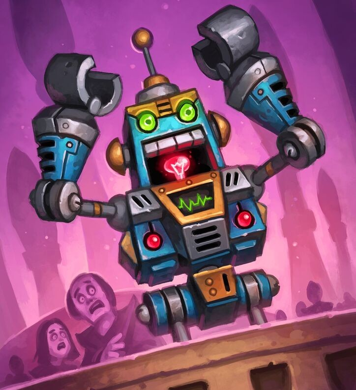

# Hecklebot

**Level 3 Medium Construct**

## <mark style="color:green;background-color:blue;">Defense Traits</mark>

<mark style="color:green;">**AC**</mark> 17\
<mark style="color:green;">**HP**</mark> 56\
<mark style="color:green;">**Poise**</mark> 35 (DRA 2)\
<mark style="color:green;">**Fort**</mark> +5, <mark style="color:green;">**Refl**</mark> +4, <mark style="color:green;">**Will**</mark> +5

<mark style="color:green;">**Immune**</mark> - Taunt

## <mark style="color:orange;background-color:red;">Offense Traits (DC 15)</mark>

<mark style="color:red;">**Clamp (C)**</mark>  +5\
d10+2 (7)

<mark style="color:red;">**Multiattack**</mark> - Make a grapple attack and a clamp attack.

<mark style="color:red;">**Innate Techniques**</mark> - [Boasting Taunt](https://app.gitbook.com/s/2kNIiIcUKxqLFlLgDKSI/martial-techniques/warfare/level-1/boasting-taunt), [Elemental Barrier](https://app.gitbook.com/s/2kNIiIcUKxqLFlLgDKSI/martial-techniques/protector/level-2/elemental-barrier-su), [Kidnap](https://app.gitbook.com/s/2kNIiIcUKxqLFlLgDKSI/martial-techniques/scoundrel/level-1/kidnap), [Stubbed Toe](https://app.gitbook.com/s/2kNIiIcUKxqLFlLgDKSI/magical-techniques/cantrips/stubbed-toe)\
1/day - [Mana Burn](https://app.gitbook.com/s/2kNIiIcUKxqLFlLgDKSI/martial-techniques/arc/level-2/mana-burn-su)\
Constant - [Mana Drain](https://app.gitbook.com/s/2kNIiIcUKxqLFlLgDKSI/martial-techniques/arc/level-1/mana-drain)

<mark style="color:red;">**Mockery \[psychic]**</mark> - Change the flavor of insults to be more painful than goading. Insult a creature within 30 ft to deal 3d8 (13) psychic damage and give them disadvantage on their next attack roll.

<mark style="color:red;">**Rage Bait \[language]**</mark> - If the hecklebot succeeds on a monster lore check against a creature, it has disadvantage on saves against the hecklebot's taunt effects.&#x20;

As a swift action, a hecklebot can throw insults at a creature within 30 feet, taunting them for 1 round (will negates).

## <mark style="color:blue;background-color:purple;">Weaknesses/Deep Lore</mark>

<mark style="color:blue;">**Killing With Kindness**</mark> - When complimented, requiring a swift action, a hecklebot needs to reprogram, typically only expecting rage in response to its harsh words. All taunt effects against it immediately end and it cannot taunt creatures on its next turn. This can only occur once a combat.

## <mark style="color:yellow;background-color:yellow;">Other Traits</mark>

<mark style="color:yellow;">**Ability Scores - Str +2, Dex +1, Lucc +0, Int +3, Wis +0, Cha +0**</mark>

<mark style="color:yellow;">**Feats**</mark> - [Power Pose](https://app.gitbook.com/s/vxnMGGHnEtmcEQDFxcK6/combat-feats/power-pose), [Defensive Training](https://app.gitbook.com/s/vxnMGGHnEtmcEQDFxcK6/combat-feats/defensive-training)

<mark style="color:yellow;">**Skills**</mark> - +5 perception, +8 linguistics, +8 engineering, +10 local, +8 planes

<figure><figcaption>
Hecklebot, Hearthstone
</figcaption></figure>
