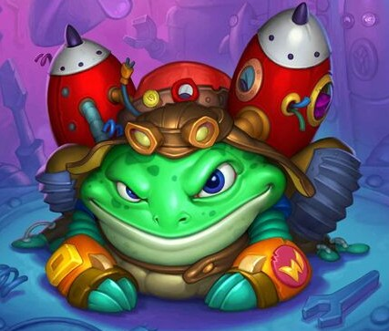

# Turbo Frogg

**Level 5 Large Construct/Beast**

## <mark style="color:green;background-color:blue;">Defense Traits</mark>

<mark style="color:green;">**AC**</mark> 18\
<mark style="color:green;">**HP**</mark> 60\
<mark style="color:green;">**Poise**</mark> 32\
<mark style="color:green;">**Fort**</mark> +7, <mark style="color:green;">**Refl**</mark> +9, <mark style="color:green;">**Will**</mark> +5

<mark style="color:green;">**Graceful**</mark> -&#x20;

## <mark style="color:orange;background-color:red;">Offense Traits (DC 16)</mark>

<mark style="color:red;">**Bite (C)**</mark>  +8\
2d6+3 (10)

<mark style="color:red;">**Tongue (C)**</mark>  +8 (+4 drag/grapple) Has 30 ft of reach during frog's turn.\
d10+3 (8)

<mark style="color:red;">**Multiattack**</mark> - Make a tongue and bite attack

<mark style="color:red;">**Innate Technique**</mark> - Laser Pointer\
1/day - Hot Potato, Plague of Froggs (U2)

<mark style="color:red;">**Special Attack: Electro Whip**</mark> - Electrify a tongue attack. It deals an additional 2d8 (9) zap damage and&#x20;

<mark style="color:red;">**Crash Landing**</mark> - If a turbo frog uses its turbo thrusters ability to jump into a spot where it threatens a creature, it lands with a powerful shockwave. Creatures take 20 poise damage. If this breaks poise, the creature falls prone.

<mark style="color:red;">**Species**</mark> -&#x20;

## <mark style="color:blue;background-color:purple;">Weaknesses/Deep Lore</mark>

<mark style="color:blue;">**Short Circuit**</mark> - Short&#x20;

## <mark style="color:yellow;background-color:yellow;">Other Traits</mark>

<mark style="color:yellow;">**Ability Scores - Str +3, Dex +2, Lucc +1, Int -2, Wis -1, Cha +0**</mark>

<mark style="color:yellow;">**Turbo Thrusters \[recharge] \[elusive]**</mark> - As a swift action, the turbo frog can boost itself, increasing its speed to 120 ft as long as it moves in a straight line. This cannot be used in consecutive rounds. Makes the frog clumsy 1.

<mark style="color:yellow;">**Enhanced Leap**</mark> - Frogs can leap as far and as high as they can move. They can jump as a free action, and take no fall damage when falling after jumping.

<mark style="color:yellow;">**Feats**</mark> -&#x20;

<mark style="color:yellow;">**Skills**</mark> - +7(+4) perception, +9 athletics

<figure><figcaption>
<a href="https://hearthstone.wiki.gg/wiki/Rocket_Hopper">Rocket Hopper, Hearthstone</a>
</figcaption></figure>
