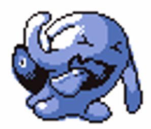

# Wobbler

**Level 1 Cryptid**

## <mark style="color:green;background-color:blue;">Defense Traits</mark>

<mark style="color:green;">**AC**</mark> 12\
<mark style="color:green;">**HP**</mark> 38  (Regen 5 Necrotic)\
<mark style="color:green;">**Poise**</mark> 32\
<mark style="color:green;">**Fort**</mark> +4, <mark style="color:green;">**Refl**</mark> +1, <mark style="color:green;">**Will**</mark> +3

<mark style="color:green;">**Safeguard**</mark> - A wobbler has advantage on any saving throw against an effect that deals no damage.

## <mark style="color:orange;background-color:red;">Offense Traits (DC 13)</mark>

<mark style="color:red;">**Encore!**</mark> - As a standard action a wobbler can clap and cheer at a creature within 60 ft who has taken a standard action in combat. That creature is forced to repeat whatever the last standard action then performed on their next turn (will reduces to repeat swift action).

If the creature is unable to perform its last standard action, such as if the ability they used last is a recharge ability, they are effectively dazed.&#x20;

<mark style="color:red;">**Trapped (Su)**</mark> - In order to leave a space within 5 feet of a wobbler, a creature must spend 15 ft of movement to push past its psychic field.

<mark style="color:red;">**Counter (Su)**</mark> - As a standard action, a wobbler can ready itself for an incoming attack. When it takes damage, it can choose to rebound this damage back at its attack and multiply it 1.5x. This can happen no matter the distance between them or the method of damage.

Indirect methods of damage, such as fall damage, or being lit ablaze, do not proc counter.

## <mark style="color:blue;background-color:purple;">Weaknesses/Deep Lore</mark>

<mark style="color:blue;">**Staring(?) Contest**</mark> - Wobblers have incredible endurance. They test it against one another constantly in what basically ends up being a staring contest. But instead of keeping their eyes open, they simply try to remain completely still. The first to break posture loses. They typically perform these contests in areas with hazards to increase the speed of the contest, such as in rivers, or unstable terrain.

In game terms, creatures must roll a fortitude save. Subtract 20 from this result. If he number you get is greater that 0, subtract that number from your poise. First to get poise broken loses.\
Every fortitude save receives a cumulative -1 penalty from the last.

## <mark style="color:yellow;background-color:yellow;">Other Traits</mark>

<mark style="color:yellow;">**Ability Scores - Str +3, Dex +0, Lucc +0, Int -2, Wis +0, Cha +0**</mark>

<mark style="color:yellow;">**Speed**</mark> - 15

<mark style="color:yellow;">**Feats**</mark> - [Toughness](https://app.gitbook.com/s/vxnMGGHnEtmcEQDFxcK6/combat-feats/toughness)

<mark style="color:yellow;">**Skills**</mark> - +3 perception, +6 athletics

<figure><figcaption></figcaption></figure>
