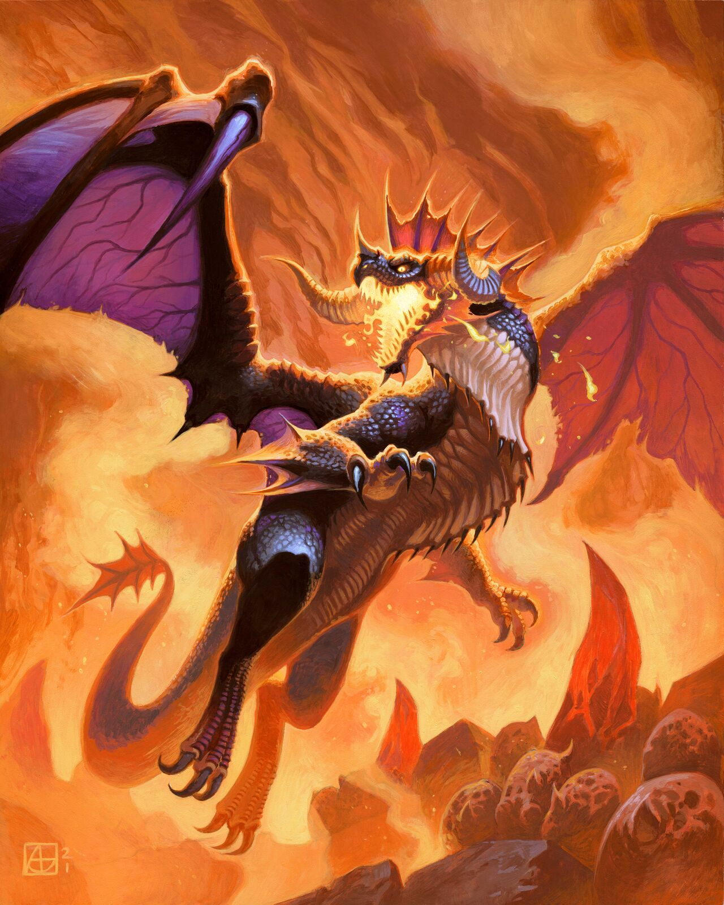

# Broodmother

**Level 9 Huge Dragon**

## <mark style="color:green;background-color:blue;">Defense Traits</mark>

<mark style="color:green;">**AC**</mark> 25\
<mark style="color:green;">**HP**</mark> 92\
<mark style="color:green;">**Poise**</mark> 34 (DRA 2)\
<mark style="color:green;">**Fort**</mark> +12, <mark style="color:green;">**Refl**</mark> +10, <mark style="color:green;">**Will**</mark> +12

<mark style="color:green;">**Immune**</mark> - fire

<mark style="color:green;">**Under My Wing**</mark> - Whelps within reach of the broodmother get +3 AC.

<mark style="color:green;">**Steady Flight**</mark> - Dragons cap at clumsy 2 while flying. They can take flight as a free action

<mark style="color:green;">**Stomper**</mark> - Dragons do not provoke AoOs from leaving a threatened square against creatures that are knocked down.

## <mark style="color:orange;background-color:red;">Offense Traits (DC 21)</mark>

<mark style="color:red;">**Bite (P)**</mark>  +12\
3d8+3 (16)

<mark style="color:red;">**Claw (S)**</mark>  +12 (reach 10 ft)\
2d6+3 (10)

<mark style="color:red;">**Multiattack**</mark> - Make a claw and a bite attack.&#x20;

<mark style="color:red;">**Innate Techniques**</mark> - [Avenging Wrath](https://app.gitbook.com/s/2kNIiIcUKxqLFlLgDKSI/martial-techniques/protector/level-1/avenging-wrath), [Flash Forward](https://app.gitbook.com/s/2kNIiIcUKxqLFlLgDKSI/martial-techniques/pupper/level-4/flash-forward-su), [Fire Blast](https://app.gitbook.com/s/2kNIiIcUKxqLFlLgDKSI/magical-techniques/pyromancy/level-3/fire-blast), [Earth Shatter](https://app.gitbook.com/s/2kNIiIcUKxqLFlLgDKSI/martial-techniques/cataclysm/level-3/earth-shatter)\
1/day - [Rainbow Beam](https://app.gitbook.com/s/2kNIiIcUKxqLFlLgDKSI/magical-techniques/prismancy/level-5/rainbow-beam)

<mark style="color:red;">**Brood \[companion] \[fire]**</mark> - A broodmother is capable of creating magical flaming eggs that hatch into **whelps** and assist her in battle. By default she always has 2 fiery flying friends around her. When a whelp is defeated, it explodes in fire in a 10 ft radius, dealing 4d6 (14) fire dmg (reflex halves).

Whelps share all the brood mother's teamwork feats.

As a free action once per turn, she can spit out 2 flaming eggs at any position within 30 ft of her. These eggs have 10 hp, fire resistance and automatically get hit by any attacks/fail any saves. If at the start of the broodmother's turn she does not have 2 whelps on her side, enough eggs hatch to make 2.

<mark style="color:red;">**Breath Weapon \[recharge] \[fire]**</mark> - 10d6 (35) fire and sets ablaze (reflex halves and negates ablaze) 300 ft line, 15 ft wide

In order to use this breath weapon, the broodmother must first take a deep breath on a previous turn (free action). It cannot take a deep breath on the same turn it uses its breath weapon.

<mark style="color:red;">**Tail Swipe**</mark> - As a swift action while grounded, a dragon can make a quick turnaround and swipe at foes it threatens with its tail. Creatures take (10+lvl) poise damage (reflex halves). Poise broken creatures are knocked down.

<mark style="color:red;">**Wing Buffet**</mark> - As an immediate action when taking flight or landing, a dragon can flap its wings rapidly to whip up a whirlwind. Creatures within 20 ft are knocked down (fort negates). A creature can choose to forgo its save, automatically getting knocked down, to make an AoO.

## <mark style="color:blue;background-color:purple;">Weaknesses/Deep Lore</mark>

<mark style="color:blue;">**Nesting**</mark> - Brood mothers are rarely seen with their actual children nearby. Due to their propensity to generate lots of offspring, they are often hunted to have their eggs sold off to rich foodies and exotic pet owners. As such, they nest deep within volcanic caverns, usually requiring swimming through lava to reach in the first place. Markets for such eggs pay 1,000g for each one.

<mark style="color:blue;">**Protect**</mark> - A creature that steals or threatens one of her eggs/children taunts the broodmother until her spawn are relinquished. She is immediately and persistently under the effect of [Inferno Sphere](https://app.gitbook.com/s/2kNIiIcUKxqLFlLgDKSI/magical-techniques/pyromancy/level-5/inferno-sphere).

She gets advantage on all attacks against them, and the creature has disadvantage on any saving throws made against the broodmother's abilities.

## <mark style="color:yellow;background-color:yellow;">Other Traits</mark>

<mark style="color:yellow;">**Ability Scores - Str +3, Dex +1, Lucc +0, Int +0, Wis +1, Cha +3**</mark>

<mark style="color:yellow;">**Dragon Senses**</mark> - Echolocation (30 ft), scent (10 ft), Darkvision

<mark style="color:yellow;">**Mother's Instinct**</mark> - A broodmother can tell when its nest is disturbed, no matter the distance. A broodmother can also tell whether or not an egg or a whelp is their spawn.

<mark style="color:yellow;">**Speed**</mark> - 40, 60 fly

<mark style="color:yellow;">**Overland Flight**</mark> - When allowed to fly long distances high in the sky, a dragon can fly 600 miles a day, or 1000 if it fatigues itself and never stops to rest. It can continue moving this fast for consecutive days by becoming drained 1 each day it does.

<mark style="color:yellow;">**Feats**</mark> - [Escape Route](https://app.gitbook.com/s/vxnMGGHnEtmcEQDFxcK6/teamwork-feats/escape-route), [Gang Up](https://app.gitbook.com/s/vxnMGGHnEtmcEQDFxcK6/teamwork-feats/gang-up), [Pack Tactics](https://app.gitbook.com/s/vxnMGGHnEtmcEQDFxcK6/teamwork-feats/pack-tactics), [As One](https://app.gitbook.com/s/vxnMGGHnEtmcEQDFxcK6/teamwork-feats/as-one), [Combat Reflexes](https://app.gitbook.com/s/vxnMGGHnEtmcEQDFxcK6/combat-feats/combat-reflexes), [Sentinel](https://app.gitbook.com/s/vxnMGGHnEtmcEQDFxcK6/combat-feats/combat-reflexes/sentinel)

<mark style="color:yellow;">**Skills**</mark> - +12(+4) perception, +12 insight, +12 medicine, +11 arcana, +11 local, +14 athletics

<figure><figcaption>
<a href="https://hearthstone.wiki.gg/wiki/Raid_Boss_Onyxia">Raid Boss Onyxia</a>, Hearthstone
</figcaption></figure>
