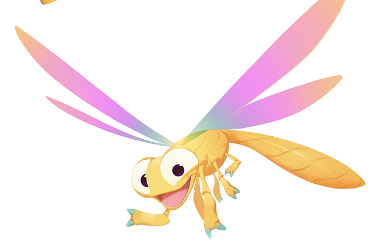

# Dragonfly

**Level 1 Tiny Dragon/Fey**

## <mark style="color:green;background-color:blue;">Defense Traits</mark>

<mark style="color:green;">**AC**</mark> 15\
<mark style="color:green;">**HP**</mark> 26\
<mark style="color:green;">**Poise**</mark> 19\
<mark style="color:green;">**Fort**</mark> -1, <mark style="color:green;">**Refl**</mark> +7 (evasion), <mark style="color:green;">**Will**</mark> +1

<mark style="color:green;">**Evasion**</mark> - Take half damage from reflex saves. If you pass your reflex save, instead negate the effect entirely.

<mark style="color:green;">**Perfect Flight**</mark> - Dragonflies do not automatically become clumsy 1 on hit while flying. They can take flight as a free action

<mark style="color:green;">**Scaly Sigils**</mark> - As a standard action, give an adjacent allied draconic creature a divine shield and become drained 1. This cannot be used on dragonflies. This divine shield lasts until lost or until the dragonfly gets more than 30 ft away from the dragon it used it on.

## <mark style="color:orange;background-color:red;">Offense Traits (DC 13)</mark>

<mark style="color:red;">**Elemental Blast (???)**</mark>  +5  (30 ft)\
2d6+4 (11)

<mark style="color:red;">**Innate Techniques**</mark> - [Noble Sacrifice](https://app.gitbook.com/s/2kNIiIcUKxqLFlLgDKSI/martial-techniques/protector/level-1/noble-sacrifice)\
1/day - [Sanctuary](https://app.gitbook.com/s/2kNIiIcUKxqLFlLgDKSI/martial-techniques/protector/level-1/sanctuary-su), [Bouncing Blast](https://app.gitbook.com/s/2kNIiIcUKxqLFlLgDKSI/magical-techniques/pyromancy/level-1/bouncing-blast)

<mark style="color:red;">**Elemental Blast**</mark> - Functions as the bender feature of the same name. The damage type is different from dragonfly to dragonfly. It matches the damage type of the breath weapon of last dragon it used its scaley sigil feature on. If the dragons breath weapon is weird, this defaults to fire.

## <mark style="color:blue;background-color:purple;">Weaknesses/Deep Lore</mark>

<mark style="color:blue;">**Tasty Snack**</mark> - A dragonfly presented with another flying bug it could reasonably eat, such as a butterfly or a locust, it can be distracted by its tantalizing aroma. If a creature lets such a creature loose in the middle of a battle, a dragonfly must roll a DC 13 will save or spend its entire next turn flying to catch it, ending its turn at the space it catches its prey.

## <mark style="color:yellow;background-color:yellow;">Other Traits</mark>

<mark style="color:yellow;">**Ability Scores - Str -2, Dex +4, Lucc +1, Int -2, Wis +0, Cha +1**</mark>

<mark style="color:yellow;">**Treasure Sense**</mark> - Dragonflies possess blind sense (scent, 5ft). It is only usable on detecting the value of objects.  They are automatically are able to discern the value of something with a quick sniff. Particularly valuable things such as rare magic items may have extremely powerful and wide scents as strongly scented creatures and objects normally would.

<mark style="color:yellow;">**Attached**</mark> - Whenever a dragonfly uses its scaly sigils feature, that creature immediately gains the benefits of the dragonfly's teamwork feats, as though they had practiced together.

<mark style="color:yellow;">**Speed**</mark> - 50 hover. Can be used to fly during the dragonfly's turn.

<mark style="color:yellow;">**Feats**</mark> - [As One](https://app.gitbook.com/s/vxnMGGHnEtmcEQDFxcK6/teamwork-feats/as-one), [Bonded Mind](https://app.gitbook.com/s/vxnMGGHnEtmcEQDFxcK6/teamwork-feats/bonded-mind-su)

<mark style="color:yellow;">**Skills**</mark> - +3 perception, +7 acrobatics, +7 stealth

<figure><figcaption>
Sparx, from concept art for the Spyro Reignited Trilogy
</figcaption></figure>
