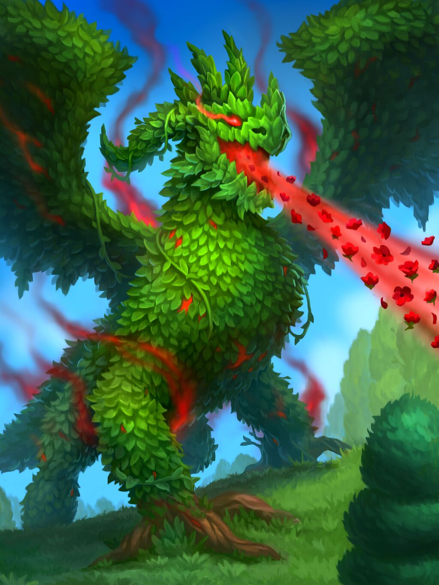
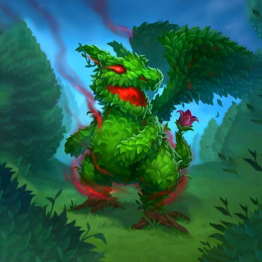

# Shrubbagazzor

**Level 3 Large Dragon/Plant**

## <mark style="color:green;background-color:blue;">Defense Traits</mark>

<mark style="color:green;">**AC**</mark> 19\
<mark style="color:green;">**HP**</mark> 44\
<mark style="color:green;">**Poise**</mark> 28 (DRA 2)\
<mark style="color:green;">**Fort**</mark> +8, <mark style="color:green;">**Refl**</mark> +3, <mark style="color:green;">**Will**</mark> +10 (adv vs fear)

<mark style="color:green;">**Resistance**</mark> - Poison

<mark style="color:green;">**Rooted \[healing]**</mark> - As a swift action while groundborne, a shrubbagazzor can cause roots to shoot out of its legs and burrow into the ground, allowing it to take the total defense action and reduce its speed to 0 this turn.

If it remains rooted (aka it doesn't move or isn't forcefully moved). It also regains 10 hp at the start of its next turn. This healing effect can only occur once a minute.

<mark style="color:green;">**Steady Flight**</mark> - Dragons cap at clumsy 2 while flying. They can take flight as a free action

<mark style="color:green;">**Stomper**</mark> - Dragons do not provoke AoOs from leaving a threatened square against creatures that are knocked down.

## <mark style="color:orange;background-color:red;">Offense Traits (DC 15)</mark>

<mark style="color:red;">**Bite (P)**</mark>  +6 (+jitters, +4 MI, +4 dirty trick)\
2d8+3 (12)

<mark style="color:red;">**Claw? (C)**</mark>  +6 (+4 MI)\
2d6+3 (10)

<mark style="color:red;">**Multiattack**</mark> - Make a claw and a bite attack.&#x20;

<mark style="color:red;">**Innate Techniques (CL 5)**</mark> - [Nourish](https://app.gitbook.com/s/2kNIiIcUKxqLFlLgDKSI/magical-techniques/mother-earth/level-2/nourish), [Tree Shape](https://app.gitbook.com/s/2kNIiIcUKxqLFlLgDKSI/magical-techniques/mother-earth/level-1/tree-shape), [Pack Attack](https://app.gitbook.com/s/2kNIiIcUKxqLFlLgDKSI/martial-techniques/beastmode/level-1/pack-attack)\
1/day - [Wall of Sheep](https://app.gitbook.com/s/2kNIiIcUKxqLFlLgDKSI/magical-techniques/mother-earth/level-2/wall-of-sheep), [Fetch](https://app.gitbook.com/s/2kNIiIcUKxqLFlLgDKSI/magical-techniques/mother-earth/level-2/fetch), [Ants in your Pants](https://app.gitbook.com/s/2kNIiIcUKxqLFlLgDKSI/magical-techniques/mother-earth/level-2/ants-in-your-pants), [Power of the Sun](https://app.gitbook.com/s/2kNIiIcUKxqLFlLgDKSI/magical-techniques/mother-earth/level-2/power-of-the-sun), [Inheritor's Smite](https://app.gitbook.com/s/2kNIiIcUKxqLFlLgDKSI/martial-techniques/pupper/level-2/inheritors-smite-su)\
Constant - [Courage](https://app.gitbook.com/s/2kNIiIcUKxqLFlLgDKSI/martial-techniques/pupper/level-1/courage)

<mark style="color:red;">**New Life \[companion] \[recharge]**</mark> - If a shrubbagazor casts a Mother Earth spell on a space where there is vegetation growing, it also causes a [whelp](whelp.md)(agazzor) to grow from it, unless it has already animated 2 of them. It has the plant type, poison resistance and the shrubbagazing ability, but no breath weapon.

<mark style="color:red;">**Breath Weapon \[recharge] \[healing]**</mark> - Against plant creatures, the rose breath heals 6d6 (21) hp. Against non plants it fascinates for 1 round (will negates). Creatures with scent have disadvantage on this save. 40 ft cone

To recharge this effect, a shrubbagazzor must plant itself into the ground and wait for 1 minute.

<mark style="color:red;">**Jitters**</mark> - The fragrant breath of a shrubbagazzor is a powerful energizer with an equally powerful crash. On hit on a bite attack, a creature gains +10 speed on their next turn, but become fatigued immediately after. A creature can only be affect by this once each day.

<mark style="color:red;">**Tail Swipe**</mark> - As a swift action while grounded, a dragon can make a quick turnaround and swipe at foes it threatens with its tail. Creatures take (10+lvl) poise damage (reflex halves). Poise broken creatures are knocked down.

<mark style="color:red;">**Wing Buffet**</mark> - As an immediate action when taking flight or landing, a dragon can flap its wings rapidly to whip up a whirlwind. Creatures within 20 ft are knocked down (fort negates). A creature can choose to forgo its save, automatically getting knocked down, to make an AoO.

## <mark style="color:blue;background-color:purple;">Weaknesses/Deep Lore</mark>

<mark style="color:blue;">**Stop and Smell the Flowers**</mark> - While in tree shape, a shrubbagazor can have flowery vines growing along its trunk and branches. Creatures with scent always get a perception check to notice something odd about the tree.

If they fail the perception check, they are affected as per the Jitters ability.

## <mark style="color:yellow;background-color:yellow;">Other Traits</mark>

<mark style="color:yellow;">**Ability Scores - Str +3, Dex +0, Lucc +0, Int +0, Wis +3, Cha +2**</mark>

<mark style="color:yellow;">**Dragon Senses**</mark> - Echolocation (30 ft), scent (10 ft), Darkvision

<mark style="color:yellow;">**Shrubbagazing**</mark> - A shrubbagazor can see through greenery like shrubs, leaves and whatnot as though they were transparent. It also gives this ability to whelps it summons.

<mark style="color:yellow;">**Earth Mother's Favor**</mark> - A shrubbagazor has [T3 earth mother favor](https://app.gitbook.com/s/qFzTamwcoNEgFoEbLz7c/gods/earthly-deities/mother-earth).

<mark style="color:yellow;">**Speed**</mark> - 35, 35 fly

<mark style="color:yellow;">**Overland Flight**</mark> - When allowed to fly long distances high in the sky, a dragon can fly 600 miles a day, or 1000 if it fatigues itself. It can continue moving this fast for consecutive days by becoming drained 1 each day it does.

<mark style="color:yellow;">**Feats**</mark> - [Perfect Positioning](https://app.gitbook.com/s/vxnMGGHnEtmcEQDFxcK6/teamwork-feats/perfect-positioning), [Divine Interference](https://app.gitbook.com/s/vxnMGGHnEtmcEQDFxcK6/combat-feats/divine-interference), [Maneuver Initiate](https://app.gitbook.com/s/vxnMGGHnEtmcEQDFxcK6/combat-feats/maneuver-initiate), [Maneuver Master](https://app.gitbook.com/s/vxnMGGHnEtmcEQDFxcK6/combat-feats/maneuver-initiate/maneuver-master)

<mark style="color:yellow;">**Skills**</mark> - +8(+4) perception, +10 insight, +7 nature, +8 athletics

<figure><figcaption>
<a href="https://hearthstone.wiki.gg/wiki/Topior_the_Shrubbagazzor">Hearthstone card art, Topior</a>
</figcaption></figure>

<figure><figcaption>
<a href="https://hearthstone.wiki.gg/wiki/Whelpagazzor">Associated token creature "Whelpagazzor"</a>
</figcaption></figure>
