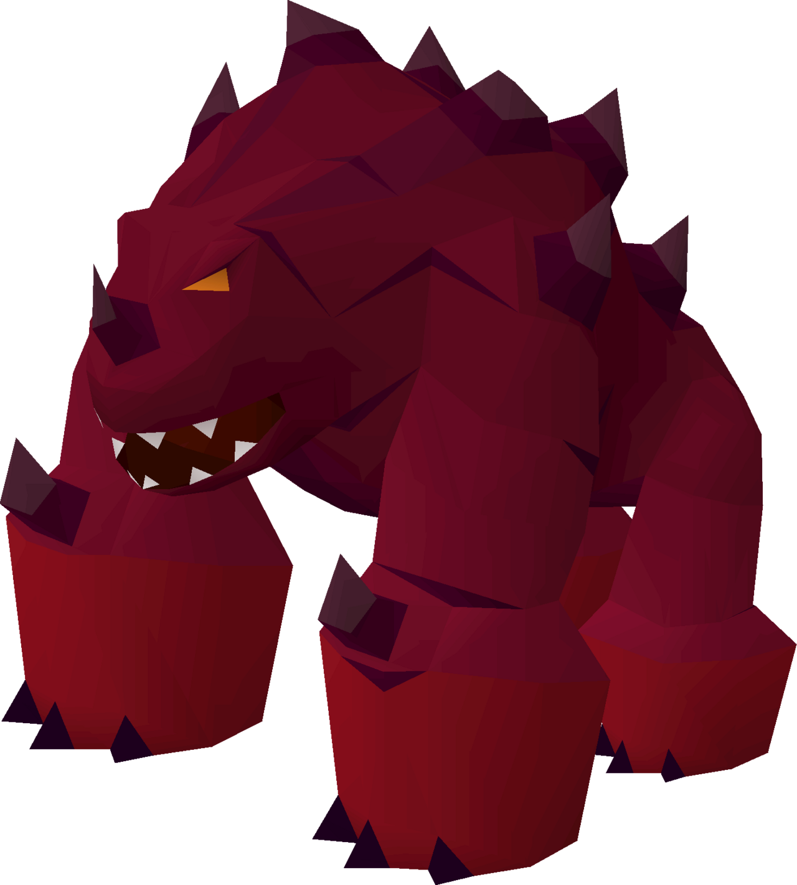

# Jad

**Level 10 Massive Elemental/Beast \[boss]**

## <mark style="color:green;background-color:blue;">Defense Traits</mark>

<mark style="color:green;">**AC**</mark> 24\
<mark style="color:green;">**HP**</mark> 200\
<mark style="color:green;">**Poise**</mark> 35\
<mark style="color:green;">**Fort**</mark> +15, <mark style="color:green;">**Refl**</mark> +10, <mark style="color:green;">**Will**</mark> +12

<mark style="color:green;">**Resistance**</mark> - Fire, +4 Earth

<mark style="color:green;">**Amorphous**</mark> - +15

<mark style="color:green;">**Massive**</mark> - Jad's movement is \[elusive] against creatures that are medium or smaller.

<mark style="color:green;">**Melt**</mark> - Whenever Jad is entombed, frosty, wet, entangled or something similar, it can spend an immediate action to automatically melt any solid material that contains it, removing the condition. If the effect is intangible magic, attempt to [dispel](https://app.gitbook.com/s/2kNIiIcUKxqLFlLgDKSI/magical-techniques/wildcard/level-2/dispel-magic) it, with a total bonus of +15.

If Jad starts its turn grappled, it deals 10 fire damage to all grappling creatures as a free action.

<mark style="color:green;">**Recovery**</mark> - At the start of a Jad's turn, if it is still suffering from an effect from status that affected it last turn, it gets a new save against the effect with advantage.

## <mark style="color:orange;background-color:red;">Offense Traits (DC 23)</mark>

<mark style="color:red;">**Bite (P)**</mark>  +15 (+overwhelming force)\
2d20+5 (no average C:<)

<mark style="color:red;">**Innate Techniques**</mark> -&#x20;

<mark style="color:red;">**Here Comes Jad!**</mark> - Jad falls from the ceiling of the battlefield and crashed into the center of the arena. All creatures inside are instantly set to 1 poise.

<mark style="color:red;">**Overwhelming Force**</mark> - Creatures hit Jad's bite are dealt an equal amount of poise damage. If this poise breaks, the creature is tossed 60 feet directly away from him.

<mark style="color:red;">**Fire Storm \[fire] \[persistent]**</mark> - Jad causes many pillars of flame to appear around the battlefield, functioning as the [Pillar of Flame](https://app.gitbook.com/s/2kNIiIcUKxqLFlLgDKSI/magical-techniques/pyromancy/level-1/pillar-of-flame) technique with the following changes. It appears underneath each enemy in combat, regardless of distance. They do not require concentration and they persist until Jad is defeated. They deal 2d20 damage (reflex halves).

<mark style="color:red;">**Boss Actions**</mark> - Usable at the end of an enemy's turn any number of times a round. Roll randomly (d4) to see which one.

<mark style="color:orange;">Crush \[earth]</mark> - Cause a stalactite to crack on the ceiling. At the end of the creature's next turn, a huge (size category, as if it were a huge creature) falls down upon them, dealing 2d20 crush damage. Creatures within 20 ft of the impact zone (except Jad) take 2d20 poise damage, knocking down any that are poise broken.\
This effect also leaves behind a stalactite that alters the terrain, providing cover and a place to get high ground, and a place to escape the lava if it rises high enough.\
<mark style="color:orange;">Time's Ticking \[fire]</mark> - Launch a fireblast that slowly moves towards the creature that just went. At the end of the creatures next turn, it explodes in their space, dealing 2d20 fire damage in a 20 ft AoE (reflex halves).\
<mark style="color:orange;">Volcanic Surge \[fire]</mark> - The lava surrounding the battlefield closes in, covering the outer 10 ft of the battlefield. A 30 ft line in the ground extending from this outer edge cracks and fills with lava. Any creature who is now affected by the lava.\
<mark style="color:orange;">Earthquake \[earth]</mark> - All enemies take 2d20 poise damage, knocking down those who are poise broken.

## <mark style="color:blue;background-color:purple;">Weaknesses/Deep Lore</mark>

<mark style="color:blue;">**Wet Weakness**</mark> - Takes a -4 penalty on saves against effects with the \[water] tag. Any attacks with the \[water] tag have advantage against this creature.

<mark style="color:blue;">**Slow and Steady**</mark> - Cannot take the dash or charge action

<mark style="color:blue;">**Clumsy Titan**</mark> - Jad cannot make attacks of opportunity

<mark style="color:blue;">**F**</mark>~~<mark style="color:blue;">**ocused**</mark> - Jad will prefer not to target creatures with total cover/hiding creatures~~

## <mark style="color:yellow;background-color:yellow;">Other Traits</mark>

<mark style="color:yellow;">**Ability Scores - Str +5, Dex +0, Lucc +0, Int -2, Wis +0, Cha +0**</mark>

<mark style="color:yellow;">**Speed**</mark> - 40

<mark style="color:yellow;">**Blindsense**</mark> - Tremorsense 300 ft

<mark style="color:yellow;">**Feats**</mark> - [SF Perception](https://app.gitbook.com/s/vxnMGGHnEtmcEQDFxcK6/general-feats/skill-focus), [SF Athletics](https://app.gitbook.com/s/vxnMGGHnEtmcEQDFxcK6/general-feats/skill-focus)

<mark style="color:yellow;">**Skills**</mark> - +16 (adv, +4) perception, +21 (adv) athletics

<figure><figcaption>
<a href="https://oldschool.runescape.wiki/w/TzTok-Jad">TzTok-Jad, Oldschool Runescape</a>
</figcaption></figure>
