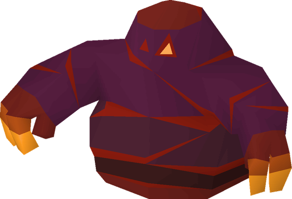

# Blob

**Level 2 Medium Elemental/Ooze**

## <mark style="color:green;background-color:blue;">Defense Traits</mark>

<mark style="color:green;">**AC**</mark> 15\
<mark style="color:green;">**HP**</mark> 30\
<mark style="color:green;">**Poise**</mark> 20\
<mark style="color:green;">**Fort**</mark> +7, <mark style="color:green;">**Refl**</mark> +1, <mark style="color:green;">**Will**</mark> +2

<mark style="color:green;">**Resistance**</mark> - Fire, Crush

## <mark style="color:orange;background-color:red;">Offense Traits (DC 14)</mark>

<mark style="color:red;">**Unarmed (C)**</mark>  +5\
d10+3 (8)

<mark style="color:red;">**Super Hot (Su) \[fire]**</mark> - Whenever a creature damages a blob, the blob can spend an immediate action to set them ablaze (reflex negates).

<mark style="color:red;">**Split Up**</mark> - When a blob is defeated, it splits into 2 lesser copies of itself. The copies have half the blob's hp, 10 AC and do not have its _super hot_ quality. The mini blobs are always considered minions.

## <mark style="color:blue;background-color:purple;">Weaknesses/Deep Lore</mark>

<mark style="color:blue;">**Wet Weakness**</mark> - Takes a -4 penalty on saves against effects with the \[water] tag. Any attacks with the \[water] tag have advantage against this creature.

<mark style="color:blue;">**Slow and Steady**</mark> - Cannot take the dash or charge action

## <mark style="color:yellow;background-color:yellow;">Other Traits</mark>

<mark style="color:yellow;">**Ability Scores - Str +3, Dex -1, Lucc +0, Int -2, Wis +0, Cha +0**</mark>

<mark style="color:yellow;">**Lava Walker**</mark> - A blob can move along the surface of lava, even if it is liquid, without harm to itself.

<mark style="color:yellow;">**Feats**</mark> - [Pack Tactics](https://app.gitbook.com/s/vxnMGGHnEtmcEQDFxcK6/teamwork-feats/pack-tactics)

<mark style="color:yellow;">**Skills**</mark> - +4 perception

<figure><figcaption>
<a href="https://oldschool.runescape.wiki/w/Tz-Kek">Tz-Kek, Oldschool Runescape</a>
</figcaption></figure>
