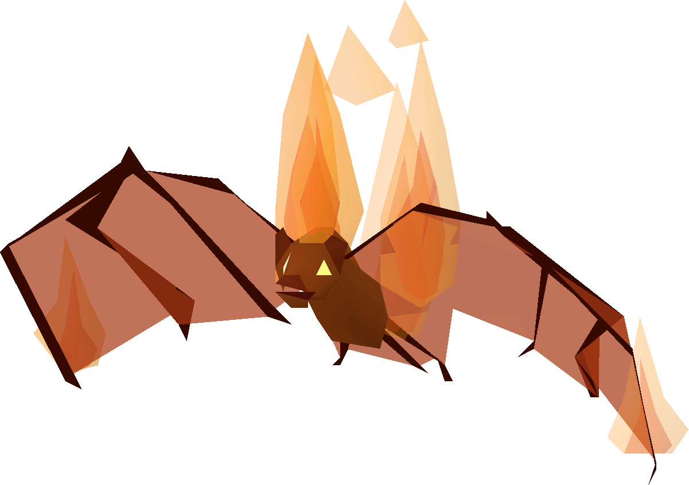

# Fire Bat

**Level 1 Tiny Elemental/Beast**

## <mark style="color:green;background-color:blue;">Defense Traits</mark>

<mark style="color:green;">**AC**</mark> 13\
<mark style="color:green;">**HP**</mark> 20\
<mark style="color:green;">**Poise**</mark> 15\
<mark style="color:green;">**Fort**</mark> +0, <mark style="color:green;">**Refl**</mark> +6, <mark style="color:green;">**Will**</mark> +1

<mark style="color:green;">**Resistance**</mark> - Fire, Pierce

<mark style="color:green;">**Flyby Attack**</mark> - Fire bats have \[elusive] movement against any creatures they attack for the rest of their turn.

## <mark style="color:orange;background-color:red;">Offense Traits (DC 13)</mark>

<mark style="color:red;">**Bite (P)**</mark>  +6 +mana drain\
d6+3 (6)

<mark style="color:red;">**Mana Drain (Su)**</mark> - Drains 2 mana on hit or 1 on a graze.

## <mark style="color:blue;background-color:purple;">Weaknesses/Deep Lore</mark>

<mark style="color:blue;">**Wet Weakness**</mark> - Takes a -4 penalty on saves against effects with the \[water] tag. Any attacks with the \[water] tag have advantage against this creature.

<mark style="color:blue;">**Slow and Steady**</mark> - Cannot take the dash or charge action

## <mark style="color:yellow;background-color:yellow;">Other Traits</mark>

<mark style="color:yellow;">**Ability Scores - Str -1, Dex +3, Lucc +0, Int -2, Wis +0, Cha +0**</mark>

<mark style="color:yellow;">**Speed**</mark> - 30 hover

<mark style="color:yellow;">**Feats**</mark> - [Butterfly Sting](https://app.gitbook.com/s/vxnMGGHnEtmcEQDFxcK6/combat-feats/butterfly-sting)

<mark style="color:yellow;">**Skills**</mark> - +3 perception

<figure><figcaption>
<a href="https://oldschool.runescape.wiki/w/Tz-Kih">Tz-Kih, Oldschool Runescape</a>
</figcaption></figure>
