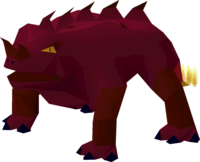

# Primordial

**Level 5 Huge Elemental/Beast**

## <mark style="color:green;background-color:blue;">Defense Traits</mark>

<mark style="color:green;">**AC**</mark> 16\
<mark style="color:green;">**HP**</mark> 50\
<mark style="color:green;">**Poise**</mark> 20\
<mark style="color:green;">**Fort**</mark> +7, <mark style="color:green;">**Refl**</mark> +1, <mark style="color:green;">**Will**</mark> +2

<mark style="color:green;">**Resistance**</mark> - Fire

## <mark style="color:orange;background-color:red;">Offense Traits (DC 17)</mark>

<mark style="color:red;">**Firebending (C)**</mark>  +8 (60 ft, +2 Bullseye)\
5d6+3 (20)

<mark style="color:red;">**Innate Techniques**</mark> - [Backfire](https://app.gitbook.com/s/2kNIiIcUKxqLFlLgDKSI/magical-techniques/pyromancy/level-3/backfire), [Pillar of Flame (U3)](https://app.gitbook.com/s/2kNIiIcUKxqLFlLgDKSI/magical-techniques/pyromancy/level-1/pillar-of-flame)

<mark style="color:red;">**Super Hot (Su) \[fire]**</mark> - Whenever a creature attacks a blob, the blob can spend an immediate action to set them ablaze (reflex negates).

## <mark style="color:blue;background-color:purple;">Weaknesses/Deep Lore</mark>

<mark style="color:blue;">**Wet Weakness**</mark> - Takes a -4 penalty on saves against effects with the \[water] tag. Any attacks with the \[water] tag have advantage against this creature.

<mark style="color:blue;">**Slow and Steady**</mark> - Cannot take the dash or charge action

## <mark style="color:yellow;background-color:yellow;">Other Traits</mark>

<mark style="color:yellow;">**Ability Scores - Str +2, Dex +3, Lucc +0, Int +1, Wis +0, Cha +0**</mark>

<mark style="color:yellow;">**Feats**</mark> - [Combat Step](https://app.gitbook.com/s/vxnMGGHnEtmcEQDFxcK6/combat-feats/combat-step), [Bullseye](https://app.gitbook.com/s/vxnMGGHnEtmcEQDFxcK6/combat-feats/bullseye), [Elemental Adept](https://app.gitbook.com/s/vxnMGGHnEtmcEQDFxcK6/combat-feats/elemental-adept)

<mark style="color:yellow;">**Skills**</mark> - +7 perception, +9 athletics, +10 arcana

<figure><figcaption>
<a href="https://oldschool.runescape.wiki/w/Ket-Zek">Ket Zek, Oldschool Runescape</a>
</figcaption></figure>
