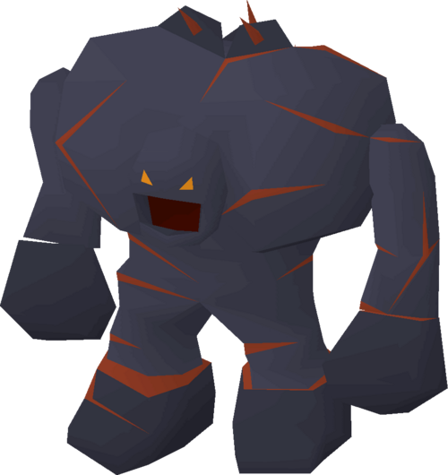

# Stalagmight

**Level 3 Large Elemental**

## <mark style="color:green;background-color:blue;">Defense Traits</mark>

<mark style="color:green;">**AC**</mark> 16\
<mark style="color:green;">**HP**</mark> 50\
<mark style="color:green;">**Poise**</mark> 23\
<mark style="color:green;">**Fort**</mark> +5, <mark style="color:green;">**Refl**</mark> +8, <mark style="color:green;">**Will**</mark> +5

<mark style="color:green;">**Resistance**</mark> - Fire, Slash

## <mark style="color:orange;background-color:red;">Offense Traits (DC 15)</mark>

<mark style="color:red;">**Spine Shot (P)**</mark>  +8 (80/160 ft)\
2d6+3 (10)

<mark style="color:red;">**Unarmed (C)**</mark>  +6\
d6+3 (6)

<mark style="color:red;">**Innate Techniques**</mark> - [Pin Down](https://app.gitbook.com/s/2kNIiIcUKxqLFlLgDKSI/martial-techniques/marksman/level-1/pin-down)

## <mark style="color:blue;background-color:purple;">Weaknesses/Deep Lore</mark>

<mark style="color:blue;">**Wet Weakness**</mark> - Takes a -4 penalty on saves against effects with the \[water] tag. Any attacks with the \[water] tag have advantage against this creature.

<mark style="color:blue;">**Slow and Steady**</mark> - Cannot take the dash or charge action

## <mark style="color:yellow;background-color:yellow;">Other Traits</mark>

<mark style="color:yellow;">**Ability Scores - Str +2, Dex +3, Lucc +0, Int +0, Wis +2, Cha +0**</mark>

<mark style="color:yellow;">**Feats**</mark> - [Bullseye](https://app.gitbook.com/s/vxnMGGHnEtmcEQDFxcK6/combat-feats/bullseye), [Parting Shot](https://app.gitbook.com/s/vxnMGGHnEtmcEQDFxcK6/combat-feats/parting-shot)

<mark style="color:yellow;">**Skills**</mark> - +7 perception, +7 insight, +7 athletics, +5 religion

<figure><figcaption>
<a href="https://oldschool.runescape.wiki/w/Tok-Xil">Tok-Xil, Oldchool Runescape</a>
</figcaption></figure>
