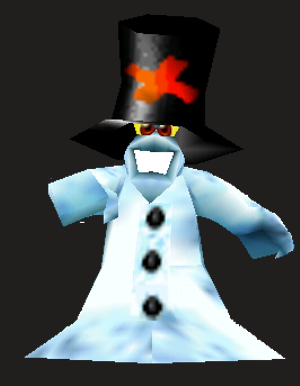

# Snowman

**Level 1 Medium Elemental**

## <mark style="color:green;background-color:blue;">Defense Traits</mark>

<mark style="color:green;">**AC**</mark> 16\
<mark style="color:green;">**HP**</mark> 30\
<mark style="color:green;">**Poise**</mark> 23\
<mark style="color:green;">**Fort**</mark> +6, <mark style="color:green;">**Refl**</mark> +2, <mark style="color:green;">**Will**</mark> +1

<mark style="color:green;">**Resistance**</mark> - Frost

<mark style="color:green;">**Amorphous**</mark> - +12

<mark style="color:green;">**Gather Snow**</mark> - By spending a standard action, a snowman can repair its (or another snowman's) body with surrounding snow, healing 10 hp.

## <mark style="color:orange;background-color:red;">Offense Traits (DC 13)</mark>

<mark style="color:red;">**Snowball (frost)**</mark>  +6 (80/160) +2 bullseye, +slushed\
2d6+3 (10)

<mark style="color:red;">**Innate Techniques**</mark> - [Curved Shot](https://app.gitbook.com/s/2kNIiIcUKxqLFlLgDKSI/martial-techniques/marksman/level-1/curved-shot), [Snow Fort](https://app.gitbook.com/s/2kNIiIcUKxqLFlLgDKSI/magical-techniques/cryomancy/level-1/snow-fort)\
1/day - [Blanket of Snow](https://app.gitbook.com/s/2kNIiIcUKxqLFlLgDKSI/magical-techniques/cryomancy/level-1/blanket-of-snow)\
Constant - [Artillery](https://app.gitbook.com/s/2kNIiIcUKxqLFlLgDKSI/martial-techniques/marksman/level-1/artillery)

<mark style="color:red;">**Slushed \[frost]**</mark> - Creatures hit by a snowball are staggered on hit.

<mark style="color:red;">**Bouncy**</mark> - A snowman can shove as a swift action

## <mark style="color:blue;background-color:purple;">Weaknesses/Deep Lore</mark>

<mark style="color:blue;">**Hatless**</mark> - By disarming or sundering a snowman, you can remove its hat to lower its AC by two and disable it hide in plain sight.

<mark style="color:blue;">**Yellow Snow**</mark> - By performing a dirty trick and urinating on a snowman, it is taunted by the creature automatically, regardless if the maneuver poise breaks it.

<mark style="color:blue;">**Weakness**</mark> - Fire 5

## <mark style="color:yellow;background-color:yellow;">Other Traits</mark>

<mark style="color:yellow;">**Ability Scores - Str +3, Dex +1, Lucc +0, Int -2, Wis +0, Cha +0**</mark>

<mark style="color:yellow;">**Speed**</mark> - 15

<mark style="color:yellow;">**Hide in Plain Sight**</mark> - In snowy terrain or the snowman can hide inside of its hat

<mark style="color:yellow;">**Feats**</mark> - [Bullseye](https://app.gitbook.com/s/vxnMGGHnEtmcEQDFxcK6/combat-feats/bullseye)

<mark style="color:yellow;">**Skills**</mark> - +4 perception, +7 athletics, +5 stealth

<figure><figcaption>
Snowman enemy from Banjo Kazooie
</figcaption></figure>
