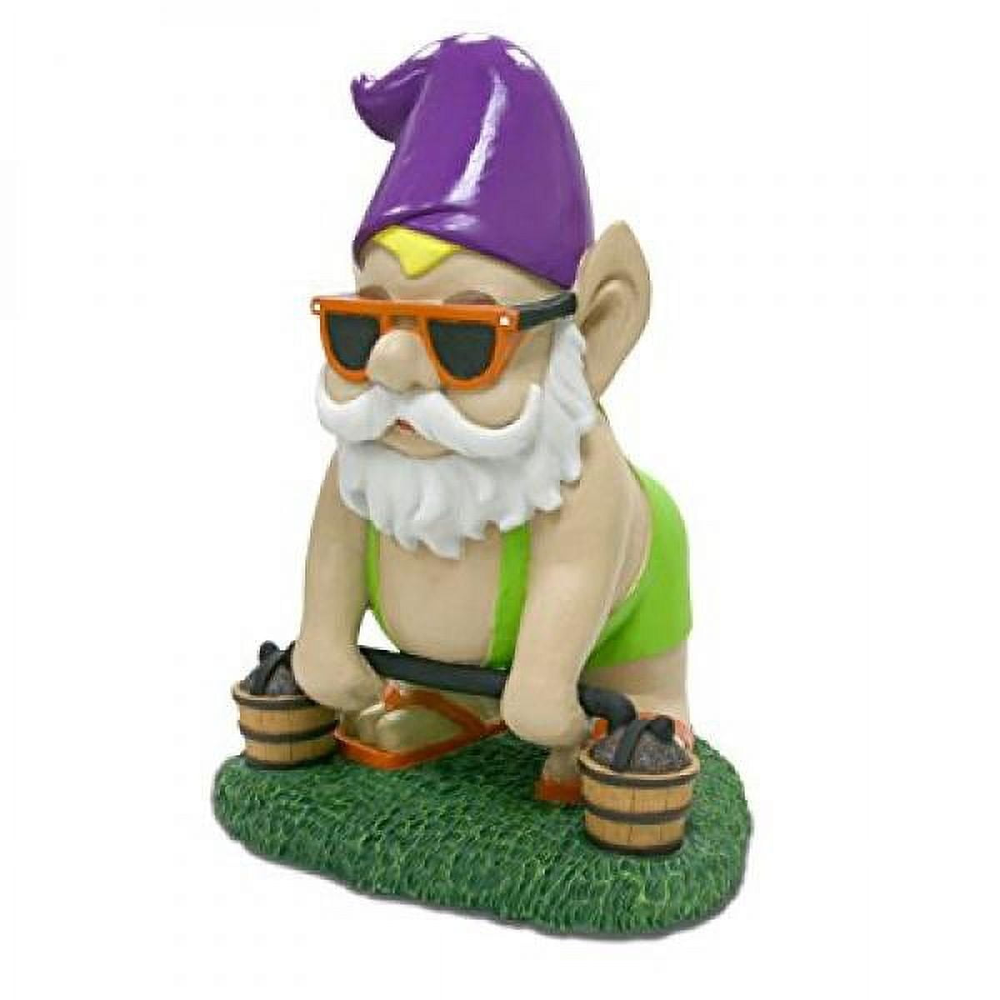

# G'nome

**Level 1 Small Fey**

## <mark style="color:green;background-color:blue;">Defense Traits</mark>

<mark style="color:green;">**AC**</mark> 15\
<mark style="color:green;">**HP**</mark> 30\
<mark style="color:green;">**Poise**</mark> 26\
<mark style="color:green;">**Fort**</mark> +3, <mark style="color:green;">**Refl**</mark> +3, <mark style="color:green;">**Will**</mark> +2

<mark style="color:green;">**Stick the Landing**</mark> - When a gnome falls, they can choose to stick into the ground with their pointed hats to negate the fall damage as an instant action. Their speed is reduced by 20 and they cannot use their pointy feature for 1 round.

## <mark style="color:orange;background-color:red;">Offense Traits (DC 13)</mark>

<mark style="color:red;">**Battle Ladder (C)**</mark> +3 (+4 MI, +4 gang up, +2 disarm/drag/dirty trick)\
2d6+2 (9)

<mark style="color:red;">**Innate Techniques**</mark> - [Boasting Taunt](https://app.gitbook.com/s/2kNIiIcUKxqLFlLgDKSI/martial-techniques/warfare/level-1/boasting-taunt), [Fake Out](https://app.gitbook.com/s/2kNIiIcUKxqLFlLgDKSI/martial-techniques/warfare/level-1/fake-out)\
1/day - [Backstab](https://app.gitbook.com/s/2kNIiIcUKxqLFlLgDKSI/martial-techniques/warfare/level-5/backstab), [Pocket Sand](https://app.gitbook.com/s/2kNIiIcUKxqLFlLgDKSI/martial-techniques/scoundrel/level-1/pocket-sand), [Kidnap](https://app.gitbook.com/s/2kNIiIcUKxqLFlLgDKSI/martial-techniques/scoundrel/level-1/kidnap)

<mark style="color:red;">**Snatch and Grab**</mark> - After using sleight of hand to steal something, or disarming an opponent, all of the gnomes actions become \[elusive] against the target of their theft.

<mark style="color:red;">**Pointy \[elusive]**</mark> - When a creature falls onto a space or jumps into a space within 10 ft of a gnome, the gnome can move to the space directly where the creature will land and use its pointed hat to damage them as an immediate action. The creature takes 2d6 (7) pierce damage and is made clumsy 1. They can choose any space adjacent to the gnome to land.

<mark style="color:red;">**Sharp Aim**</mark> - A gnome can spend a standard action to assume the position. Any other allied creature of at least medium size can throw a gnome in the position as though they were a thrown weapon with +2 attack (as though the gnome was aiding them), dealing 4d6 (14) piercing damage.

If a gnome is poise broken while assuming the position, its stance falters and it can no longer be thrown.

## <mark style="color:blue;background-color:purple;">Weaknesses/Deep Lore</mark>

<mark style="color:blue;">**Gnome Toss**</mark> - Gnomes are surprisingly aerodynamic and light. After grappling a gnome, you can choose to end your grapple to toss the gnome (athletics roll) feet in a direction of your choosing. This also happens if you successfully shove, with the athletics roll determining the extra distance moved.

This happens instead of the usual effect of grapple and in addition to the effects of a shove.

<mark style="color:blue;">**One of a Kind**</mark> - Gnomes love to steal things that normally come as a set, but only 1 of them, such as a pair of socks or several wheels on a vehicle. When presented with the opportunity to pilfer such an object, a gnome will do everything in their power to steal it. This could mean invading a home after hours, staking out a vehicle etc.

## <mark style="color:yellow;background-color:yellow;">Other Traits</mark>

<mark style="color:yellow;">**Ability Scores - Str +2, Dex +2, Lucc +2, Int +0, Wis -1, Cha +2**</mark>

<mark style="color:yellow;">**Gnome Chomsky (Su) \[poly, true]**</mark> - Gnomes can transform into a lawn ornament that resembles a gnome. In this form, they can only move while not observed, unless the observers are gnomes. This effectively functions as Hide in Plain Sight.

<mark style="color:yellow;">**Feats**</mark> - [Maneuver Initiate](https://app.gitbook.com/s/vxnMGGHnEtmcEQDFxcK6/combat-feats/maneuver-initiate), [Maneuver Master](https://app.gitbook.com/s/vxnMGGHnEtmcEQDFxcK6/combat-feats/maneuver-initiate/maneuver-master), [Gang Up](https://app.gitbook.com/s/vxnMGGHnEtmcEQDFxcK6/teamwork-feats/gang-up)

<mark style="color:yellow;">**Skills**</mark> - +2 perception, +5 stealth, +7 sleight of hand, +5 deception, +3 cryptozoology

<figure><figcaption></figcaption></figure>
