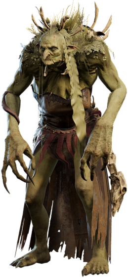

# Hag

**Level 5 Large Fey \[boss]**

## <mark style="color:green;background-color:blue;">Defense Traits</mark>

<mark style="color:green;">**AC**</mark> 20\
<mark style="color:green;">**HP**</mark> 100\
<mark style="color:green;">**Poise**</mark> 26\
<mark style="color:green;">**Fort**</mark> +7, <mark style="color:green;">**Refl**</mark> +5, <mark style="color:green;">**Will**</mark> +9

<mark style="color:green;">**Spell Resistance**</mark> - Masters of magic, hags have protective wards created from their coven magic to reduce the effectiveness of magic against them. The reduce the damage taken from any spell or supernatural ability by 3.

## <mark style="color:orange;background-color:red;">Offense Traits (DC 18)</mark>

<mark style="color:red;">**Claws (S)**</mark> +7\
2d6+2 (9)

<mark style="color:red;">**Innate Techniques (CL 7)**</mark> - [Mage Hand](https://app.gitbook.com/s/2kNIiIcUKxqLFlLgDKSI/magical-techniques/cantrips/mage-hand), [Detect Pregnancy](https://app.gitbook.com/s/2kNIiIcUKxqLFlLgDKSI/magical-techniques/cantrips/detect-pregnancy), [Ventriloquism](https://app.gitbook.com/s/2kNIiIcUKxqLFlLgDKSI/magical-techniques/moogen/level-1/ventriloquism), [Imagination](https://app.gitbook.com/s/2kNIiIcUKxqLFlLgDKSI/magical-techniques/moogen/level-1/imagination), [Dispel Magic](https://app.gitbook.com/s/2kNIiIcUKxqLFlLgDKSI/magical-techniques/wildcard/level-2/dispel-magic), [Violent Accident](https://app.gitbook.com/s/2kNIiIcUKxqLFlLgDKSI/magical-techniques/corruption/level-2/violent-accident), [Poison the Well](https://app.gitbook.com/s/2kNIiIcUKxqLFlLgDKSI/magical-techniques/corruption/level-1/poison-the-well), [Grasp of the Undying](https://app.gitbook.com/s/2kNIiIcUKxqLFlLgDKSI/magical-techniques/cantrips/grasp-of-the-undying)\
1/day - [Persistent Pranksters](https://app.gitbook.com/s/2kNIiIcUKxqLFlLgDKSI/magical-techniques/mother-earth/level-3/persistent-pranksters), [Pollinate (U3)](https://app.gitbook.com/s/2kNIiIcUKxqLFlLgDKSI/magical-techniques/mother-earth/level-1/pollinate), [Gutwrench](https://app.gitbook.com/s/2kNIiIcUKxqLFlLgDKSI/magical-techniques/moogen/level-3/gutwrench), [Animate Dead](https://app.gitbook.com/s/2kNIiIcUKxqLFlLgDKSI/magical-techniques/necromancy/level-2/animate-dead), [Corpse Explosion](https://app.gitbook.com/s/2kNIiIcUKxqLFlLgDKSI/magical-techniques/necromancy/level-3/corpse-explosion)\
Constant - [Spectral Hand](https://app.gitbook.com/s/2kNIiIcUKxqLFlLgDKSI/magical-techniques/necromancy/level-2/spectral-hand)

<mark style="color:red;">**Boss Actions**</mark> - Only one can be used 1/round

<mark style="color:orange;">**Scatter Clones (Su) \[elusive] \[figment] \[recharge]**</mark> - At the end of the hags turn, she can cause 4 exact copies of herself appear in adjacent spaces. She and her copies immediately scatter in every direction. A creature can detect hidden presence to tell which one is the real one with a DC 20 perception check.

However, if the clones live until the start of the hag's next turn, they also get 30 ft of movement and a standard action to cast the Grasp of the Undying spell. They continue to do so every turn they survive. The clones automatically disappear when they take damage or fail a saving throw.

<mark style="color:orange;">**Deep Digs \[mind-affecting] \[psychic]**</mark> - This can only target an enemy at the end of their turn. Against a creature it has successfully rolled a knowledge check against, a hag can unbury some deep insecurity. The creature takes 3d6 (10) psychic damage and has disadvantage on its next attack roll (will halves dmg and negates disadvantage).

<mark style="color:orange;">**Imposter (Su) \[teleportation] \[figment] \[recharge]**</mark> - At the end of another creature's turn, a hag can teleport within 10 ft of a that creature if they are within 60 feet. When she does, the target creature also teleports to another location within 10 feet of their original position and the hag copies their appearance exactly.&#x20;

Using this on enemies tends to fall through if they know each other well enough, so hags prefer to choose neutral parties, such as creatures they capture. If they aren't participating in combat because they are a noncombatant, she can use this ability at the end of any other creature's turn to target this noncombatant.

<mark style="color:orange;">**Summon Ally \[recharge] \[companion]**</mark> - At the end of another creature's turn, the hag can summon 2 fey of level 2 or lower to appear within 30 feet of her. They share her teamwork feats.

## <mark style="color:blue;background-color:purple;">Weaknesses/Deep Lore</mark>

<mark style="color:blue;">**Dealer**</mark> - Hags typically do not like to engage in combat, and instead prefer to cooperate with other sentient creatures. This is to get something out of them rather than the goodness of their heart. As such, a hag will employ any method in her arsenal: threatening loved ones, offering valuable items or information, healing unique ailments, threatening retaliation etc.

<mark style="color:blue;">**Coven**</mark> - Hags typically exist in trios. They don't live with their sisters, but they tend to have some method to regularly visit them. This could mean they live somewhere close by, they teleport whatever. They keep in regular contact and come to eachother's aid when needed. When gathered, hags possess the ability to perform magical rituals. This allows them to cast spells beyond what they are normally capable of.&#x20;

The most notable of which is a type of resurrection usable on the sisters. This happens automatically when the hag dies, and she appears within a special predesignated location in one of the homes of her sisters. The hag is drained 10. More info about covens, such as how to stop the resurrection, can be found in subsection, which requires more direct research for players to find than just a successful knowledge check.

## <mark style="color:yellow;background-color:yellow;">Other Traits</mark>

<mark style="color:yellow;">**Ability Scores - Str +2, Dex +0, Lucc +0, Int +3, Wis +2, Cha +3**</mark>

<mark style="color:yellow;">**Believer**</mark> - Gain Tier 3 favor in the god [Shira](https://app.gitbook.com/s/qFzTamwcoNEgFoEbLz7c/gods/demon-lords/shira-the-she-devil). This gives access to the contract ability, which hags use liberally with mortals to fulfill their desires.

<mark style="color:yellow;">**Feats**</mark> - [Skill Focus (Local)](https://app.gitbook.com/s/vxnMGGHnEtmcEQDFxcK6/general-feats/skill-focus), [Signature Skill (Knowledge)](https://app.gitbook.com/s/vxnMGGHnEtmcEQDFxcK6/general-feats/skill-focus/signature-skill), [MM Sniping](https://app.gitbook.com/s/vxnMGGHnEtmcEQDFxcK6/magic-feats/mm-sniping), [Cooperative Casting](https://app.gitbook.com/s/vxnMGGHnEtmcEQDFxcK6/teamwork-feats/cooperative-casting)

<mark style="color:yellow;">**Skills**</mark> - +9 perception, +9 insight, +11 deception, +11 persuasion, +13 disguise, +13 (adv) local, +11 nature, +11 arcana, +11 religion, +11 history, +11 cryptozoology

<figure><figcaption>
Auntie Ethel, Baldur's Gate 3
</figcaption></figure>
