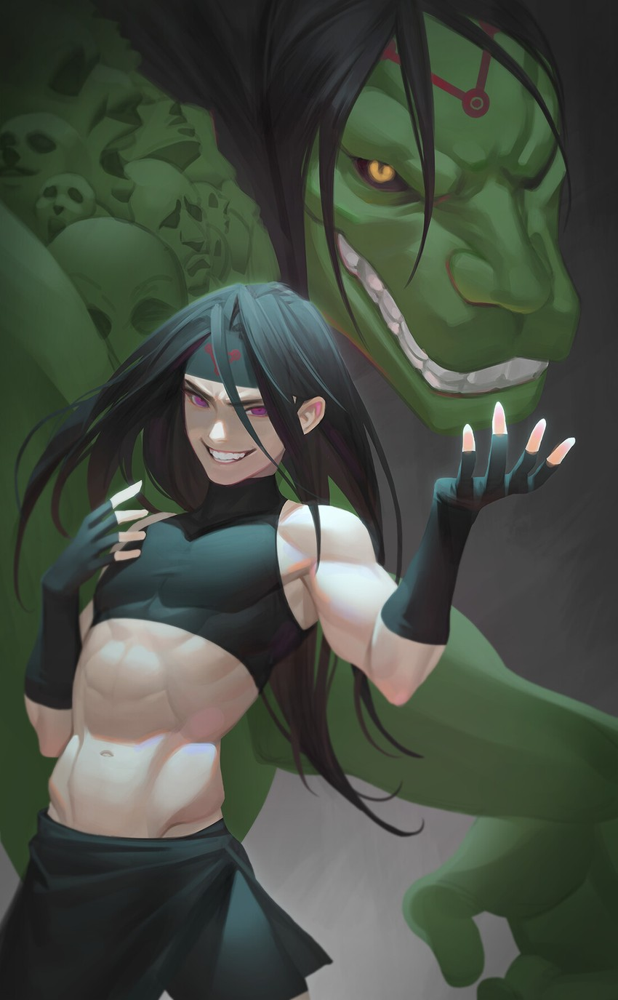

# Slur'nesh True Form

**Level 10 Huge Fiend \[unique] \[boss] \[mastermind]**

## <mark style="color:green;background-color:blue;">Defense Traits</mark>

<mark style="color:green;">**AC**</mark> 15\
<mark style="color:green;">**HP**</mark> 80\
<mark style="color:green;">**Poise**</mark> 24\
<mark style="color:green;">**Fort**</mark> +11, <mark style="color:green;">**Refl**</mark> +5, <mark style="color:green;">**Will**</mark> +8

<mark style="color:green;">**Resistance**</mark> - Sonic

## <mark style="color:orange;background-color:red;">Offense Traits (DC 17)</mark>

<mark style="color:red;">**1h Axe (S)**</mark>  +9 (+4 combat maneuvers, +4 MI) 20/40\
d10+4 (9)

<mark style="color:red;">**Tail (C+P)**</mark>  +9 (+4 combat maneuvers, +4 MI)\
2d6+4 (11)

<mark style="color:red;">**Multiattack**</mark> - Make a combat maneuver attack and an axe attack.

<mark style="color:red;">**Innate Techniques**</mark> - Corpse Transposition\
1/day - Nightmare

<mark style="color:red;">**Power Word N (Su) \[mind affecting] \[language] \[recharge] \[subtle]**</mark> - Slur'Nesh can utter a heinous word, and have it echo from the mouth of a creature within 60 feet. This word carries such vulgarity that it causes another creature within 30 ft of the original target to fly into a blind and senseless rage at the original target. They are taunted by the creature for 3 rounds, and use their deadliest most powerful abilities to kill them as quickly as possible.

If the creature is a minion to Slur'Nesh, or if the secondary target has been subjugated by the race/people of the primary target, this has no save. If they are not they have disadvantage but (will negates). If the creatures have been allies for an extended amount of time, are family etc, then they do not make the save at disadvantage.

Essentially, target 1 creature to taunt another with the power of racism. The two creatures relationship and races affect how difficult it is to resist.

<mark style="color:red;">**Cycle of Hate**</mark> -&#x20;

## <mark style="color:blue;background-color:purple;">Weaknesses/Deep Lore</mark>

<mark style="color:blue;">**Choice Attire**</mark> -&#x20;

## <mark style="color:yellow;background-color:yellow;">Other Traits</mark>

<mark style="color:yellow;">**Ability Scores - Str +0, Dex +0, Lucc +2, Int +3, Wis +3, Cha +3**</mark>

<mark style="color:yellow;">**Hierarchy**</mark> - When Slur'Nesh is in a settlement of humanoids, it can intuitively tell certain aspects of the social hierarchy. It knows which types of people are subjugated, as well as who does the subjugation, and can generally tell how extreme said subjugation is.

If the settlement is generally egalitarian, then it can intuit 3 specific creatures who break this mold.

<mark style="color:yellow;">**Shape Change \[poly, true]**</mark> - Any humanoid, including any racial features. Can be used as a free action 1/turn.

<mark style="color:yellow;">**Rumormonger**</mark> - Slur'Nesh can attempt to spread a rumor throughout a small town or larger settlement by attempting a deception check. The difficulty depends on the size, ranging from 10 for a small town to 30 for a metropolis, though this difficulty may be modified if the population as a whole tends towards skepticism or insanity.

It takes a week for a rumor to spread. If it succeeds by 5 or more, the time is reduced to 3 days. If it fails by 5 or more, the rumor mutates into a competing theory.

Can only have 1 rumor brewing at once.

<mark style="color:yellow;">**Feats**</mark> - SF Deception, SS Deception, SF Insight, SS Insight

<mark style="color:yellow;">**Skills**</mark> - +15 perception, +19 (adv) insight, +19 (adv) deception, +19 disguise

<figure><figcaption>
Envy from Fullmetal Alchemist by <a href="https://danbooru.donmai.us/posts/3807105">Jinwu</a> 
</figcaption></figure>
