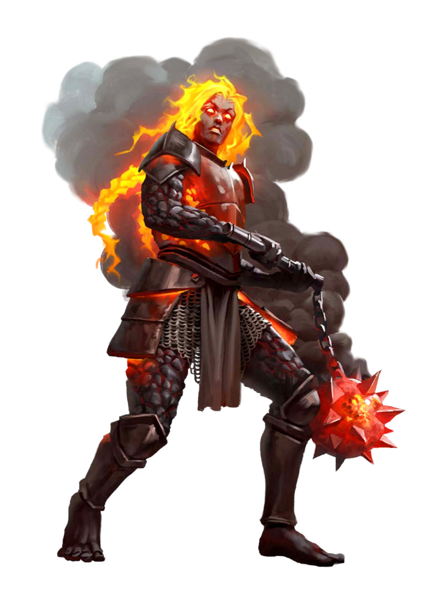

# Molten Giant

**Level 5 Large Giant/Elemental**

## <mark style="color:green;background-color:blue;">Defense Traits</mark>

<mark style="color:green;">**AC**</mark> 21 (Heavy Armor)\
<mark style="color:green;">**HP**</mark> 70\
<mark style="color:green;">**Poise**</mark> 32 (DRA 1)\
<mark style="color:green;">**Fort**</mark> +9, <mark style="color:green;">**Refl**</mark> +4, <mark style="color:green;">**Will**</mark> +9

<mark style="color:green;">**Resistance**</mark> - Fire, +4 earth

<mark style="color:green;">**Easy Fix**</mark> - Molten giants exclusively use metal equipment. They can spend 1 heat as a free action to fix a piece of metal equipment that was sundered.

<mark style="color:green;">**Super Hot**</mark> - Any creatures without fire resistance that maintain prolonged contact (such as with a grapple) with a molten giant take 4 fire damage and are sickened 2 from the intense pain.

## <mark style="color:orange;background-color:red;">Offense Traits (DC 17)</mark>

<mark style="color:red;">**Molten Flail (C+Fire)**</mark>  +11  (+4 MI)\
d10+4+d6 (13)

<mark style="color:red;">**Molten Rock (C+Fire)**</mark>  +8  (20/40, +lava on hit)\
2d6+4+2d6 (18)

<mark style="color:red;">**Multiattack**</mark> - Make 2 melee weapon attacks

<mark style="color:red;">**Innate Techniques**</mark> - [Awesome Blow](https://app.gitbook.com/s/2kNIiIcUKxqLFlLgDKSI/martial-techniques/warfare/level-3/awesome-blow), [Foe Toss](https://app.gitbook.com/s/2kNIiIcUKxqLFlLgDKSI/martial-techniques/barbarism/level-2/foe-toss)\
1/day - [Colossal Smash (U3)](https://app.gitbook.com/s/2kNIiIcUKxqLFlLgDKSI/martial-techniques/warfare/level-2/colossal-smash), [Earth Shatter](https://app.gitbook.com/s/2kNIiIcUKxqLFlLgDKSI/martial-techniques/cataclysm/level-3/earth-shatter)\
Constant - [Shockwave](https://app.gitbook.com/s/2kNIiIcUKxqLFlLgDKSI/martial-techniques/cataclysm/level-3/shockwave)

<mark style="color:red;">**Heat of Battle \[fire]**</mark> - At the start of a molten giants turn, it generates 2 heat. Whenever a molten giant takes fire damage, it gains heat stacks equal to how much fire damage it took. As a swift action, a molten giant can superheat its weapon, adding its heat stacks as additional fire damage on hit, after which the heat dissipates until used again.

<mark style="color:red;">**Molten Rock \[fire]**</mark> - By spending 2 heat as a standard action and with 2 hands free, a molten giant can dig its fingers into a stone surface and melt it enough to give it something to throw, or it can super heat a nearby rock of adequate size. The rock is a thrown weapon that deals 2d6+4 (11) crush and 2d6 (7) fire damage.

The creature also has molten rock cling to them, functioning as lava (3d6, 2d6, d6 damage or until cooled).

<mark style="color:red;">**Giant Slam**</mark> - Giants deal 10 poise damage on hit to any creature smaller than them when they make melee attacks. If this breaks poise, the creature is either shoved or knocked down, giants choice.

This poise damage is dealt after the effects of the attack (for moves that deal hp damage and poise damage).

## <mark style="color:blue;background-color:purple;">Weaknesses/Deep Lore</mark>

<mark style="color:blue;">**Extinguish**</mark> - Whenever a molten giant is made wet, they negate it and instead lose all heat stacks. They also cannot gain heat for 1 round.

## <mark style="color:yellow;background-color:yellow;">Other Traits</mark>

<mark style="color:yellow;">**Ability Scores - Str +4, Dex -1, Lucc +0, Int +1, Wis +2, Cha +0**</mark>

<mark style="color:yellow;">**Speed**</mark> - 35

<mark style="color:yellow;">**Feats**</mark> - [Skill Focus](https://app.gitbook.com/s/vxnMGGHnEtmcEQDFxcK6/general-feats/skill-focus), [Pet](https://app.gitbook.com/s/vxnMGGHnEtmcEQDFxcK6/multiclass/pet-companion), [Weapon Focus (Crush)](https://app.gitbook.com/s/vxnMGGHnEtmcEQDFxcK6/combat-feats/weapon-focus), [Maneuver Initiate](https://app.gitbook.com/s/vxnMGGHnEtmcEQDFxcK6/combat-feats/maneuver-initiate)

<mark style="color:yellow;">**Skills**</mark> - +9 perception, +9 (adv) insight, +9 survival, +8 nature, +11 athletics, +13 profession (smithy)

<figure><figcaption>
Unknown Sauce. Used in many places from what I can find.
</figcaption></figure>
