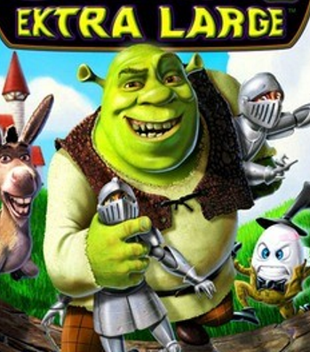

# Ogre

**Level 3 Large Giant**

## <mark style="color:green;background-color:blue;">Defense Traits</mark>

<mark style="color:green;">**AC**</mark> 16\
<mark style="color:green;">**HP**</mark> 44\
<mark style="color:green;">**Poise**</mark> 27\
<mark style="color:green;">**Fort**</mark> +8, <mark style="color:green;">**Refl**</mark> +2, <mark style="color:green;">**Will**</mark> +3

<mark style="color:green;">**Resistance**</mark> - Poison

## <mark style="color:orange;background-color:red;">Offense Traits (DC 15)</mark>

<mark style="color:red;">**Unarmed (C)**</mark>  +6\
2d6+3 (10)

<mark style="color:red;">**Onion (C)**</mark>  +6 (20/40 ft) +2 Bullseye, applies sickened 2 on-hit\
3d6+3 (13)

<mark style="color:red;">**Multiattack**</mark> - Make 2 unarmed attacks

<mark style="color:red;">**Innate Techniques**</mark> - [Body Slam](https://app.gitbook.com/s/2kNIiIcUKxqLFlLgDKSI/martial-techniques/unarmed/level-2/body-slam)

<mark style="color:red;">**Summon Ally \[recharge]**</mark> - [DONKEH](../beasts/horse.md). It has -1 intelligence and knows common

<mark style="color:red;">**Better Out Than In \[poison] \[recharge]**</mark> - As a free action (1/combat) an ogre can create a cloud of toxic gas within 10ft of them. Creatures inside are staggered and take 3 poison damage each round inside until they leave. This effect persists for 1 round after they leave (fort negates). Ogres are immune to this ability.

<mark style="color:red;">**Special Attack: Slam**</mark> - Shove a creature in any direction with a +4 bonus. If it impacts a solid surface, it takes unarmed damage. It is dazed for one round (fort negates).

<mark style="color:red;">**Giant Slam**</mark> - Giants deal 10 poise damage on hit to any creature smaller than them when they make melee attacks.

## <mark style="color:blue;background-color:purple;">Weaknesses/Deep Lore</mark>

<mark style="color:blue;">**Weakness**</mark> -&#x20;

## <mark style="color:yellow;background-color:yellow;">Other Traits</mark>

<mark style="color:yellow;">**Ability Scores - Str +3, Dex -1, Lucc +0, Int +0, Wis +0, Cha +4**</mark>

<mark style="color:yellow;">**Feats**</mark> - [Maneuver Initiate](https://app.gitbook.com/s/vxnMGGHnEtmcEQDFxcK6/combat-feats/maneuver-initiate), [Bullseye](https://app.gitbook.com/s/vxnMGGHnEtmcEQDFxcK6/combat-feats/bullseye)

<mark style="color:yellow;">**Skills**</mark> - +5 perception, +9 intimidation, +5 nature, +8 athletics

<figure><figcaption>
From the Shrek:Extra Large video game
</figcaption></figure>
