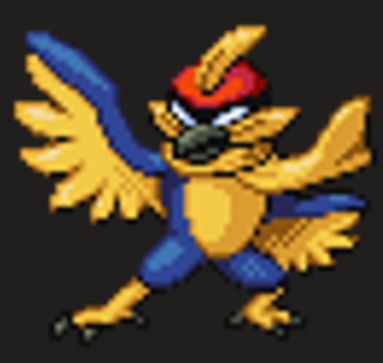

# Falcaptain

**Level 9 Medium Beastfolk**

## <mark style="color:green;background-color:blue;">Defense Traits</mark>

<mark style="color:green;">**AC**</mark> 24\
<mark style="color:green;">**HP**</mark> 110\
<mark style="color:green;">**Poise**</mark> 35 (DR 2 +5 PP))\
<mark style="color:green;">**Fort**</mark> +12, <mark style="color:green;">**Refl**</mark> +14, <mark style="color:green;">**Will**</mark> +9

<mark style="color:green;">**Dash Dance**</mark> - In combat a falcaptain is persistently moving. At the end of its turn, it chooses an adjacent space. It is treated as though it occupies its current space, or the space it chose for all effects, whichever is more advantageous. To guaranteed affecting him with a given ability, it must be able to reach/affect both spaces.

Falcaptain's movement while strafing is \[elusive].

## <mark style="color:orange;background-color:red;">Offense Traits (DC 18)</mark>

<mark style="color:red;">**Unarmed (C)**</mark>  +12 (+4 MI)\
d10+3 (8)

<mark style="color:red;">**Multiattack**</mark> - Make 3 unarmed attacks

<mark style="color:red;">**Innate Techniques**</mark> -  [Clothesline](https://app.gitbook.com/s/2kNIiIcUKxqLFlLgDKSI/martial-techniques/unarmed/level-1/clothesline), [Wake-Up Slap](https://app.gitbook.com/s/2kNIiIcUKxqLFlLgDKSI/martial-techniques/unarmed/level-1/wake-up-slap), [Fired Up](https://app.gitbook.com/s/2kNIiIcUKxqLFlLgDKSI/martial-techniques/pupper/level-1/fired-up-su), [Burst of Speed](https://app.gitbook.com/s/2kNIiIcUKxqLFlLgDKSI/martial-techniques/pupper/level-2/burst-of-speed)\
1/day - [Unbreakable Advance](https://app.gitbook.com/s/2kNIiIcUKxqLFlLgDKSI/martial-techniques/pupper/level-3/unbreakable-advance), [Quick Attack](https://app.gitbook.com/s/2kNIiIcUKxqLFlLgDKSI/martial-techniques/pupper/level-3/quick-attack), [Rend Vision](https://app.gitbook.com/s/2kNIiIcUKxqLFlLgDKSI/martial-techniques/beastmode/level-2/rend-vision), [Peacocking](https://app.gitbook.com/s/2kNIiIcUKxqLFlLgDKSI/martial-techniques/beastmode/level-4/peacocking)

<mark style="color:red;">**Combo Starter**</mark> - When a falcaptain successfully grapples a creature, he can choose to immediately throw them airborne 15 ft into the air. They maintain the entangled condition until the end of the falcaptains next turn and become clumsy 1. This remains the case no matter what happens to the falcaptain in the meantime.

A creature can take the aid action to automatically grab their ally out of the air if they can reach (typically only for large creatures), removing these penalties.

<mark style="color:red;">**Special Attack: Falcon Punch \[fire]**</mark> - Deal an additional 2d6 (7) fire damage and launch target 30 ft directly away from the falcaptain on hit. The target is also set ablaze on hit.

<mark style="color:red;">**Special Attack: Knee of Justice \[zap]**</mark> - Special: This attack can only be used against an airborne target\
Deal an additional 4d6 (14) zap damage and launch target 30 ft directly away from the falcaptain on hit.

<mark style="color:red;">**Special Attack: Stomp**</mark> - Special: This attack can only be used against an airborne target or a knocked down target.\
Deal an extra 2d6 (7) crush damage and immediately send the target to the ground, knocking them down. This special attack recharges on hit and can be used multiple times a turn.

<mark style="color:red;">**Down Taunt \[healing]**</mark> - By spending a standard action to say his catch phrase, falcaptain can recharge all of his special attacks and gain 10 temp hp. If he successfully hits a creature with falcon punch, he can take an immediate action to down taunt, ending his turn.

## <mark style="color:blue;background-color:purple;">Weaknesses/Deep Lore</mark>

<mark style="color:blue;">**Clipn't**</mark> - Falcaptain must use a special attack each round of combat. If he fails to do so and doesn’t down taunt, he is shaken 2. If this happens and he becomes shaken 5 or higher, he gains the time out condition until he rests.

## <mark style="color:yellow;background-color:yellow;">Other Traits</mark>

<mark style="color:yellow;">**Ability Scores - Str +3, Dex +3, Lucc +0, Int -2, Wis +0, Cha +1**</mark>

<mark style="color:yellow;">**Athleticism**</mark> - Falcaptain can jump twice each round as a free action, even combining them in midair.&#x20;

<mark style="color:yellow;">**Speed**</mark> - 40

<mark style="color:yellow;">**Glide**</mark>

<mark style="color:yellow;">**Feats**</mark> - [Maneuver Initiate](https://app.gitbook.com/s/vxnMGGHnEtmcEQDFxcK6/combat-feats/maneuver-initiate), [Maneuver Master](https://app.gitbook.com/s/vxnMGGHnEtmcEQDFxcK6/combat-feats/maneuver-initiate/maneuver-master), [Power Pose](https://app.gitbook.com/s/vxnMGGHnEtmcEQDFxcK6/combat-feats/power-pose), [Blind Fight](https://app.gitbook.com/s/vxnMGGHnEtmcEQDFxcK6/combat-feats/blind-fight), [Skill Focus (Acrobatics)](https://app.gitbook.com/s/vxnMGGHnEtmcEQDFxcK6/general-feats/skill-focus)

<mark style="color:yellow;">**Skills**</mark> - +11 perception, +16 (adv) acrobatics

<figure><figcaption>
Falcaptain, Clovermon
</figcaption></figure>
