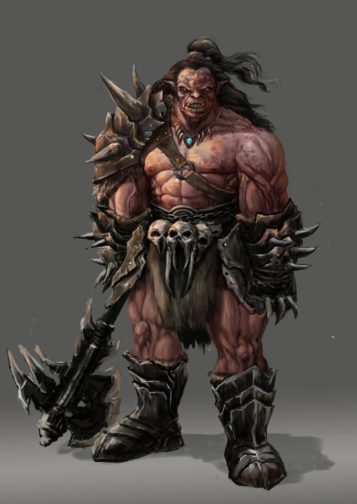

# Murderous Chieftain

**Level 4 Medium Orc \[boss]**

## <mark style="color:green;background-color:blue;">Defense Traits</mark>

<mark style="color:green;">**AC**</mark> 17\
<mark style="color:green;">**HP**</mark> 60 (+40 rally)\
<mark style="color:green;">**Poise**</mark> 30  (DRA 4)\
<mark style="color:green;">**Fort**</mark> +6, <mark style="color:green;">**Refl**</mark> +4, <mark style="color:green;">**Will**</mark> +2

<mark style="color:green;">**Ferocity**</mark>

<mark style="color:green;">**Naked Courage**</mark> - Gain DRA 4 while not wearing armor.

## <mark style="color:orange;background-color:red;">Offense Traits (DC 16)</mark>

<mark style="color:red;">**2h Axe (C)**</mark>  +7 (+2 vengeance)\
2d6+3 (10)

<mark style="color:red;">**Crossbow (P)**</mark>  +7 (+2 vengeance, 40/80)\
2d6+3 (10)

<mark style="color:red;">**Multiattack**</mark> - Make an axe attack and a combat maneuver

<mark style="color:red;">**Innate Techniques**</mark> - [Break Free](https://app.gitbook.com/s/2kNIiIcUKxqLFlLgDKSI/martial-techniques/warfare/level-1/break-free)\
1/day - [War Paint](https://app.gitbook.com/s/2kNIiIcUKxqLFlLgDKSI/martial-techniques/barbarism/level-1/war-paint)

<mark style="color:red;">**Vengeance**</mark> - Get a +2 bonus to attack against any creature that has damaged you since the end of your last turn.

<mark style="color:red;">**Menacing Gaze \[fear]**</mark> - By spending 30 feet of movement, the chieftain can demoralize a creature with the power of their blood lust alone. This functions as the demoralize action under the intimidation skill.

<mark style="color:red;">**Special Attack: Frenzied Strike**</mark> - The chieftain grows noticeably more jittery as their muscles bulge, their mouth froths and their eyes roll into the back of their head. A chieftain makes an amount of simple axe attacks equal to (1+the number of turns they have made a frenzied strike this combat), stacking up to 4 attacks at once.&#x20;

<mark style="color:red;">**Boss Actions**</mark> - A boss action is usable 1/turn as an instant action with specific triggers. Can only be used at the end of an opposing creature's turn.

<mark style="color:orange;">Sound the Horn \[healing]</mark> - When combat begins, the chieftain blows their war horn. If there are at least 3 other allied orcs in the nearby area, the chieftain is rallied, giving them 40 temp hp.\ <mark style="color:orange;">Finish Him</mark> - Command an ally within 60 ft to make an attack against a defeated creature.\
<mark style="color:orange;">Chieftain's Command \[recharge] \[healing]</mark> - Snap an ally within 30 ft out from an effect that causes the frightened or fascinated conditions.\
<mark style="color:orange;">Feast \[recharge] \[healing]</mark> - The chieftain drives their fist into a dead enemy's chest, then pulls out and consume their heart. All allies that can see them, and the chieftain themselves, gains 10 temp hp. This kills the enemy.\
<mark style="color:orange;">Dishonorable COWARDS</mark> - Can only be used in response to a creature breaking the rules of Mak'Gora. Immediately use the [Warcry ](https://app.gitbook.com/s/2kNIiIcUKxqLFlLgDKSI/martial-techniques/warfare/level-3/warcry)technique, and its radius increases to 40 ft.

## <mark style="color:blue;background-color:purple;">Weaknesses/Deep Lore</mark>

<mark style="color:blue;">**Mak'Gora**</mark> - Chieftain of an orc tribe is an ever shifting position, and a chief must be ready to defend their position. If you challenge the chieftain to a duel, they may be willing to partake depending on the circumstances. Even if they don't the pressure of their peers may goad them into it (will negates, DC). If they pass their save they make up an excuse to placate their band of warriors.

The murderous chieftain and the members of their tribe fight with honor to the death, and will not aid each other using magic, items etc, before or during the fight. It is expected the opponent does the same. Breaking the rules in the middle of the battle, such as to cast a spell on an ally, causes the duel to break down and a chaotic battle ensues. In such cases, the war chief gets access to the a new boss action.&#x20;

A war band will respect the results of the battle, and bow to whoever is the victor.

## <mark style="color:yellow;background-color:yellow;">Other Traits</mark>

<mark style="color:yellow;">**Ability Scores - Str +3, Dex +3, Lucc +0, Int -1, Wis +1, Cha +1**</mark>

<mark style="color:yellow;">**Night Vision**</mark>

<mark style="color:yellow;">**Gear**</mark> - One 2h axe, crossbow, 1 bola, war horn

<mark style="color:yellow;">**Feats**</mark> - [Maneuver Initiate](https://app.gitbook.com/s/vxnMGGHnEtmcEQDFxcK6/combat-feats/maneuver-initiate), [Maneuver Master](https://app.gitbook.com/s/vxnMGGHnEtmcEQDFxcK6/combat-feats/maneuver-initiate/maneuver-master), [Fearsome Finisher](https://app.gitbook.com/s/vxnMGGHnEtmcEQDFxcK6/combat-feats/fearsome-finisher)

<mark style="color:yellow;">**Skills**</mark> - +7 perception, +9 athletics, +11 (+4 FF) intimidation, +7 survival, +7 insight

<figure><figcaption>
<a href="https://www.deviantart.com/ponikstudios">ponikstudios</a>
</figcaption></figure>
