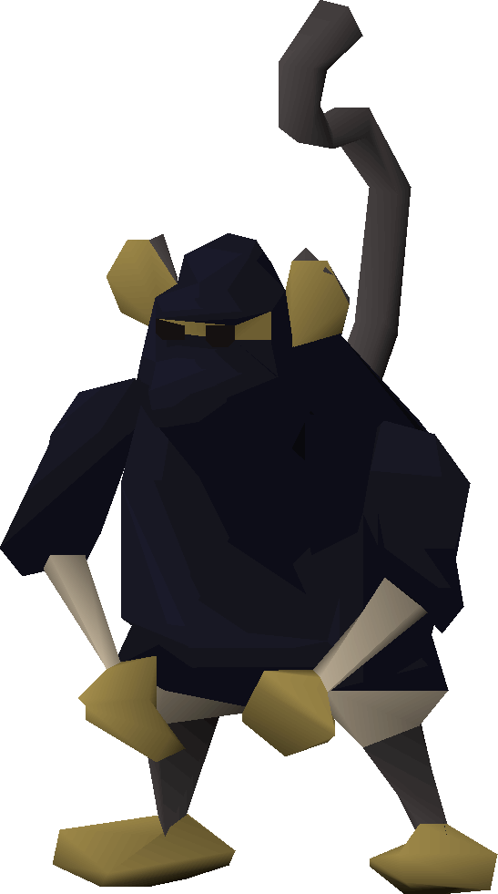

# Ninja Monke Master

**Level 5 Small Beastfolk**

## <mark style="color:green;background-color:blue;">Defense Traits</mark>

<mark style="color:green;">**AC**</mark> 19 (light armor)\
<mark style="color:green;">**HP**</mark> 60\
<mark style="color:green;">**Poise**</mark> 24\
<mark style="color:green;">**Fort**</mark> +5, <mark style="color:green;">**Refl**</mark> +10 (ev), <mark style="color:green;">**Will**</mark> +5

<mark style="color:green;">**Evasion**</mark> - Take half damage from reflex saves. If you pass your save, it has no effect.

## <mark style="color:orange;background-color:red;">Offense Traits (DC 17)</mark>

<mark style="color:red;">**Dragon Scimitar x2 (S or P)**</mark>  +8\
d6+5 (8)

<mark style="color:red;">**Longbow (P)**</mark>  +8 (60/120, +poisoned arrows)\
d8+3 (7)

<mark style="color:red;">**Innate Techniques**</mark> - [Terminal Isolation](https://app.gitbook.com/s/2kNIiIcUKxqLFlLgDKSI/martial-techniques/scoundrel/level-1/terminal-isolation), [Backstab](https://app.gitbook.com/s/2kNIiIcUKxqLFlLgDKSI/martial-techniques/warfare/level-5/backstab), [Pin Down](https://app.gitbook.com/s/2kNIiIcUKxqLFlLgDKSI/martial-techniques/marksman/level-1/pin-down)\
1/day - [Garrote](https://app.gitbook.com/s/2kNIiIcUKxqLFlLgDKSI/martial-techniques/scoundrel/level-3/garrote), [Pin Down (U3)](https://app.gitbook.com/s/2kNIiIcUKxqLFlLgDKSI/martial-techniques/marksman/level-1/pin-down), [Rain of Arrows](https://app.gitbook.com/s/2kNIiIcUKxqLFlLgDKSI/martial-techniques/marksman/level-3/rain-of-arrows-su)\
Constant - [Blur](https://app.gitbook.com/s/2kNIiIcUKxqLFlLgDKSI/martial-techniques/scoundrel/level-2/blur)

<mark style="color:red;">**Special Attack: Sever**</mark> - This attack gains +2 attack. On-hit sever the connection a creature has to their deity. Any abilities related to prayer they cannot use until they rest. Similar abilities that rely on divine power like [Smite](https://app.gitbook.com/s/N6QDh7J4iyEozmJJtVa8/classes-1/zealot) are unaffected.

<mark style="color:red;">**Poisoned Arrows \[poison]**</mark> - Ninja monke masters use poisons they regularly harvest from the toxic plants in the wilderness they occupy. Roll a (d3+Luck) to see how many poisoned arrows they have at their disposal in a given combat.

<mark style="color:green;">Poisoned Arrows</mark> have the following effect. Passing a save halts the progression\
Immediate   - Blurred vision for 24 hours (fort negates)\
1 minute        - Blindness for 24 hours (fort negates)\
1 hour            - Unconsciousness for 24 hours (fort negates)

## <mark style="color:blue;background-color:purple;">Weaknesses/Deep Lore</mark>

<mark style="color:blue;">**One of Us**</mark> - Any monkey-like creatures generally do not concern the ninja monke master. A creature proficient with disguise can create an monkey suit to easily ignore all ninjas.

<mark style="color:blue;">**Balloon Hatred**</mark> - Monke have an irrational hatred towards balloons. If a creature is in possession of a balloon in combat, the monke will attack them first. Out of combat they will do their best to covertly pop them.

## <mark style="color:yellow;background-color:yellow;">Other Traits</mark>

<mark style="color:yellow;">**Ability Scores - Str +0, Dex +3, Lucc +1, Int +2, Wis +0, Cha +0**</mark>

<mark style="color:yellow;">**Night Vision**</mark>

<mark style="color:yellow;">**Speed**</mark> - 30, 30 climb (+20 while hiding)

<mark style="color:yellow;">**Prehensile Tail**</mark> - Capable of holding objects, but not wielding weapons

<mark style="color:yellow;">**Gear**</mark> - 2x dragon scimitars, 1 longbow, light armor, (d3+1) poisoned arrows

<mark style="color:yellow;">**Feats**</mark> - [Bullseye](https://app.gitbook.com/s/vxnMGGHnEtmcEQDFxcK6/combat-feats/bullseye), [Skill Focus Stealth](https://app.gitbook.com/s/vxnMGGHnEtmcEQDFxcK6/general-feats/skill-focus), [Signature Skill Stealth](https://app.gitbook.com/s/ffUc9JSjKiYL5XuDfVdc/skills/stealth), [Sniper](https://app.gitbook.com/s/vxnMGGHnEtmcEQDFxcK6/combat-feats/sniper)

<mark style="color:yellow;">**Skills**</mark> - +9 perception, +9 survival, +14 (adv) stealth, +12 acrobatics, +9 nature, +9 one other knowledge

<figure><figcaption>
<a href="https://oldschool.runescape.wiki/w/Monkey_Archer">Ninja Monkey Oldschool Runescape</a>
</figcaption></figure>
