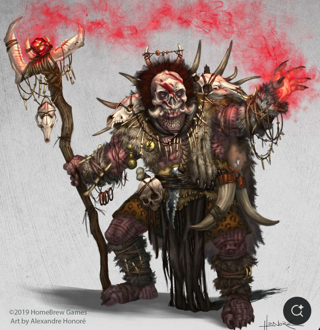

# Orc Shaman

**Level 5 Medium Orc**

## <mark style="color:green;background-color:blue;">Defense Traits</mark>

<mark style="color:green;">**AC**</mark> 20\
<mark style="color:green;">**HP**</mark> 50\
<mark style="color:green;">**Poise**</mark> 27  (DR 1)\
<mark style="color:green;">**Fort**</mark> +6, <mark style="color:green;">**Refl**</mark> +7, <mark style="color:green;">**Will**</mark> +10

<mark style="color:green;">**Ferocity**</mark>

<mark style="color:green;">**Flames Cleanse You**</mark> - A shaman can use their Flames Cleanse Me technique on an ally within reach.

## <mark style="color:orange;background-color:red;">Offense Traits (DC 17)</mark>

<mark style="color:red;">**Staff (C)**</mark>  +6\
d8+1 (5)

<mark style="color:red;">**Blazing Palm (Fire)**</mark>  +6 (+2 sniper)\
d6+6 (9) +ablaze

<mark style="color:red;">**Innate Techniques (CL 6)**</mark> - [Blazing Palm](https://app.gitbook.com/s/2kNIiIcUKxqLFlLgDKSI/magical-techniques/prismancy/level-1/blazing-palm), [Flame Cleanse Me](https://app.gitbook.com/s/2kNIiIcUKxqLFlLgDKSI/magical-techniques/pyromancy/level-2/flame-cleanse-me)\
1/day - [Fire Blast](https://app.gitbook.com/s/2kNIiIcUKxqLFlLgDKSI/magical-techniques/pyromancy/level-3/fire-blast), [Corpse Explosion](https://app.gitbook.com/s/2kNIiIcUKxqLFlLgDKSI/magical-techniques/necromancy/level-3/corpse-explosion), [Corpse Transposition](https://app.gitbook.com/s/2kNIiIcUKxqLFlLgDKSI/magical-techniques/necromancy/level-3/corpse-transposition)

<mark style="color:red;">**Bloodlust (Su) \[buff] \[concentration]**</mark> - Inspire ferocity in an ally within 30 ft. They gain a new multiattack option. The shaman must use both staves it wields to concentrate on this effect, and cannot make staff attacks while doing so.

<mark style="color:red;">**Multiattack**</mark> - Make 3 melee attacks against a creature.

## <mark style="color:blue;background-color:purple;">Weaknesses/Deep Lore</mark>

<mark style="color:blue;">**Necromantic Fascination**</mark> - An orc shaman can be persuaded with the promise of interesting information regarding necromancy. This can be custom spells made by a wizard, information related to in-universe discoveries or unique types of undead.

## <mark style="color:yellow;background-color:yellow;">Other Traits</mark>

<mark style="color:yellow;">**Ability Scores - Str +1, Dex +2, Lucc +0, Int +0, Wis +3, Cha +0**</mark>

<mark style="color:yellow;">**Night Vision**</mark>

<mark style="color:yellow;">**Gear**</mark> - Medium armor, 2 staves

<mark style="color:yellow;">**Feats**</mark> - [MM Sniping](https://app.gitbook.com/s/vxnMGGHnEtmcEQDFxcK6/magic-feats/mm-sniping), [Speak for the Dead](https://app.gitbook.com/s/vxnMGGHnEtmcEQDFxcK6/multiclass/speak-for-the-dead-su), [Ambrosia](https://app.gitbook.com/s/vxnMGGHnEtmcEQDFxcK6/multiclass/unarmored-defense)

<mark style="color:yellow;">**Skills**</mark> - +10 perception, +10 insight, +7 Religion, +7 History, +7 Arcana, +7 cryptozoology

<figure><figcaption>
Alexandre Honore
</figcaption></figure>
