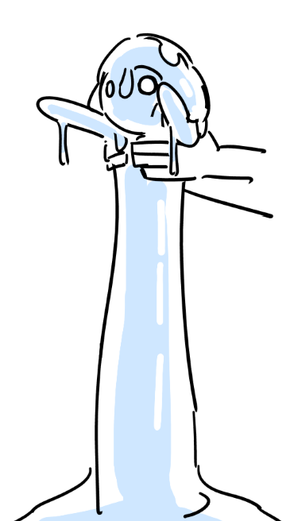

# Jizzle

**Level 0 Small Ooze**

## <mark style="color:green;background-color:blue;">Defense Traits</mark>

<mark style="color:green;">**AC**</mark> 11\
<mark style="color:green;">**HP**</mark> 20\
<mark style="color:green;">**Poise**</mark> 21\
<mark style="color:green;">**Fort**</mark> +5, <mark style="color:green;">**Refl**</mark> +1, <mark style="color:green;">**Will**</mark> +1

<mark style="color:green;">**Resistance**</mark> - Poison

<mark style="color:green;">**Indestructible**</mark> - A jizzle cannot be killed, only temporarily abated. When defeated, it shrinks down to the size of a mouse. By placing a defeated jizzle into a vessel, you can remove it as a threat.

<mark style="color:green;">**Immune**</mark> - Blinded, Blurred Vision

<mark style="color:green;">**Amorphous**</mark> - +12

## <mark style="color:orange;background-color:red;">Offense Traits (DC 12)</mark>

<mark style="color:red;">**Psuedpod (poison)**</mark>  +3 (+4 drag)\
2d6+2 (9)

<mark style="color:red;">**Extract Fluids**</mark> - As a standard action, the jizzle can feast on a creature within reach's bodily fluids. The creature takes 5 true damage and is fatigued (fort negates). Proper hydration and 10 minutes of rest can get rid of this fatigue.

## <mark style="color:blue;background-color:purple;">Weaknesses/Deep Lore</mark>

<mark style="color:blue;">**So That's Why it's Called That...**</mark> - With a DC 11 alchemy check and 1 hour, you can add the secret ingredient to a captured jizzle. With it, you can create a new jizzle physick.

<mark style="color:blue;">**Curiosity**</mark> - Jizzles when they aren't hungry will attempt to mimic the appearance of friendly creatures around them.

## <mark style="color:yellow;background-color:yellow;">Other Traits</mark>

<mark style="color:yellow;">**Ability Scores - Str +2, Dex +0, Lucc +0, Int -, Wis +0, Cha +0**</mark>

<mark style="color:yellow;">**Sightless Blindsense**</mark> - Tremor 60 ft

<mark style="color:yellow;">**Compression**</mark>

<mark style="color:yellow;">**Speed**</mark> - Swim 30, Climb 30 that is usable on any solid surface

<mark style="color:yellow;">**Skills**</mark> - +2 (+8) perception, +4 athletics

<figure><figcaption>
<a href="https://www.pixiv.net/en/artworks/83696755">By </a><a href="https://www.pixiv.net/en/users/8800162">水太</a>
</figcaption></figure>
