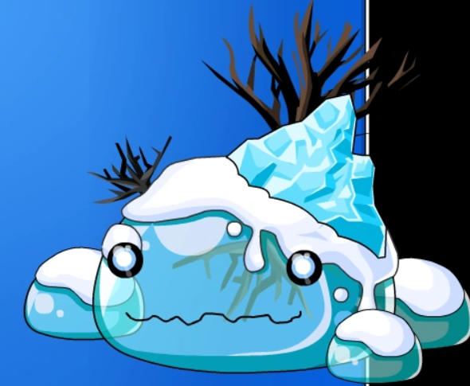

# Living Ice

**Level 4 Large Ooze**

## <mark style="color:green;background-color:blue;">Defense Traits</mark>

<mark style="color:green;">**AC**</mark> 17\
<mark style="color:green;">**HP**</mark> 78\
<mark style="color:green;">**Poise**</mark> 27 (DR 5 _Solid_)\
<mark style="color:green;">**Fort**</mark> +8, <mark style="color:green;">**Refl**</mark> +5, <mark style="color:green;">**Will**</mark> +3

<mark style="color:green;">**Resistance**</mark> - Frost, Water +4

<mark style="color:green;">**Amorphous**</mark> - +15

<mark style="color:green;">**Immune**</mark> - Blinded, Blurred Vision

## <mark style="color:orange;background-color:red;">Offense Traits (DC 16)</mark>

<mark style="color:red;">**Psuedopod**</mark><mark style="color:red;">**&#x20;**</mark>_<mark style="color:red;">**Solid**</mark>_<mark style="color:red;">**&#x20;**</mark><mark style="color:red;">**(P)**</mark>  +7\
2d6+3 (10)

<mark style="color:red;">**Waterbending**</mark><mark style="color:red;">**&#x20;**</mark>_<mark style="color:red;">**Liquid**</mark>_<mark style="color:red;">**&#x20;**</mark><mark style="color:red;">**(Frost/Crush)**</mark>  +7 (+frosty, 30 ft)\
4d6+3 (17)

<mark style="color:red;">**Multiattack**</mark>  - The living ice shrinks and causes many spikes to rapidly expand around its body. Make 3 psuedopod attacks attacks with a -4 penalty. If they all target different creatures, remove the penalty.

<mark style="color:red;">**Innate Techniques**</mark> - [Body Slam](https://app.gitbook.com/s/2kNIiIcUKxqLFlLgDKSI/martial-techniques/unarmed/level-2/body-slam), [Denied](https://app.gitbook.com/s/2kNIiIcUKxqLFlLgDKSI/martial-techniques/scoundrel/level-2/denied), [Lick (U2)](https://app.gitbook.com/s/2kNIiIcUKxqLFlLgDKSI/martial-techniques/beastmode/level-1/lick)\
1/day - [Ice Lance](https://app.gitbook.com/s/2kNIiIcUKxqLFlLgDKSI/magical-techniques/cryomancy/level-2/ice-lance)

<mark style="color:red;">**Icy Hold \[frost]**</mark> - Creature within 30 ft is made frosty. They are also take the living ice's waterbending damage as frost damage and is entangled (reflex halves dmg and negates entangled). Athletics to escape as a swift action. 1 fire damage frees the creature automatically. Can also be used on medium-sized objects.

<mark style="color:red;">**Ice Skating**</mark> - Whenever living ice moves, it leaves behind a trail of ice. Most creatures that step onto an icy space are knocked down (acrobatics or reflex negates). Living ice and other creatures accustomed to ice can traverse safely.

## <mark style="color:blue;background-color:purple;">Weaknesses/Deep Lore</mark>

<mark style="color:blue;">**Leftovers**</mark> - Living ice can swap between a solid and liquid form, generally preferring it's solid ice form. If a creature does fire damage to it while it is solid, it becomes liquid. If a creature uses frost damage on it when it is liquid, it becomes solid. Various other stats change depending on form, as noted in _italics_.

Dealing crush damage to it while it is knocked down also turns it into its liquid form.

If not under duress, it can change forms as a free action 1/turn. While in combat, it can't transform back into its solid form for 1 round after forcefully converted to its liquid form.

## <mark style="color:yellow;background-color:yellow;">Other Traits</mark>

<mark style="color:yellow;">**Ability Scores - Str +2, Dex +3, Lucc +0, Int -, Wis +0, Cha +0**</mark>

<mark style="color:yellow;">**Sightless Blindsense**</mark> - Tremor 60 ft

<mark style="color:yellow;">**Hide in Plain Sight**</mark> - Any snowy or arctic terrain.\
1 creature that fails to notice the living ice when it uses its hide in plain sight ability to ambush is automatically knocked down when attacked.

<mark style="color:yellow;">**Speed**</mark> - Swim 30, Climb 30 that is usable on any solid surface (_+20 all speeds liquid_)

<mark style="color:yellow;">**Feats**</mark> - [Power Pose](https://app.gitbook.com/s/vxnMGGHnEtmcEQDFxcK6/combat-feats/power-pose), [Skill Focus Stealth](https://app.gitbook.com/s/vxnMGGHnEtmcEQDFxcK6/general-feats/skill-focus), [Signature Skill Stealth](https://app.gitbook.com/s/ffUc9JSjKiYL5XuDfVdc/skills/stealth),

<mark style="color:yellow;">**Skills**</mark> - +6 perception, +9 (adv) stealth

<figure><figcaption>
<a href="https://epicbattlefantasy.fandom.com/wiki/Giant_Blue_Slime">Giant Blue Slime, Epic Battle Fantasy 3</a>
</figcaption></figure>
