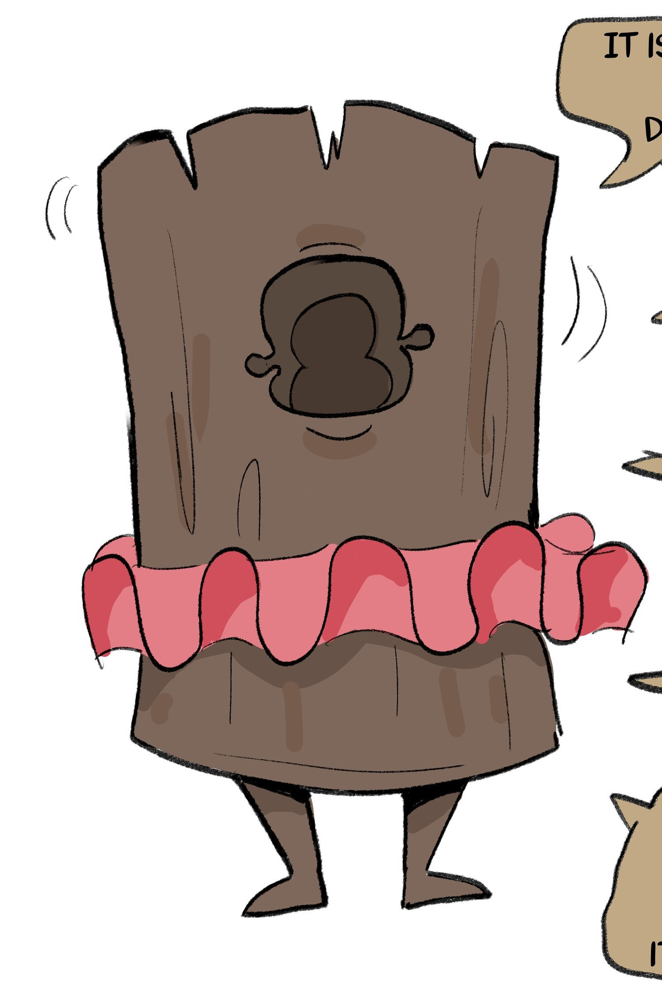

# Mockstump

**Level 3 Small Plant**

## <mark style="color:green;background-color:blue;">Defense Traits</mark>

<mark style="color:green;">**AC**</mark> 19\
<mark style="color:green;">**HP**</mark> 44\
<mark style="color:green;">**Poise**</mark> 27\
<mark style="color:green;">**Fort**</mark> +5, <mark style="color:green;">**Refl**</mark> +3, <mark style="color:green;">**Will**</mark> +7

<mark style="color:green;">**Comedy Gold \[healing]**</mark> - If a creature spends a standard action to roll a perform (comedy) check within 30 ft of the mockstump, they can grant the mockstump temp hp equal to half their roll. This functions with all mockstumps in range.

## <mark style="color:orange;background-color:red;">Offense Traits (DC 15)</mark>

<mark style="color:red;">**Bonk (C)**</mark>  +7\
d10+2 (7)

<mark style="color:red;">**Innate Techniques**</mark> - [Tree Shape](https://app.gitbook.com/s/2kNIiIcUKxqLFlLgDKSI/magical-techniques/mother-earth/level-1/tree-shape), [Mushroom Dance](https://app.gitbook.com/s/2kNIiIcUKxqLFlLgDKSI/magical-techniques/goomshroom/level-2/mushroom-dance), [Pants](https://app.gitbook.com/s/2kNIiIcUKxqLFlLgDKSI/magical-techniques/nack/level-1/pants)\
1/day - [Nourish](https://app.gitbook.com/s/2kNIiIcUKxqLFlLgDKSI/magical-techniques/mother-earth/level-2/nourish), [WonkaS](https://app.gitbook.com/s/2kNIiIcUKxqLFlLgDKSI/magical-techniques/frogg-saran/level-2/wonkas), [Headbutt](https://app.gitbook.com/s/2kNIiIcUKxqLFlLgDKSI/martial-techniques/warfare/level-2/headbutt), [Sanctuary](https://app.gitbook.com/s/2kNIiIcUKxqLFlLgDKSI/martial-techniques/protector/level-1/sanctuary-su)

<mark style="color:red;">**Wall of Wood (Su) \[concentration]**</mark> - A mockstump can create a wall of trees that resemble larger versions of itself placed side by side in a long line. The wall is 30 feet high and 30 feet wide. This wall cannot be damaged, but a creature can attempt to break it or tell it a joke as a swift action. They can also attempt to climb it as a swift action, but the stumps are constantly laughing, making it require an athletics check to climb. The DC for breaking, comedying or climbing the wall is 20. If broken or told a good joke, the wall disappears entirely.

If the creature fails this check, they are immediately effected by the mockstumps Hoo Hoo! ability. If the failure results in a natural 1 roll, the creature fails so spectacularly the wall disappears (though it is still ridiculed by the stumps).

<mark style="color:red;">**Hoo Hoo! \[psychic] \[recharge]**</mark> - Whenever a mockstump passes a saving throw, a creature misses an attack against it or fails an opposed skill check, a mockstump can laugh at them to cause them distress if they are within 60 ft. They take 2d6 (7) psychic damage and are shaken 1 (will halves dmg and negates shaken).

This can only happen once a turn, unless performed as a result of a creature failing to best the wood wall.

<mark style="color:red;">**Speak for the Trees (Su)**</mark> - A mockstump can spend a swift action to cause an inanimate tree (including one from its own wall) to slam down on a creature within 10 feet of it. This functions as its own bonk attack, and can also be used to shove, bully or knock down.

## <mark style="color:blue;background-color:purple;">Weaknesses/Deep Lore</mark>

<mark style="color:blue;">**Weakness**</mark> - Fire 2

## <mark style="color:yellow;background-color:yellow;">Other Traits</mark>

<mark style="color:yellow;">**Ability Scores - Str +2, Dex +0, Lucc +3, Int -2, Wis +2, Cha +0**</mark>

<mark style="color:yellow;">**Speed**</mark> - 30

<mark style="color:yellow;">**Mascot**</mark> - A mockstump always grants a +2 bonus to skill checks when using the aid action.

<mark style="color:yellow;">**Feats**</mark> - [Fleet Footwork](https://app.gitbook.com/s/vxnMGGHnEtmcEQDFxcK6/combat-feats/fleet-footwork), [Blind Fight](https://app.gitbook.com/s/vxnMGGHnEtmcEQDFxcK6/combat-feats/blind-fight)

<mark style="color:yellow;">**Skills**</mark> - +7 perception, +7 survival

<figure><figcaption>
Mockstump by <a href="https://x.com/basedbinkie">BasedBinkie</a>
</figcaption></figure>
