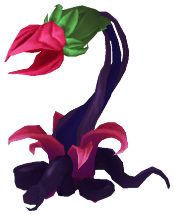

# Thorn Spitter

**Level 3 Small Plant**

## <mark style="color:green;background-color:blue;">Defense Traits</mark>

<mark style="color:green;">**AC**</mark> 17\
<mark style="color:green;">**HP**</mark> 50\
<mark style="color:green;">**Poise**</mark> 24\
<mark style="color:green;">**Fort**</mark> +3, <mark style="color:green;">**Refl**</mark> +9, <mark style="color:green;">**Will**</mark> +3

<mark style="color:green;">**Resistance**</mark> - Poison

## <mark style="color:orange;background-color:red;">Offense Traits (DC 15)</mark>

<mark style="color:red;">**Thorn Spit (P)**</mark>  +7 (30 ft, no second increment)\
d8+4 (8)

<mark style="color:red;">**Multiattack**</mark> - Make 2 thorn attacks.

<mark style="color:red;">**Innate Techniques**</mark> - [Pin Down](https://nick-nacks-rpg.gitbook.io/nicknacksrpg.com/techniques/martial-techniques/marksman/level-1/pin-down)

<mark style="color:red;">**Special Attack: Toxin \[poison]**</mark> - A thorn spitter can coat its thorns in annoying poisons, dealing an additional d8 (4) poison damage. It can apply one of the following. This special attack can be used once for each poison.

<mark style="color:orange;">Irritation</mark> - Apply sickened 2 on hit.\
<mark style="color:orange;">Sleepy</mark> - Creature is made drowsy. If it does not take damage within 1 round, it falls asleep. Thorn spitters will not attack creatures still drowsy from sleep toxin.\
<mark style="color:orange;">Paralytic</mark> - Inflict a poison that worsens as time passes.\
Creature is staggered for 1 round (fort negates). If the creature failed the first save, they make another save at the end of the turn they are staggered. They are dazed on the turn after (fort negates). If the creature failed the past 2 saves, it makes another save at the end of the turn it is dazed. They are stunned the turns after (fort negates). This stun lasts until they pass a save.

<mark style="color:red;">**Thorn in my Side**</mark> - Thorn attacks stick inside of creatures on hit. A creature takes damage equal to the number of thorns stuck in them at the start of their turn. A thorn can be removed automatically with either a swift action or the aid action, dealing 1 damage. All thorns can be removed with a DC 17 medicine check to apply first aid, dealing no damage.

## <mark style="color:blue;background-color:purple;">Weaknesses/Deep Lore</mark>

<mark style="color:blue;">**Weakness**</mark> - Slash 2, Fire 2

## <mark style="color:yellow;background-color:yellow;">Other Traits</mark>

<mark style="color:yellow;">**Ability Scores - Str -1, Dex +4, Lucc +0, Int -, Wis +0, Cha +0**</mark>

<mark style="color:yellow;">**Sightless Blindsense**</mark> - Tremorsense (60 ft)

<mark style="color:yellow;">**Speed**</mark> - 5

<mark style="color:yellow;">**Feats**</mark> - [Snap Shot](https://nick-nacks-rpg.gitbook.io/nicknacksrpg.com/feats/combat-feats/point-blank-master/snap-shot), [Point Blank Master](https://nick-nacks-rpg.gitbook.io/nicknacksrpg.com/feats/combat-feats/point-blank-master), [Combat Reflexes](https://nick-nacks-rpg.gitbook.io/nicknacksrpg.com/feats/combat-feats/combat-reflexes)

<mark style="color:yellow;">**Skills**</mark> - +5 perception, +9 stealth

<figure><figcaption>
Zyra Plant, League of Legends
</figcaption></figure>
