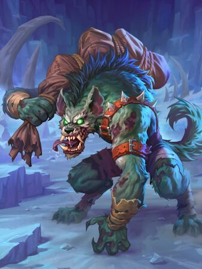

# Body Bagger

**Level 1 Medium Undead**

## <mark style="color:green;background-color:blue;">Defense Traits</mark>

<mark style="color:green;">**AC**</mark> 15\
<mark style="color:green;">**HP**</mark> 30\
<mark style="color:green;">**Poise**</mark> 28\
<mark style="color:green;">**Fort**</mark> +4, <mark style="color:green;">**Refl**</mark> +5, <mark style="color:green;">**Will**</mark> +2

<mark style="color:green;">**Resistance**</mark> - Necrotic

## <mark style="color:orange;background-color:red;">Offense Traits (DC 13)</mark>

<mark style="color:red;">**Bite (P)**</mark>  +4  (+4 MI)\
2d6+3 (10)

<mark style="color:red;">**Body Bag (C)**</mark>  +4  (+2 drag, +4 MI)\
2d6+3 (10)

<mark style="color:red;">**Multiattack**</mark> - Make a drag attack and a body bag attack.

<mark style="color:red;">**Innate Techniques**</mark> - [Kidnap](https://app.gitbook.com/s/2kNIiIcUKxqLFlLgDKSI/martial-techniques/scoundrel/level-1/kidnap)\
1/day - [Blight](https://app.gitbook.com/s/2kNIiIcUKxqLFlLgDKSI/magical-techniques/necromancy/level-1/blight)

<mark style="color:red;">**Bag 'em and Drag 'em**</mark> - When a body bagger succeeds on a drag attempt, they snatch the creature up in their durable leather body bag. The creature is entangled while encased in this bag. They can escape by successfully disarming or sundering the body bagger. Anything else that could reasonably separate trapped creatures from the bag can also free them.

If a body bagger has something already in its bag, it cannot put another creature inside. Body baggers can empty their bag as a swift action. They cannot bag bodies with a sundered bag.

<mark style="color:red;">**Special Attack: Bag 'em and Whack Em**</mark> - If the body bagger has a creature or sufficiently heavy object in their bag, they can use it as an attack form. This makes it an improvised 2h weapon. If a creature is inside the bag, they also take any damage dealt by this special attack.

## <mark style="color:blue;background-color:purple;">Weaknesses/Deep Lore</mark>

<mark style="color:blue;">**Weakness**</mark> - Slash 2

<mark style="color:blue;">**Even Trade**</mark> - Body baggers can be convinced to leave a creature alone for bits and pieces of deceased creatures. They won't accept rotten or skeletal remains. Any deal made with such items gives a creature advantage on skill checks with them.

## <mark style="color:yellow;background-color:yellow;">Other Traits</mark>

<mark style="color:yellow;">**Ability Scores - Str +3, Dex +2, Lucc +0, Int -1, Wis +1, Cha +0**</mark>

<mark style="color:yellow;">**Nightvision**</mark>

<mark style="color:yellow;">**Speed**</mark> - 35

<mark style="color:yellow;">**Blindsense**</mark> - Scent (10 ft)

<mark style="color:yellow;">**Feats**</mark> - [Maneuver Initiate](https://app.gitbook.com/s/vxnMGGHnEtmcEQDFxcK6/combat-feats/maneuver-initiate)

<mark style="color:yellow;">**Skills**</mark> - +4 perception, +6(+2) survival, +6 athletics, +5 stealth&#x20;

<figure><figcaption>
<a href="https://hearthstone.wiki.gg/wiki/Body_Bagger">Body Bagger, Hearthstone</a>
</figcaption></figure>
