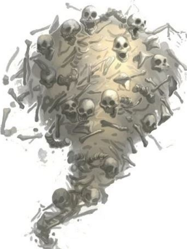

# Calcium Elemental

**Level 5 Large Undead/Elemental**

## <mark style="color:green;background-color:blue;">Defense Traits</mark>

<mark style="color:green;">**AC**</mark> 18\
<mark style="color:green;">**HP**</mark> 90\
<mark style="color:green;">**Poise**</mark> 29 (DRA 1)\
<mark style="color:green;">**Fort**</mark> +8, <mark style="color:green;">**Refl**</mark> +8, <mark style="color:green;">**Will**</mark> +4

<mark style="color:green;">**Resistance**</mark> - Necrotic

<mark style="color:green;">**Amorphous**</mark> - +12

<mark style="color:green;">**One of Us \[healing]**</mark> - By hovering adjacent to it, a calcium elemental can absorb a defeated undead creature into its being. This heals the calcium elemental equal to (5+creatures level).

## <mark style="color:orange;background-color:red;">Offense Traits (DC 17)</mark>

<mark style="color:red;">**Bones (S+P+C)**</mark>  +8\
d10+3 (8)

<mark style="color:red;">**Bone Cannon (S+P+C)**</mark>  +10 (60/120 range, deals 5 damage to calcium elemental when used)\
4d8+3 (21)

<mark style="color:red;">**Multiattack**</mark> - 1 bones/weapon attack and 1 disarm

<mark style="color:red;">**Bone Zone**</mark> - A calcium elemental can hover through another creatures space, provoking attacks of opportunity and dealing its bones attack damage (8).

<mark style="color:red;">**Loot!**</mark> - When the calcium elemental disarms a weapon, it incorporates it into its being and the weapon cannot be retrieved until the calcium elemental is defeated or disarmed. It can make attacks (include special attacks) with any weapons it steals in place of a bones attack.&#x20;

<mark style="color:red;">**Extract Calcium \[healing]**</mark> - As a standard action, the calcium elemental can extract the calcium of an adjacent creature. The creature takes a -4 penalty to AC (fort negates) and the calcium elemental heals 10 hp. The creature can recover its calcium by sucking on the bones of a defeated calcium elemental or drinking some milk (swift).&#x20;

## <mark style="color:blue;background-color:purple;">Weaknesses/Deep Lore</mark>

<mark style="color:blue;">**Weakness**</mark> - Crush 2

## <mark style="color:yellow;background-color:yellow;">Other Traits</mark>

<mark style="color:yellow;">**Ability Scores - Str +1, Dex +3, Lucc +0, Int -3, Wis -1, Cha -1**</mark>

<mark style="color:yellow;">**Nightvision**</mark>

<mark style="color:yellow;">**Speed**</mark> - 50 hover

<mark style="color:yellow;">**Hide in Plain Sight**</mark>

<mark style="color:yellow;">**Spookyness**</mark> - +2

<mark style="color:yellow;">**Feats**</mark> - [Toughness](https://app.gitbook.com/s/vxnMGGHnEtmcEQDFxcK6/combat-feats/toughness), [Power Pose](https://app.gitbook.com/s/vxnMGGHnEtmcEQDFxcK6/combat-feats/power-pose), [Unstoppable](https://app.gitbook.com/s/vxnMGGHnEtmcEQDFxcK6/combat-feats/unstoppable)

<mark style="color:yellow;">**Skills**</mark> - +6 perception

<figure><figcaption>
<a href="https://origamigoblin.com/ep136/">https://origamigoblin.com/ep136/</a>
</figcaption></figure>
