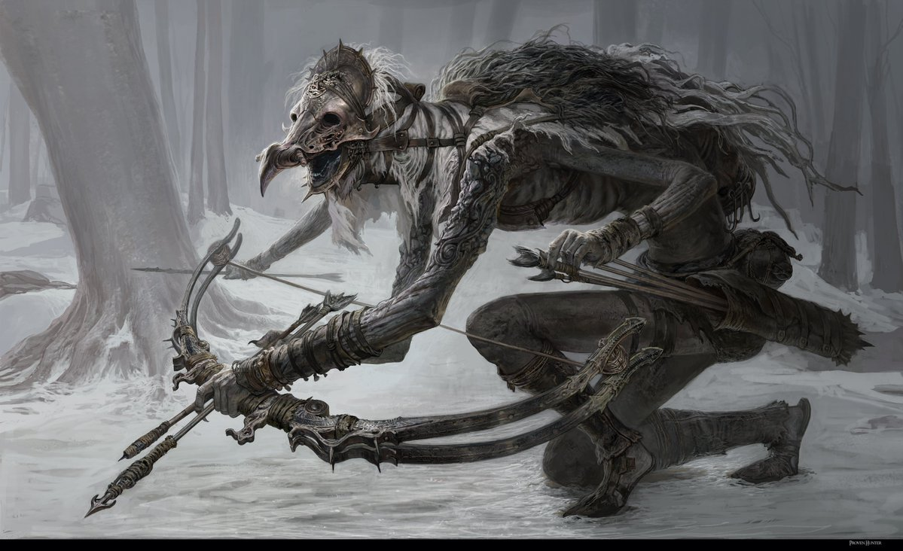

# Gloomstalker

**Level 5 Medium Undead**

## <mark style="color:green;background-color:blue;">Defense Traits</mark>

<mark style="color:green;">**AC**</mark> 19 (light armor)\
<mark style="color:green;">**HP**</mark> 70\
<mark style="color:green;">**Poise**</mark> 27\
<mark style="color:green;">**Fort**</mark> +5, <mark style="color:green;">**Refl**</mark> +10, <mark style="color:green;">**Will**</mark> +8

<mark style="color:green;">**Snatch Arrows**</mark> - As an immediate action, negate a ranged attack that does physical damage.

<mark style="color:green;">**Resistance**</mark> - Necrotic

## <mark style="color:orange;background-color:red;">Offense Traits (DC 17)</mark>

<mark style="color:red;">**Longbow (P)**</mark>  +10\
d8+3 (7)

<mark style="color:red;">**Peck (P)**</mark>  +8\
d8+3 (7)

<mark style="color:red;">**Multiattack**</mark> - Make 3 ranged attacks

<mark style="color:red;">**Innate Techniques**</mark> - [Flying Arrow,](https://app.gitbook.com/s/2kNIiIcUKxqLFlLgDKSI/martial-techniques/marksman/level-1/flying-arrow-su) [Pin Down](https://app.gitbook.com/s/2kNIiIcUKxqLFlLgDKSI/martial-techniques/marksman/level-1/pin-down)\
1/day - [Rain of Arrows](https://app.gitbook.com/s/2kNIiIcUKxqLFlLgDKSI/martial-techniques/marksman/level-3/rain-of-arrows-su), [Silence](https://app.gitbook.com/s/2kNIiIcUKxqLFlLgDKSI/magical-techniques/moogen/level-2/silence)

<mark style="color:red;">**Sigil of Vigilance (Su) \[sigil]**</mark> - As a standard action, a gloom stalker can place a sigil on the ground at a point within 60 ft that it can see. When an enemy moves anywhere within 20 ft of the sigil, the gloom stalker reflexively shoots them, provided they have a ranged weapon with which to do so and can see the target.

They get a +2 bonus to these reflexive attacks if made with high ground.

<mark style="color:red;">**Special Attack: Serrated Arrow**</mark> - This arrow is embedded in a creature in such a way that it impedes movement, making a creature clumsy 1. Can be removed as a swift action. When removed, the creature takes 7 damage unless it is removed by successfully administering first aid.

This special attack can be used any number of times a combat.

<mark style="color:red;">**Special Attack: Silencing Strike**</mark>

## <mark style="color:blue;background-color:purple;">Weaknesses/Deep Lore</mark>

<mark style="color:blue;">**Weakness**</mark> - Holy 3

<mark style="color:blue;">**Birdcalls**</mark> - By rolling a disguise check (DC 20) as a swift action, you can fake bird calls to fascinate a gloom stalker that can hear them for 1 round. Can only be attempted once. You get advantage on this disguise check if you are hiding in a tree.

## <mark style="color:yellow;background-color:yellow;">Other Traits</mark>

<mark style="color:yellow;">**Ability Scores - Str +0, Dex +3, Lucc +0, Int +0, Wis +3, Cha +0**</mark>

<mark style="color:yellow;">**Nightvision**</mark>

<mark style="color:yellow;">**Wall Cling**</mark> - Extra limbs afford a gloom stalker the ability to shoot its bow while climbing, but it loses an attack from its multiattack if it does so

<mark style="color:yellow;">**Speed**</mark> - 30 climb

<mark style="color:yellow;">**Equipment**</mark> - 1 longbow, Light Armor

<mark style="color:yellow;">**Feats**</mark> - [Suppressing Fire](https://app.gitbook.com/s/vxnMGGHnEtmcEQDFxcK6/combat-feats/suppressing-fire), [SF Perception](https://app.gitbook.com/s/vxnMGGHnEtmcEQDFxcK6/general-feats/skill-focus), [SS Perception](https://app.gitbook.com/s/ffUc9JSjKiYL5XuDfVdc/skills/perception)

<mark style="color:yellow;">**Skills**</mark> - +10 (adv) perception, +12 survival, +10 stealth, +12 sleight of hand, +10 acrobatics, +7 nature

<figure><figcaption>
<a href="https://x.com/orfii13954/status/1894744790685618350">By Orfii</a>
</figcaption></figure>
