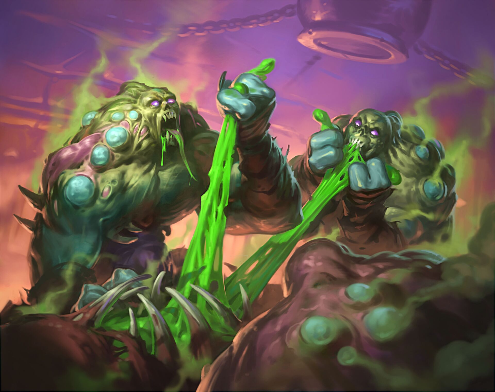

# Nameless Hoard

**Level 4 Massive Undead \[group]**

## <mark style="color:green;background-color:blue;">Defense Traits</mark>

<mark style="color:green;">**AC**</mark> 14\
<mark style="color:green;">**HP**</mark> 68\
<mark style="color:green;">**Poise**</mark> -\
<mark style="color:green;">**Fort**</mark> +9, <mark style="color:green;">**Refl**</mark> +3, <mark style="color:green;">**Will**</mark> +4

<mark style="color:green;">Single Target Resistance</mark> - Resistance to any damage that only affects a single creature, most common with attack rolls. Certain attacks like cleave can ignore this resistance.

Single target effects that deal no damage have no effect.

<mark style="color:green;">Poise Immune</mark> - Cannot be poise broken

## <mark style="color:orange;background-color:red;">Offense Traits (DC 16)</mark>

<mark style="color:red;">**Auto Attack (P)**</mark> \
2d6+3 (10) or 23 poise damage to attempt a grapple

<mark style="color:red;">**Multiattack -**</mark> Special: Can only be used after feasting\
Make an auto attack to deal pierce damage and to grapple.

<mark style="color:red;">**Feast**</mark> - The nameless hoard consumes all. It can move over a dead creature and rapidly tear it to shreds, including other undead creatures. Any round the hoard does this, they can move an additional 40 feet to continue the frenzy. They also get access to a multiattack during any turn they feast.

<mark style="color:red;">**Grasp of the Starved**</mark> - Creatures grappled by a nameless hoard are automatically dragged into its center. The hoard takes no penalty to actions or movement. The grappled creature are carried along with the hoard and automatically take its auto attack each turn (including the turn they initiate the grapple).

The hoard can move over the space of a knocked down creature. While the hoard does so, the creature cannot lose the knocked down condition.

<mark style="color:red;">**Infection**</mark> - Creatures that take damage from the hoard are inflicted with a T1 affliction (fort negates).

<mark style="color:orange;">Boils</mark> - A bunch of puss filled boils slowly form on your skin. At the end of each day, you become drained 1. If this kills the creature by reducing its max hp to 0 or the creature otherwise dies while this infection affects them, they rise as a [zombie](zombie.md) a few minutes later.

<mark style="color:orange;">Cure</mark> - Application of holy water to the affected area immediately dissolves the boils, removing the affliction, but not any drain it inflicted.

## <mark style="color:blue;background-color:purple;">Weaknesses/Deep Lore</mark>

<mark style="color:blue;">**AoE Vulnerability**</mark> - Take 50% more damage from any AoE effect

<mark style="color:blue;">**Weakness**</mark> - Holy 3

## <mark style="color:yellow;background-color:yellow;">Other Traits</mark>

<mark style="color:yellow;">**Ability Scores - Str +3, Dex -1, Lucc +0, Int -, Wis +0, Cha -1**</mark>

<mark style="color:yellow;">**Nightvision**</mark>

<mark style="color:yellow;">**Skills**</mark> - +7 perception

<figure><figcaption>
<a href="https://hearthstone.wiki.gg/wiki/Cannibalize">Cannibalize, Hearthstone</a>
</figcaption></figure>
