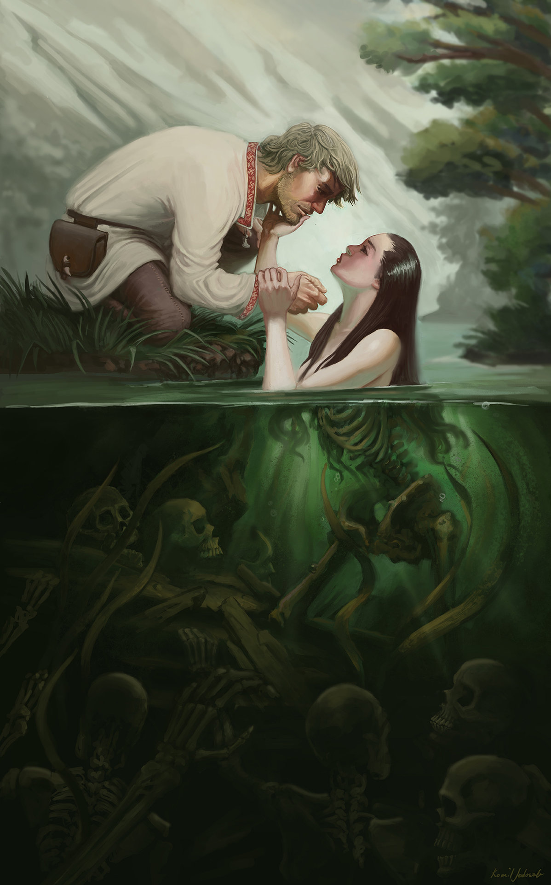

# River Spirit

**Level 1 Medium Undead/Fey \[boss]**

## <mark style="color:green;background-color:blue;">Defense Traits</mark>

<mark style="color:green;">**AC**</mark> 14 (+4)\
<mark style="color:green;">**HP**</mark> 52\
<mark style="color:green;">**Poise**</mark> 23\
<mark style="color:green;">**Fort**</mark> +0, <mark style="color:green;">**Refl**</mark> +3, <mark style="color:green;">**Will**</mark> +3

<mark style="color:green;">**Bound**</mark> - River spirits are bound to the body of water they perished in and cannot be forcefully removed from it. They also cannot willingly leave it.

<mark style="color:green;">**Resistance**</mark> - Necrotic

<mark style="color:green;">**Washed Away \[recharge] \[elusive]**</mark> - As a swift action, a river spirit can cause a wave of water to push itself or an ally within 30 ft. It pushes up to 30 feet in a straight line.

<mark style="color:green;">**Beneath the Waves**</mark> - As long as its attacker is not immersed in water, gains resistance to ALL damage from said creature.

## <mark style="color:orange;background-color:red;">Offense Traits (DC 14)</mark>

<mark style="color:red;">**Caress**</mark>  +3\
Drain 1 and fatigue

<mark style="color:red;">**Waterbending (C)**</mark>  +3 (30 ft)\
2d6+3&#x20;

<mark style="color:red;">**Innate Techniques**</mark> - [Pollinate](https://app.gitbook.com/s/2kNIiIcUKxqLFlLgDKSI/magical-techniques/mother-earth/level-1/pollinate), [Bone Shaker](https://app.gitbook.com/s/2kNIiIcUKxqLFlLgDKSI/magical-techniques/necromancy/level-1/bone-shaker), [Decomposition](https://app.gitbook.com/s/2kNIiIcUKxqLFlLgDKSI/magical-techniques/necromancy/level-1/decomposition)\
1/day - [Mind Crush](https://app.gitbook.com/s/2kNIiIcUKxqLFlLgDKSI/magical-techniques/larella/level-1/mind-crush), [Wild Growth](https://app.gitbook.com/s/2kNIiIcUKxqLFlLgDKSI/magical-techniques/mother-earth/level-1/wild-growth), [Blight](https://app.gitbook.com/s/2kNIiIcUKxqLFlLgDKSI/magical-techniques/necromancy/level-1/blight), [Unnatural Lust](https://app.gitbook.com/s/2kNIiIcUKxqLFlLgDKSI/magical-techniques/brazzeria/level-1/unnatural-lust)

<mark style="color:red;">**Pool Party \[glamer]**</mark> - A river spirit is surrounded by the victims it kills. From outside of the water the victims and the spirit appear as though they have taken on aquatic forms and are enjoying life beneath the surface of the water.

For creatures that are inside of the water, the skeletal victims reach for them and pull them under. The victims cannot be attacked. They deal 17 poise damage each turn \[persistent].

<mark style="color:red;">**Boss Actions**</mark>

<mark style="color:orange;">Rattle 'Em Boys \[recharge] \[companion]</mark> - Once the jig is up and creatures realize the true nature of the river spirit, let 2 skeletal victims walk free, functioning as [skeletons](skeleton.md). They gain the river spirit's teamwork feats and a +4 bonus to grapple attacks.\
<mark style="color:orange;">Water's Caress \[elusive]</mark> - Move up to 20 feet and automatically land a caress attack when a creature is grappled. Usable 1/turn.

## <mark style="color:blue;background-color:purple;">Weaknesses/Deep Lore</mark>

<mark style="color:blue;">**Temptation \[charm]**</mark> - A river spirit has an aura that compels creature to approach the water's edge (will negates). Each turn a creature stands next to the water, they are unknowingly drained 1 as it caresses them. The effects of the drain are not apparent to onlookers or the creature until the river spirits hold is broken. Each turn a tempted creature may attempt a new will save to realize what is happening.&#x20;

If creatures that are not tempted happen to pass a religion check, they automatically learn of this quality.

<mark style="color:blue;">**Weakness**</mark> - Crush 2

## <mark style="color:yellow;background-color:yellow;">Other Traits</mark>

<mark style="color:yellow;">**Ability Scores - Str -1, Dex +2, Lucc +2, Int +1, Wis +0, Cha +3**</mark>

<mark style="color:yellow;">**Nightvision**</mark>

<mark style="color:yellow;">**Speed**</mark> - Swim 40

<mark style="color:yellow;">**Feats**</mark> - [Combat Step](https://app.gitbook.com/s/vxnMGGHnEtmcEQDFxcK6/combat-feats/combat-step), [Escape Route](https://app.gitbook.com/s/vxnMGGHnEtmcEQDFxcK6/teamwork-feats/escape-route)

<mark style="color:yellow;">**Skills**</mark> - +3 perception, +10 deception, +4 local, +4 cryptozoology

<figure><figcaption></figcaption></figure>
