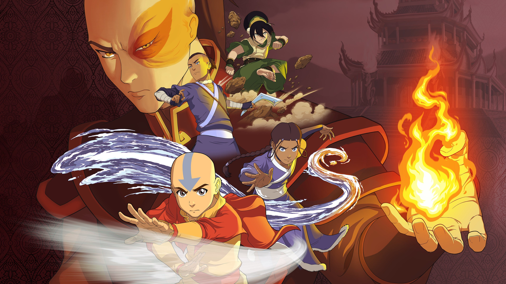

# Bender

Gain mastery over a specific element, using it as an extension of your own body. Benders use their favored element in order to augment their attacks and movement. They also get unique quirks based off of the qualities of the elements that they bend.



<figure><figcaption>
From the cover art of the game <em>Avatar: The Last Airbender - Quest for Balance</em>
</figcaption></figure>



Requires Archetype

| HP (mixed) | 20(+8 per level) |
| ---------- | ---------------- |
| Poise      | 6                |
| Skills     | 4                |
| Save       | Refl             |
| Memory     | 3+lvl            |



## <mark style="color:green;">1 - Elemental Techniques</mark>

Benders ignore the standard technique point progression when it comes to abilities that match a tag of their favored element. They automatically know all techniques (still capped by the technique level maximum) that match the tag of elemental blasts they can use. In addition, I added a list of other techniques I thought thematically appropriate.

You can replace the damage of any attacks in techniques with your blast damage (not compatible with upcast damage). You can use your blast to deliver the effects of techniques and special attacks, though they still must match the type of attack (ranged attack, melee attack etc). You ignore the staff component of any spell you gain through this feature. Techniques/special attacks that require simple attacks cannot use your blast damage.

<mark style="color:green;">Waterbenders</mark> initially get the \[water] tag and @3 get the \[frost] tag. Most water techniques are in the [Goomshroom](https://app.gitbook.com/s/2kNIiIcUKxqLFlLgDKSI/magical-techniques/goomshroom) tree and most frost techniques are in the [Cryomancy](https://app.gitbook.com/s/2kNIiIcUKxqLFlLgDKSI/magical-techniques/cryomancy) tree.

<mark style="color:green;">Earthbenders</mark> get the \[earth] tag. Most earth techniques are in the [Cataclysm](https://app.gitbook.com/s/2kNIiIcUKxqLFlLgDKSI/martial-techniques/cataclysm) tree.

<mark style="color:green;">Firebenders</mark> get the \[fire] tag and @5 get the \[zap] tag. Most fire techniques are in the [Pyromancy](https://app.gitbook.com/s/2kNIiIcUKxqLFlLgDKSI/magical-techniques/pyromancy) tree and most zap techniques are in the [Clairvoyance](https://app.gitbook.com/s/2kNIiIcUKxqLFlLgDKSI/magical-techniques/clairvoyance) tree.

<mark style="color:green;">Airbenders</mark> get the \[air] tag. Most air techniques are in the [Clairvoyance](https://app.gitbook.com/s/2kNIiIcUKxqLFlLgDKSI/magical-techniques/clairvoyance) tree.

Instead of a particular specialization, you ignore the staff component of any spells that match your elemental tag(s).

## <mark style="color:green;">1 - Favored Element (Su)</mark>

At level 1 you choose an element. Once chosen it cannot be changed. Your elements decides many aspects of your class. In order to use any (Su) class abilities, you must meet requirements based on the element. You get a +4 bonus on saves against effects that share the same tag as your element.

## <mark style="color:green;">1 - Elemental Blast (Su)</mark>

As a standard action you attack a foe within 30 ft using either str or dex as your attacking stat. If the creature is out of reach, it counts as a ranged attack. If the creature is within your natural reach, you can either make the blast as a melee or ranged attack. It's damage is 2d6+str/dex, increasing by d6 @3 and every odd level after. The damage type is determined by your favored element.

## <mark style="color:green;">1 - Elemental Movement (Su)</mark>

Gain a bonus movement type based off of your favored element.

## <mark style="color:green;">1 - Elemental Defense (Su)</mark>

Gain a defensive property based off of your favored element.

## <mark style="color:green;">1 - Elemental Intuition (Su)</mark>

These features are passives gained regularly by leveling up. These features are universal for each element. Gain one each odd level.

## <mark style="color:green;">1 - Elemental Styles (Su)</mark>

These features give your bending more options. If an ability has a mana cost, it is noted next to its name (in parenthesis), or in the description if only a specific part costs mana.\
Gain 1 this level and another one at level 2, 4, 6, 8 and 10.&#x20;

## <mark style="color:green;">2 - Elemental Wave (Su)</mark>

Spend 1 mana to launch your element at all creatures in a 30 ft line or in a 10 ft burst (centered on you). Deal your blast damage to all affected creatures (reflex halves). If you can change your blasts damage, you can change the damage of elemental wave as well.

## <mark style="color:green;">2 - Elemental Counter</mark>

You can innately cast dispel magic (CL=lvl+2), but only on effects that share the tag of your blast tag(s).

## <mark style="color:green;">4 - Improved Blast</mark>

The damage dice of your elemental blast increases to d8.

## <mark style="color:green;">6 - Planar Travel (Su)</mark>

1/day you can use plane shift to transport yourself to your corner of the elemental plane based on your favored element. At any time thereafter you can perform a similar ritual to return to the exact position you came from.

## <mark style="color:green;">8 - Greater Blast</mark>

The damage dice of your elemental blast increases to d10
