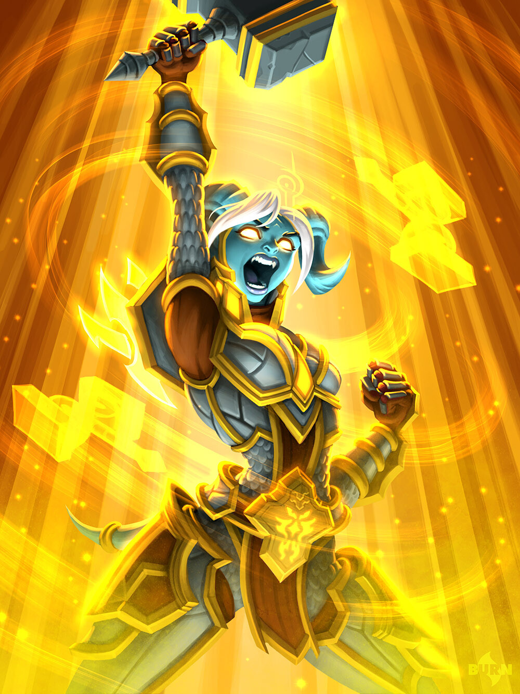

# 🔆 Light Guardian

The Light Guardians are an organization of people that make sure mages don't tear the world asunder. They also do their best to keep the planes separate from each other, in particular the demon realm. Their incredibly powerful signature ability, light binding, suppresses magic in all of its forms, leveling the playing field.&#x20;



<figure><figcaption>
<a href="https://hearthstone.wiki.gg/wiki/Lightforged_Crusader">Lightforged Crusader, Hearthstone</a>
</figcaption></figure>



Requires Archetype

| HP (martial) | 20(+10 per level) |
| ------------ | ----------------- |
| Poise        | 8                 |
| Skills       | 2                 |
| Save         | Will              |
| Memory       | 3+lvl             |



## <mark style="color:green;">1 - Technique Specialization (Martial)</mark>

You gain 2 technique points at level 1, then another point every 2 levels after.\
These technique points can be used on the Arc and Protector tree.

Characters with martial specialization gain points in warfare equal to their highest tier of martial technique.

## <mark style="color:green;">1 - Special Attack: Light Binding (Su)</mark>

Make a weapon, natural or unarmed attack and deal your level in additional holy damage. If this attack is melee, gain +2 attack. Siphon on-hit until the end of your next turn (will negates).\
You can use this special attack at will.

Light binding can also be used to permanently close a portal to another plane automatically.\
Light binding functions as [dispel magic](https://app.gitbook.com/s/2kNIiIcUKxqLFlLgDKSI/magical-techniques/wildcard/level-2/dispel-magic) against magical effects not attached to creatures, using your attack bonus in place of your CL.

## <mark style="color:green;">1 -Bouncing Light (Su)</mark>

Whenever you use light binding, your attack bounces using ghostly shining afterimages, affecting another target using the same attack roll. It bounces to an additional target at level 6 and 10. Functions even if the attack is melee.\
Each additional target needs to be within 20 ft of the last. Additional targets can be ongoing magical effects as well as creatures.

## <mark style="color:green;">1 - Spell Resistance (Su)</mark>

As an immediate action, shield an ally (including yourself), giving them resistance to damage against a spell or supernatural (Su) effect. You intuitively know what this ability can and can't apply to.

## <mark style="color:green;">2 - Channel Energy (Su) \[healing] \[overheal] \[recharge]</mark>

You can unleash a pulse of energy at your maximum power, healing all allies within 60ft for (5+2\*lvl) hp.

## <mark style="color:green;">4 - Hell and Back (Sp) \[recharge]</mark>

You can innately cast the spell [Hell and Back](https://app.gitbook.com/s/2kNIiIcUKxqLFlLgDKSI/magical-techniques/brazzeria/level-3/hell-and-back).

## <mark style="color:green;">8 - Banishment (Su)</mark>

When a fiend fails its save against light binding and you are not in the demon realm, you choose can send it to the demon realm as an instant action.
