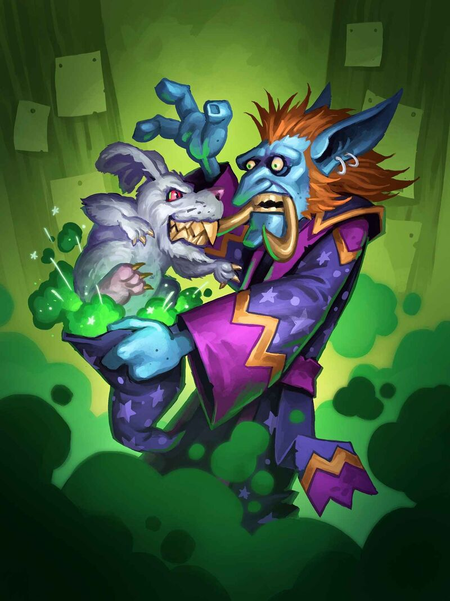

# 🐸 Lunatic

Trust in the power of Frogg-Saran. He's playing multi-dimensional 4D chess on a cosmic scale the likes of which you cannot comprehend. You need only to enact his will and you will be rewarded accordingly. To the moon!

The lunatic has a spell list filled with spells that have very inconsistent results. On top of that, every time a lunatic casts a spell, there is a chance that he receives a blessing from Frogg in the form of wild magic, further adding more unpredictable variables to their spell casting.



<figure><figcaption>
<a href="https://hearthstone.wiki.gg/wiki/Darkmoon_Magician">Darkmoon Magician</a>, Hearthstone
</figcaption></figure>



Requires Archetype

| HP (specialist) | 20(+6 per level) |
| --------------- | ---------------- |
| Poise           | 5                |
| Skills          | 2                |
| Save            | Will             |
| Memory          | 3+lvl            |



## <mark style="color:green;">1 - Spell Preferences</mark>

Lunatics simultaneously have access to every single spell school, and do not prepare spells. Instead they can choose any spell to memorize permanently whenever they gain a memory slot. Additional technique points gained through natural progression or otherwise grant additional memory slots.

Martial techniques consume 2 memory slots.

@Lvl 1 they can only select level 1 techniques. @Lvl 3 they can select up to level 2 techniques etc.\
In addition, they get cantrips and always memorize all Frogg techniques of spell levels they can cast.

## <mark style="color:green;">1 - Innate Casting \[recharge]</mark>

You can innately cast metronome.

## <mark style="color:green;">1 - Madness?</mark>

By embracing his will you have little need for your own. Instead of taking a penalty to your will saves based on your negative wisdom, you gain a bonus (-2 wis=+2 will). Instead of gaining a bonus to your will save based off of your positive wisdom, you gain a penalty (+2 wis=-2 will).\
Decrease your wisdom by 1.\
Gain Tier 1 favor in Frogg (see [wisdom](https://app.gitbook.com/s/1UhIURz1UgUHbhhsNrtV/the-rules/publish-your-docs) as well as [gods](https://app.gitbook.com/o/EKVEWQG0W87J8YCOQDO5/s/qFzTamwcoNEgFoEbLz7c/) for more info)

## <mark style="color:green;">1 - Inner Machinations</mark>

You gain resistance to psychic damage.

Whenever a creature attempts to read your thoughts, it fails. When a creature attempts to read your thoughts or deals psychic damage to you, they take 2d6+lvl (7+lvl) psychic damage.

## <mark style="color:green;">1 - Suffering From Success</mark>

Whenever you roll a natural 1 on a D20, gain a luck dice. The first time you are harmed by one of your own spells in combat, gain a luck dice.

A luck dice can be used to reroll any d20 Roll you make. If you use anything to reroll a natural one, or have advantage and don't roll multiple 1s, you do not gain a luck dice. You can have an unlimited number of luck dice. With many saved up you hum/glow with power. At the start of each day if you have zero luck dice, gain one.

## <mark style="color:green;">1 - Wild Magic</mark>

Whenever you cast a (non cantrip) spell, roll a DC 5 luck check. If you fail, roll on the wild magic table for a bonus effect. Every time you pass this luck check, increase the DC by 2. When wild magic triggers, reset the DC back to 5. Triggering wild magic is the only way to reduce the DC of this luck check.

The effect always triggers after the casting of the spell has been resolved.

## <mark style="color:green;">2 - Lucky Number</mark>

Roll a d8+1. This number permanently becomes your lucky number. Whenever you roll this number on a d20, you gain a luck dice and you treat the result as 10 higher.

## <mark style="color:green;">2 - Refund \[recharge]</mark>

Every even level you can replace one of your spells known with another spell.\
By donating 1,000 gold to a frog, you can instantly replace a spell known 1/day.

## <mark style="color:green;">4 - Certified Expert</mark>

You have advantage on skill checks and serendipity checks as long as nobody is watching you.

## <mark style="color:green;">6 - Wilder Magic (Su)</mark>

As an immediate action, spend a luck dice to force a creature casting a spell within 30 feet of you to roll on the wild magic table.\
Usable 1/minute without spending a luck dice.

## <mark style="color:green;">8 - Crazy Talk</mark>

You say a lot of weird things, but sometimes trapped in the madness is a grain of truth. Once per game session, you can will practically anything to be true, though how true it is varies. First you make your intention to the DM to be known.

"I'm good friends with the royalty in this town."

"There is a secret entrance into the base through this cave."

"There's someone on the other side of this door" right before you blow it up.

How true it becomes depends on what the bronze senses are tingling over. Being friends with royalty is unlikely, so its much more likely you're friends with the banished prince. There may just be a secret entrance through the cave, but the tunnel has since collapsed, only allowing the smallest of creatures inside. Someone being directly on the other side of a door is context based, but in the right scenario could possibly catch your enemies off guard.&#x20;
