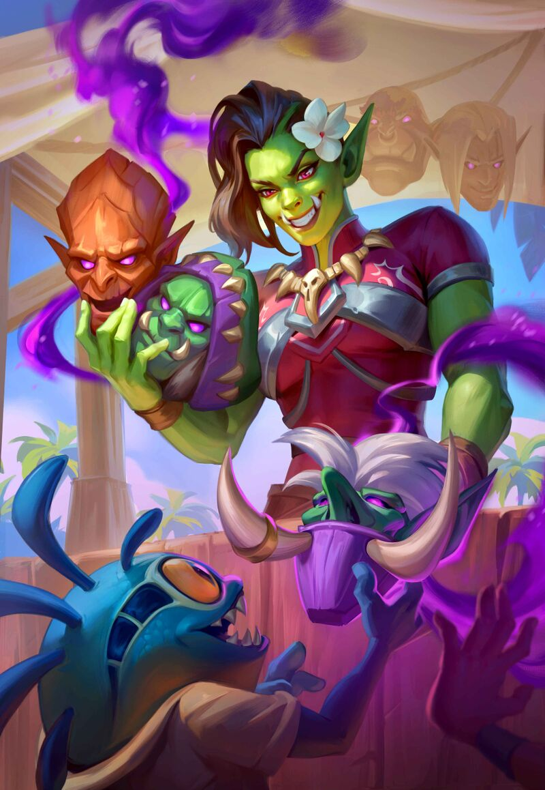

# 🎭 Maligner

Maligners are master manipulators that worm their way into positions of power through deceit and cunning. They use enchantments to force cooperation, illusions to misdirect, lies to spread rumors, and polymorphs to imitate. While there are Maligners that start off benevolent, they most often find themselves engaging in morally abhorrent behavior while impersonating enemies just to keep their stories straight.


This class is a pretty odd fit for this game, mostly because it has basically zero combat related abilities as part of the class. The role a Maligner will play in a party will probably be akin to that of a rogue. They are much more impressive out of combat than in combat.&#x20;




<figure><figcaption>
<a href="https://hearthstone.wiki.gg/wiki/Maestra,_Mask_Merchant">Maestra, Mask Merchant, Hearthstone</a>
</figcaption></figure>



| HP (specialist) | 20(+6 per level) |
| --------------- | ---------------- |
| Poise           | 5                |
| Skills          | 4                |
| Save            | Will             |
| Memory          | 2+(2\*lvl)       |



## <mark style="color:green;">1 - Technique Specialization (Magic)</mark>

You gain 3 technique points at level 1, then another 2 points every 2 levels after.\
These technique points can be used on the Shira, Moogen and one other tree, chosen at character creation.

Characters with magical specialization gain points in wild card equal to their highest tier of magic technique and cantrips.

## <mark style="color:green;">1 - Faceless Monster (Su) \[polymorph, true] \[companion]</mark>

As a standard action, you can assume an alternate persona of your creation.\
You fabricate a backstory, connections, race, appearance, clothes, voice, the works - this alternate form is completely unique. When you have an alternate persona, you have no "true" form.

Your alternate persona has all of your abilities and statistics, but you can decide to swap up to 2 of your skills for any others, and your race may be different. If these changes cause you to no longer qualify for a feat or class feature upon assuming the other form, then you lose access as normal.

It takes a week of work to fabricate a new form, and a week to "kill off" an old form. These personas consume your Companion slots, and you may have more than one if you have enough slots. You start off with one alternate persona.

## <mark style="color:green;">1 - Skill</mark>

Gain deception and disguise as bonus skills.

## <mark style="color:green;">1 - Catechize \[language]</mark>

Upon engaging in conversation with a creature for at least one minute, you can call out one detail of its appearance, recent activities (within a day), or mannerisms as a free action. You instantly learn its mental state and intentions as they relate to the detail, within the scope of the totality of information you have on the creature (will negates).

Essentially, you correctly guess why a creature did or is doing something. Part of this ability is speaking your guess to the creature, and judging your accuracy off of its response; if it passes its save, you guess wrong, may look silly, and can no longer use this ability on the same creature until you rest.

&#x20;You may substitute the DC with Insight, and the target may substitute its Will save with Deception.

## <mark style="color:green;">2 - Rumor Trails (Su) \[concentration]</mark>

As a free action, name a rumor. You gain a sixth sense for who has heard or spread this rumor. If you see the people they told or heard it from, they appear to glow white or red to you, respectively. If you interact with the creature, you can see a literal trail of ethereal energy to the people they either heard the rumor from, or who they told the rumor.

Using this ability again negates the previous use.

## <mark style="color:green;">4 - Face Stealer (Su) \[poly, true]</mark>

You can amputate a helpless, willing, or recently deceased (within an hour) playable race's face, and spend 500g and 8 hours of labor to convert it into a Maligner's Mask attuned to that specific creature. Most creatures will die or go blind upon having their face amputated without immediate medical attention.

When you wear this mask, you partially transform into that creature, which counts as a disguise and grants a +4 bonus skill checks to appear as that specific creature. Putting it on is a full round action, but removing it is a Swapping Gear action. It does not change your clothes or equipment. Other creatures may wear these masks.

While you possess a mask, you can use Faceless Monster to create a persona of a person whose mask you possess. If the persona you steal still lives, or is absent for long periods of time, it can cause problems.

## <mark style="color:green;">6 - Rumormonger</mark>

You can attempt to spread a rumor throughout a small town or larger settlement by attempting a deception check. The difficulty depends on the size, ranging from 10 for a small town to 30 for a metropolis, though this difficulty may be modified if the population as a whole tends towards skepticism or insanity.

It takes a week for a rumor to spread. If you succeed by 5 or more, the time is reduced to 3 days. If you fail by 5 or more, the rumor mutates into a competing theory.

Each of your personas may only have one rumor brewing at a time.

## <mark style="color:green;">8 - All Friends Here (Su)</mark>

After a minute of concentration, you can enter a state of calm where you deepen your connection with your collection of masks. You can communicate with the fragments of the persons soul left behind within. The masks appear to speak to you, and you can inquire things about these people as though you were a neutral party. As such, they are usually willing to tell you some things, but hesitant for others, usually requiring skill checks. Once you try and pry into something secret and fail, the information is lost forever.&#x20;

The masks are unable to form new memories, and therefore always treat you as they would a stranger, no matter what you ask.
