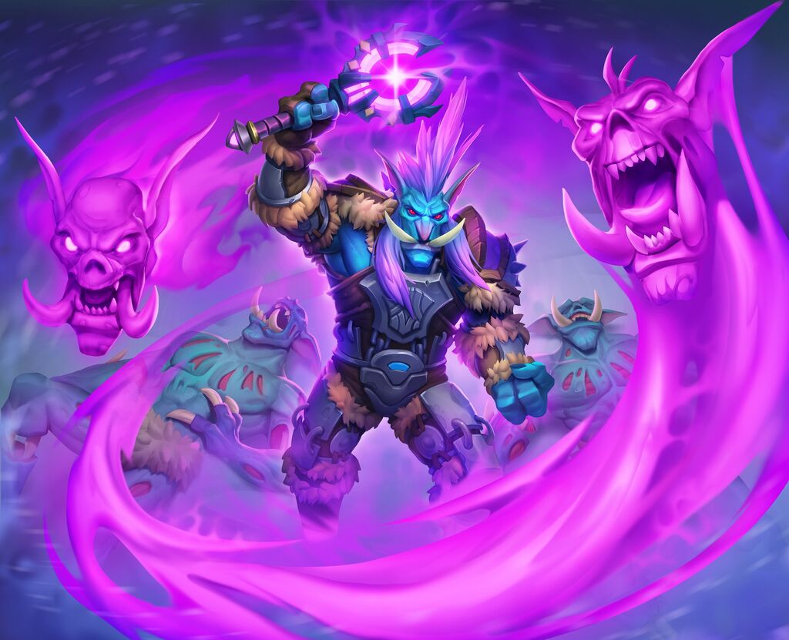

# Medium

Mediums go all in on casting. They also have several unique abilities that give them insight into the dead.



<figure><figcaption>
<a href="https://hearthstone.wiki.gg/wiki/From_De_Other_Side">From De Other Side, Hearthstone</a>
</figcaption></figure>



| HP (specialist) | 20(+6 per level) |
| --------------- | ---------------- |
| Poise           | 5                |
| Skills          | 2                |
| Save            | Will             |
| Memory          | 2+(2\*lvl)       |



## <mark style="color:green;">1 - Adept Caster</mark>

You gain an additional 2 technique points at level 1, then another point every 2 levels after.\
The technique points can be spent on any magic tree.

## <mark style="color:green;">1 - Skill</mark>

You gain religion proficiency and a +4 bonus.

## <mark style="color:green;">2 - DoD: Speak with Corpse (Su)</mark>

For 10 minutes your eyes glow with a chilling green aura. During this time you can speak to corpses of creatures with intact heads within 5 feet of you, asking 5 questions (in total, not to each creature) before the power fades.

The corpse knows only what it knew in life, including languages. Answers are usually brief or cryptic. The corpse is under no compulsion to offer a truthful answer if you are hostile to it or it recognizes you as an enemy. The corpse can’t learn new information, doesn’t comprehend anything that has happened since it died, and can’t speculate about future events.

## <mark style="color:green;">4 - DoD: Through Death's Eyes (Su) \[scrying]</mark>

Touch a dead creature to perceive what happened during the last minute it was alive and conscious.

Alternatively project your senses through one of the undead you control for 10 up to minutes. You can continue to give your minions orders while you observe. You sense using all of your faculties from the minions position. You can speak using your voice or a raspier one more appropriate for an undead creature. You are stunned while you use this feature. You can end it as an instant action, and it ends automatically if you take damage.

## <mark style="color:green;">6 - DoD: Spirit Medium (Su) \[concentration]</mark>

You can initiate contact with spirits of the dead that reside in the Underworld. To do so you need a few things...

* An artifact of significance to the creature, such as a weapon, trinket or family picture.
* The creature's full name
* 1 minute of uninterrupted concentration

If you meet the conditions, and the creature's spirit is not trapped in some way (including inside of a living body) then the spirit temporarily inhabits your body, up to 10 minutes. If the ritual fails, you know why, such as the artifact not being of enough significance, the creature being alive etc.

You lose access to your body, only viewing the events as though a passenger in your own body, therefore requiring a 3rd party to do the interacting with the spirit. The creature speaks in its own voice, but otherwise moves and interacts with the physical world via your body.&#x20;

Whether or not a spirit is interested in speaking changes drastically from person to person. Some spirits will be happy to be able to speak with loved ones, and others will immediately leave at the sight of a past enemy. A persuasion check is usually in order before the spirit leaves.

The spirit is mostly limited to only what they knew in life, and they are still able to fully articulate their thoughts as though they were of sound mind. Little information about the Mortal Realm passes into the Underworld, and less still reaches the ears of the average spirit.

## <mark style="color:green;">8 - DoD: Soul Cage (Su)</mark>

As an immediate action when a creature dies within 60 ft of you, you can choose to seal the creatures soul inside of a staff you wield. A tiny spectral cage forms at its tip with a miniature version of the creatures spirit inside. Until the staff is sundered, the cage is opened with sleight of hand, or you cage a new soul, the spirit is trapped inside of your staff.

While trapped the spirit remains conscious and can perceive the world around it as it did in life. You can converse with the spirit, and you can silence it if it gets to loud.

## <mark style="color:green;">11 - Overlord</mark>

When you animate dead, you can choose to set its level to 3 and have it not consume a companion slot. You are allowed to give it a singular order at the time of creation that it fulfills until it is destroyed.
